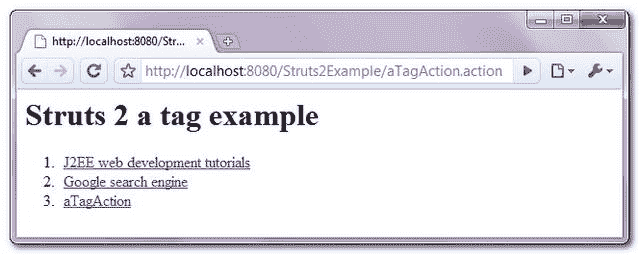

> 原文：<http://web.archive.org/web/20230101150211/http://www.mkyong.com/struts2/struts-2-a-tag-example/>

# Struts 2 标签示例

Download It – [Struts2-A-Tag-Example.zip](http://web.archive.org/web/20190304031358/http://www.mkyong.com/wp-content/uploads/2010/07/Struts2-A-Tag-Example.zip)

Struts 2 " **一个**"标签用于呈现一个 HTML " **<一个>** "标签。最佳实践是始终使用“ **< s:url >** ”标签来创建 url 并将其嵌入到“ **a** 标签中。举个例子，

```
 <s:url value="http://www.google.com" var="googleURL" />
<s:a href="%{googleURL}">Google</s:a> 
```

在本教程中，它展示了使用 Struts 2 " **a** 标签的 3 种方法。

## 1.行动

转发请求的操作类。

**ATagAction.java**

```
 package com.mkyong.common.action;

import com.opensymphony.xwork2.ActionSupport;

public class ATagAction extends ActionSupport{

	public String execute() {
		return SUCCESS;
	}

} 
```

 <ins class="adsbygoogle" style="display:block; text-align:center;" data-ad-format="fluid" data-ad-layout="in-article" data-ad-client="ca-pub-2836379775501347" data-ad-slot="6894224149">## 2.标签示例

一个 JSP 页面，展示了使用“ **a** 标签以不同的方式呈现 URL。

**a.jsp**

```
 <%@ taglib prefix="s" uri="/struts-tags" %>
 <html>
<head>
</head>

<body>
<h1>Struts 2 a tag example</h1>

<ol>

<li>
<s:url value="http://www.mkyong.com" var="mkyongURL" />
<s:a href="%{mkyongURL}">J2EE web development tutorials</s:a>
</li>

<li>
<s:a href="http://www.google.com">Google search engine</s:a>
</li>

<li>
<s:url action="aTagAction.action" var="aURL" />
<s:a href="%{aURL}">aTagAction</s:a>
</li>

</ol>

</body>
</html> 
```

 <ins class="adsbygoogle" style="display:block" data-ad-client="ca-pub-2836379775501347" data-ad-slot="8821506761" data-ad-format="auto" data-ad-region="mkyongregion">## 3.struts.xml

链接一下~

```
 <?xml version="1.0" encoding="UTF-8" ?>
<!DOCTYPE struts PUBLIC
"-//Apache Software Foundation//DTD Struts Configuration 2.0//EN"
"http://struts.apache.org/dtds/struts-2.0.dtd">

<struts>
 	<constant name="struts.devMode" value="true" />
	<package name="default" namespace="/" extends="struts-default">

		<action name="aTagAction" 
			class="com.mkyong.common.action.aTagAction" >
			<result name="success">pages/a.jsp</result>
		</action>

	</package>
</struts> 
```

## 4.演示

*http://localhost:8080/struts 2 example/atag action . action*

**输出**



**在 HTML 源文件中输出**

```
 <html> 
<head> 
</head> 

<body> 
<h1>Struts 2 a tag example</h1> 

<ol> 
<li> 
<a href="http://www.mkyong.com">J2EE web development tutorials</a> 
</li> 

<li> 
<a href="http://www.google.com">Google search engine</a> 
</li> 

<li> 
<a href="/Struts2Example/aTagAction.action">aTagAction</a> 
</li> 
</ol> 

</body> 
</html> 
```

## 参考

1.  [Struts 2 a 标签文档](http://web.archive.org/web/20190304031358/http://struts.apache.org/2.0.14/docs/a.html)

[struts2](http://web.archive.org/web/20190304031358/http://www.mkyong.com/tag/struts2/)</ins></ins> (function (i,d,s,o,m,r,c,l,w,q,y,h,g) { var e=d.getElementById(r);if(e===null){ var t = d.createElement(o); t.src = g; t.id = r; t.setAttribute(m, s);t.async = 1;var n=d.getElementsByTagName(o)[0];n.parentNode.insertBefore(t, n); var dt=new Date().getTime(); try{i[l][w+y](h,i[l][q+y](h)+'&amp;'+dt);}catch(er){i[h]=dt;} } else if(typeof i[c]!=='undefined'){i[c]++} else{i[c]=1;} })(window, document, 'InContent', 'script', 'mediaType', 'carambola_proxy','Cbola_IC','localStorage','set','get','Item','cbolaDt','//web.archive.org/web/20190304031358/http://route.carambo.la/inimage/getlayer?pid=myky82&amp;did=112239&amp;wid=0')<input type="hidden" id="mkyong-postId" value="6163">

#### 关于作者


##### mkyong

Founder of [Mkyong.com](http://web.archive.org/web/20190304031358/http://mkyong.com/), love Java and open source stuff. Follow him on [Twitter](http://web.archive.org/web/20190304031358/https://twitter.com/mkyong), or befriend him on [Facebook](http://web.archive.org/web/20190304031358/http://www.facebook.com/java.tutorial) or [Google Plus](http://web.archive.org/web/20190304031358/https://plus.google.com/110948163568945735692?rel=author). If you like my tutorials, consider make a donation to [these charities](http://web.archive.org/web/20190304031358/http://www.mkyong.com/blog/donate-to-charity/).