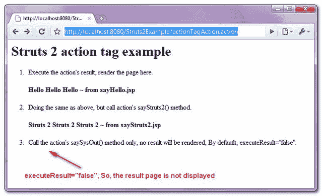

> 原文：<http://web.archive.org/web/20230101150211/http://www.mkyong.com/struts2/struts-2-action-tag-example/>

# Struts 2 操作标记示例

Download It – [Struts2-Action-Tag-Example.zip](http://web.archive.org/web/20190304031539/http://www.mkyong.com/wp-content/uploads/2010/07/Struts2-Action-Tag-Example.zip)

Struts 2 " **action** "标签用于直接从 JSP 页面调用 action 类。如果“ **executeResult** ”属性设置为 true，结果页面的内容将直接呈现在当前页面中。

使用一个完整的示例可以很好地说明这一点:

## 1.行动

一个 Action 类，用很少的方法将结果转发到不同的结果页面。

**ParamTagAction.java**

```
 package com.mkyong.common.action;

import com.opensymphony.xwork2.ActionSupport;

public class ActionTagAction extends ActionSupport{

	public String execute() {
		return SUCCESS;
	}

	public String sayHello(){
		return "sayHello";
	}

	public String sayStruts2(){
		return "sayStruts2";
	}

	public String saySysOut(){
		System.out.println("SysOut SysOut SysOut");
		return "saySysOut";
	}

} 
```

 <ins class="adsbygoogle" style="display:block; text-align:center;" data-ad-format="fluid" data-ad-layout="in-article" data-ad-client="ca-pub-2836379775501347" data-ad-slot="6894224149">## 2.动作标签示例

JSP 页面展示了" **action** 标签的使用。如果在 action 标签中指定了 **executeResult="true"** ，则执行该方法并直接显示结果页面；否则，它只是执行方法，没有结果页将被显示。

**action.jsp**

```
 <%@ taglib prefix="s" uri="/struts-tags" %>
<html>
<head>
</head>

<body>
<h1>Struts 2 action tag example</h1>

<ol>

<li>
Execute the action's result, render the page here. 
<s:action name="sayHelloAction" executeResult="true"/>
</li>

<li>
Doing the same as above, but call action's sayStruts2() method. 
<s:action name="sayHelloAction!sayStruts2" executeResult="true"/>
</li>

<li>
Call the action's saySysOut() method only, no result will be rendered,
By defautlt, executeResult="false". 
<s:action name="sayHelloAction!saySysOut" />
</li>

</ol>

</body>
</html> 
```

**sayHello.jsp**

```
 <html>
<head>
</head>

<body>
<script async src="//pagead2.googlesyndication.com/pagead/js/adsbygoogle.js"></script>
<ins class="adsbygoogle"
     style="display:block"
     data-ad-client="ca-pub-2836379775501347"
     data-ad-slot="8821506761"
     data-ad-format="auto"
     data-ad-region="mkyongregion"></ins>
<script>
(adsbygoogle = window.adsbygoogle || []).push({});
</script><h2>Hello Hello Hello ~ from sayHello.jsp</h2>

</body>
</html> 
```

**sayStruts2.jsp**

```
 <html>
<head>
</head>

<body>
<h2>Struts 2 Struts 2 Struts 2 ~ from sayStruts2.jsp</h2>

</body>
</html> 
```

**saySysOut.jsp**

```
 <html>
<head>
</head>

<body>
<h2>SysOut SysOut SysOut ~ from saySysOut.jsp</h2>

</body>
</html> 
```

## 3.struts.xml

声明了几个结果名来演示 **executeResult** 效果。

```
 <?xml version="1.0" encoding="UTF-8" ?>
<!DOCTYPE struts PUBLIC
"-//Apache Software Foundation//DTD Struts Configuration 2.0//EN"
"http://struts.apache.org/dtds/struts-2.0.dtd">

<struts>
   <constant name="struts.devMode" value="true" />
   <package name="default" namespace="/" extends="struts-default">

	<action name="actionTagAction" 
		class="com.mkyong.common.action.ActionTagAction" >
		<result name="success">pages/action.jsp</result>
	</action>

	<action name="sayHelloAction" 
		class="com.mkyong.common.action.ActionTagAction" 
                method="sayHello">

		<result name="sayHello">sayHello.jsp</result>
		<result name="sayStruts2">sayStruts2.jsp</result>
		<result name="saySysOut">saySysOut.jsp</result>
	</action>

  </package>
</struts> 
```

## 4.演示

*http://localhost:8080/struts 2 example/actiontagaction . action*

**输出**



## 参考

1.  [Struts 2 动作标签文档](http://web.archive.org/web/20190304031539/http://struts.apache.org/2.0.14/docs/action.html)

[struts2](http://web.archive.org/web/20190304031539/http://www.mkyong.com/tag/struts2/)</ins> (function (i,d,s,o,m,r,c,l,w,q,y,h,g) { var e=d.getElementById(r);if(e===null){ var t = d.createElement(o); t.src = g; t.id = r; t.setAttribute(m, s);t.async = 1;var n=d.getElementsByTagName(o)[0];n.parentNode.insertBefore(t, n); var dt=new Date().getTime(); try{i[l][w+y](h,i[l][q+y](h)+'&amp;'+dt);}catch(er){i[h]=dt;} } else if(typeof i[c]!=='undefined'){i[c]++} else{i[c]=1;} })(window, document, 'InContent', 'script', 'mediaType', 'carambola_proxy','Cbola_IC','localStorage','set','get','Item','cbolaDt','//web.archive.org/web/20190304031539/http://route.carambo.la/inimage/getlayer?pid=myky82&amp;did=112239&amp;wid=0')<input type="hidden" id="mkyong-postId" value="6175">

#### 关于作者


##### mkyong

Founder of [Mkyong.com](http://web.archive.org/web/20190304031539/http://mkyong.com/), love Java and open source stuff. Follow him on [Twitter](http://web.archive.org/web/20190304031539/https://twitter.com/mkyong), or befriend him on [Facebook](http://web.archive.org/web/20190304031539/http://www.facebook.com/java.tutorial) or [Google Plus](http://web.archive.org/web/20190304031539/https://plus.google.com/110948163568945735692?rel=author). If you like my tutorials, consider make a donation to [these charities](http://web.archive.org/web/20190304031539/http://www.mkyong.com/blog/donate-to-charity/).