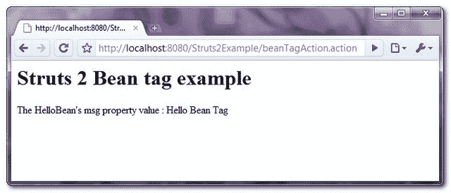

> 原文：<http://web.archive.org/web/20230101150211/http://www.mkyong.com/struts2/struts-2-bean-tag-example/>

# Struts 2 bean 标记示例

Download It – [Struts2-Bean-Tag-Example.zip](http://web.archive.org/web/20190225125854/http://www.mkyong.com/wp-content/uploads/2010/07/Struts2-Bean-Tag-Example.zip)

Struts 2 " **bean** "标签用于在 JSP 页面中实例化一个类。在本教程中，您将使用“ **bean** ”标记实例化一个名为“ **HelloBean** ”的类，通过“ **param** ”元素设置其属性并打印出值。

## 1.简单豆

一个简单的类，稍后使用 **bean** 标签来实例化它。

**地狱篇. java**

```java
 package com.mkyong.common.action;

public class HelloBean{

	private String msg;

	public String getMsg() {
		return msg;
	}

	public void setMsg(String msg) {
		this.msg = msg;
	}

} 
```

 <ins class="adsbygoogle" style="display:block; text-align:center;" data-ad-format="fluid" data-ad-layout="in-article" data-ad-client="ca-pub-2836379775501347" data-ad-slot="6894224149">## 2.行动

转发请求的操作类。

**BeanTagAction.java**

```java
 package com.mkyong.common.action;

import com.opensymphony.xwork2.ActionSupport;

public class BeanTagAction extends ActionSupport{

	public String execute() {
		return SUCCESS;
	}

} 
```

 <ins class="adsbygoogle" style="display:block" data-ad-client="ca-pub-2836379775501347" data-ad-slot="8821506761" data-ad-format="auto" data-ad-region="mkyongregion">## 2.Bean 标记示例

一个 JSP 页面，展示了如何使用“ **bean** ”标记实例化“ **HelloBean** ”。

In “**bean**” tag, you can assign a name to the bean via a “**var**” attribute, later you can access the bean via **#var_bean_name** , or its property value via **#var_bean_name.property**.

**bean.jsp**

```java
 <%@ taglib prefix="s" uri="/struts-tags" %>
 <html>
<head>
</head>

<body>
<h1>Struts 2 Bean tag example</h1>

<s:bean name="com.mkyong.common.action.HelloBean" var="hello">
  <s:param name="msg">Hello Bean Tag</s:param>
</s:bean>

The HelloBean's msg property value : <s:property value="#hello.msg"/>

</body>
</html> 
```

## 3.struts.xml

链接一下~

```java
 <?xml version="1.0" encoding="UTF-8" ?>
<!DOCTYPE struts PUBLIC
"-//Apache Software Foundation//DTD Struts Configuration 2.0//EN"
"http://struts.apache.org/dtds/struts-2.0.dtd">

<struts>
    <constant name="struts.devMode" value="true" />
    <package name="default" namespace="/" extends="struts-default">

	<action name="beanTagAction" 
	    class="com.mkyong.common.action.BeanTagAction" >
	    <result name="success">pages/bean.jsp</result>
	</action>

    </package>
</struts> 
```

## 4.演示

*http://localhost:8080/struts 2 example/bean tag action . action*

**输出**



## 参考

1.  [Struts 2 Bean 标签文档](http://web.archive.org/web/20190225125854/http://struts.apache.org/2.0.14/docs/bean.html)

[struts2](http://web.archive.org/web/20190225125854/http://www.mkyong.com/tag/struts2/)</ins></ins> (function (i,d,s,o,m,r,c,l,w,q,y,h,g) { var e=d.getElementById(r);if(e===null){ var t = d.createElement(o); t.src = g; t.id = r; t.setAttribute(m, s);t.async = 1;var n=d.getElementsByTagName(o)[0];n.parentNode.insertBefore(t, n); var dt=new Date().getTime(); try{i[l][w+y](h,i[l][q+y](h)+'&amp;'+dt);}catch(er){i[h]=dt;} } else if(typeof i[c]!=='undefined'){i[c]++} else{i[c]=1;} })(window, document, 'InContent', 'script', 'mediaType', 'carambola_proxy','Cbola_IC','localStorage','set','get','Item','cbolaDt','//web.archive.org/web/20190225125854/http://route.carambo.la/inimage/getlayer?pid=myky82&amp;did=112239&amp;wid=0')<input type="hidden" id="mkyong-postId" value="6150">


