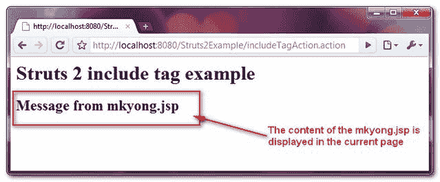

> 原文：<http://web.archive.org/web/20230101150211/http://www.mkyong.com/struts2/struts-2-include-tag-example/>

# Struts 2 包含标签示例

Download It – [Struts2-Include-Tag-Example.zip](http://web.archive.org/web/20190304032715/http://www.mkyong.com/wp-content/uploads/2010/07/Struts2-Include-Tag-Example.zip)

Struts 2 " **include** 标签用于将 JSP 或 HTML 页面直接包含到当前页面中。关于“**包含**标签的演示，请参见下面的示例。

## 1.行动

仅执行转发任务的简单操作类。

**IncludeTagAction.java**

```
 package com.mkyong.common.action;

import com.opensymphony.xwork2.ActionSupport;

public class IncludeTagAction extends ActionSupport{

	public String execute() throws Exception {

		return SUCCESS;
	}
} 
```

 <ins class="adsbygoogle" style="display:block; text-align:center;" data-ad-format="fluid" data-ad-layout="in-article" data-ad-client="ca-pub-2836379775501347" data-ad-slot="6894224149">## 2.包括标签示例

它展示了如何使用 **include** 标签将一个【mkyong.jsp】的页面包含到当前页面**的**中。

**include.jsp**

```
 <%@ taglib prefix="s" uri="/struts-tags" %>
<html>
<head>
</head>

<body>
<h1>Struts 2 include tag example</h1>

<s:include value="/pages/mkyong.jsp"></s:include>

</body>
</html> 
```

**mkyong.jsp**

```
 <html>
<head>
</head>

<body>
<script async src="//pagead2.googlesyndication.com/pagead/js/adsbygoogle.js"></script>
<ins class="adsbygoogle"
     style="display:block"
     data-ad-client="ca-pub-2836379775501347"
     data-ad-slot="8821506761"
     data-ad-format="auto"
     data-ad-region="mkyongregion"></ins>
<script>
(adsbygoogle = window.adsbygoogle || []).push({});
</script><h2>Message from mkyong.jsp</h2>

</body>
</html> 
```

## 3.struts.xml

链接一下~

```
 <?xml version="1.0" encoding="UTF-8" ?>
<!DOCTYPE struts PUBLIC
"-//Apache Software Foundation//DTD Struts Configuration 2.0//EN"
"http://struts.apache.org/dtds/struts-2.0.dtd">

<struts>
 	<constant name="struts.devMode" value="true" />
	<package name="default" namespace="/" extends="struts-default">

		<action name="includeTagAction" 
			class="com.mkyong.common.action.IncludeTagAction" >
			<result name="success">pages/include.jsp</result>
		</action>

	</package>
</struts> 
```

## 4.演示

*http://localhost:8080/struts 2 example/include tagaction . action*

**输出**



## 参考

1.  [Struts 2 包含标签文档](http://web.archive.org/web/20190304032715/http://struts.apache.org/2.0.14/docs/include.html)

[struts2](http://web.archive.org/web/20190304032715/http://www.mkyong.com/tag/struts2/)</ins> (function (i,d,s,o,m,r,c,l,w,q,y,h,g) { var e=d.getElementById(r);if(e===null){ var t = d.createElement(o); t.src = g; t.id = r; t.setAttribute(m, s);t.async = 1;var n=d.getElementsByTagName(o)[0];n.parentNode.insertBefore(t, n); var dt=new Date().getTime(); try{i[l][w+y](h,i[l][q+y](h)+'&amp;'+dt);}catch(er){i[h]=dt;} } else if(typeof i[c]!=='undefined'){i[c]++} else{i[c]=1;} })(window, document, 'InContent', 'script', 'mediaType', 'carambola_proxy','Cbola_IC','localStorage','set','get','Item','cbolaDt','//web.archive.org/web/20190304032715/http://route.carambo.la/inimage/getlayer?pid=myky82&amp;did=112239&amp;wid=0')<input type="hidden" id="mkyong-postId" value="6202">

#### 关于作者


##### mkyong

Founder of [Mkyong.com](http://web.archive.org/web/20190304032715/http://mkyong.com/), love Java and open source stuff. Follow him on [Twitter](http://web.archive.org/web/20190304032715/https://twitter.com/mkyong), or befriend him on [Facebook](http://web.archive.org/web/20190304032715/http://www.facebook.com/java.tutorial) or [Google Plus](http://web.archive.org/web/20190304032715/https://plus.google.com/110948163568945735692?rel=author). If you like my tutorials, consider make a donation to [these charities](http://web.archive.org/web/20190304032715/http://www.mkyong.com/blog/donate-to-charity/).