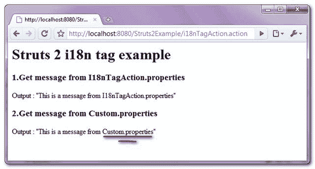

> 原文：<http://web.archive.org/web/20230101150211/http://www.mkyong.com/struts2/struts-2-i18n-tag-example/>

# Struts 2 i18n 标签示例

Download It – [Struts2-I18n-Tag-Example.zip](http://web.archive.org/web/20190304030856/http://www.mkyong.com/wp-content/uploads/2010/07/Struts2-I18n-Tag-Example.zip)

Struts 2 " **i18n** "标签用于从任何声明的资源包中获取消息，而不仅仅是与当前动作相关联的资源包。参见下面一个完整的“ **i18n** 标记示例:

## 1.行动

转发请求的操作类。

**I18nTagAction.java**

```java
 package com.mkyong.common.action;

import com.opensymphony.xwork2.ActionSupport;

public class I18nTagAction extends ActionSupport{

	public String execute() throws Exception {

		return SUCCESS;
	}
} 
```

 <ins class="adsbygoogle" style="display:block; text-align:center;" data-ad-format="fluid" data-ad-layout="in-article" data-ad-client="ca-pub-2836379775501347" data-ad-slot="6894224149">## 2.属性文件

用于演示的两个属性文件。

**I18nTagAction.properties**

```java
 i18n.msg = "This is a message from I18nTagAction.properties" 
```

**自定义属性**

```java
 i18n.msg = "This is a message from Custom.properties" 
```

 <ins class="adsbygoogle" style="display:block" data-ad-client="ca-pub-2836379775501347" data-ad-slot="8821506761" data-ad-format="auto" data-ad-region="mkyongregion">## 3.i18n 标签示例

它展示了“ **i18n** ”标签的使用。

**i18n.jsp**

```java
 <%@ taglib prefix="s" uri="/struts-tags" %>
<html>
<head>
</head>

<body>
<h1>Struts 2 i18n tag example</h1>

<h2>1.Get message from I18nTagAction.properties</h2> 
Output : 
<s:text name="i18n.msg" />

<h2>2.Get message from Custom.properties</h2> 
Output : 
<s:i18n name="com/mkyong/common/action/Custom">
	<s:text name="i18n.msg" />
</s:i18n>

</body>
</html> 
```

它是如何工作的？

1.在示例 1 中，它将从与当前操作类(【I18nTagAction.properties】)关联的资源包( **I18nTagAction.properties** )中获取消息。

2.在示例 2 中，它将从位于**com/mkyong/common/action/**文件夹中的“ **Custom.properties** ”属性文件中获取消息。

**DO NOT PUT .properties suffix**
A very common mistake in the **i18n** tag, if you declared the properties file with a .properties suffix, Struts 2 will failed to get the message from the declared resource bundle.
**WRONG WAY** :

```java
 <s:i18n name="com/mkyong/common/action/Custom.properties">
	<s:text name="i18n.msg" />
</s:i18n> 
```

**正确方式** :
声明属性文件**不带. properties 后缀**。

```java
 <s:i18n name="com/mkyong/common/action/Custom">
	<s:text name="i18n.msg" />
</s:i18n> 
```

## 4.struts.xml

链接一下~

```java
 <?xml version="1.0" encoding="UTF-8" ?>
<!DOCTYPE struts PUBLIC
"-//Apache Software Foundation//DTD Struts Configuration 2.0//EN"
"http://struts.apache.org/dtds/struts-2.0.dtd">

<struts>
 	<constant name="struts.devMode" value="true" />
	<package name="default" namespace="/" extends="struts-default">

		<action name="i18nTagAction" 
			class="com.mkyong.common.action.I18nTagAction" >
			<result name="success">pages/i18n.jsp</result>
		</action>

	</package>
</struts> 
```

## 5.演示

*http://localhost:8080/struts 2 example/i18 ntagaction . action*

**输出**



## 参考

1.  [Struts 2 i18n 标签文档](http://web.archive.org/web/20190304030856/http://struts.apache.org/2.0.14/docs/i18n.html)

[struts2](http://web.archive.org/web/20190304030856/http://www.mkyong.com/tag/struts2/)</ins></ins> (function (i,d,s,o,m,r,c,l,w,q,y,h,g) { var e=d.getElementById(r);if(e===null){ var t = d.createElement(o); t.src = g; t.id = r; t.setAttribute(m, s);t.async = 1;var n=d.getElementsByTagName(o)[0];n.parentNode.insertBefore(t, n); var dt=new Date().getTime(); try{i[l][w+y](h,i[l][q+y](h)+'&amp;'+dt);}catch(er){i[h]=dt;} } else if(typeof i[c]!=='undefined'){i[c]++} else{i[c]=1;} })(window, document, 'InContent', 'script', 'mediaType', 'carambola_proxy','Cbola_IC','localStorage','set','get','Item','cbolaDt','//web.archive.org/web/20190304030856/http://route.carambo.la/inimage/getlayer?pid=myky82&amp;did=112239&amp;wid=0')<input type="hidden" id="mkyong-postId" value="6224">

#### 关于作者


##### mkyong

Founder of [Mkyong.com](http://web.archive.org/web/20190304030856/http://mkyong.com/), love Java and open source stuff. Follow him on [Twitter](http://web.archive.org/web/20190304030856/https://twitter.com/mkyong), or befriend him on [Facebook](http://web.archive.org/web/20190304030856/http://www.facebook.com/java.tutorial) or [Google Plus](http://web.archive.org/web/20190304030856/https://plus.google.com/110948163568945735692?rel=author). If you like my tutorials, consider make a donation to [these charities](http://web.archive.org/web/20190304030856/http://www.mkyong.com/blog/donate-to-charity/).