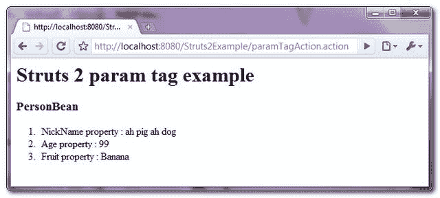

> 原文：<http://web.archive.org/web/20230101150211/http://www.mkyong.com/struts2/struts-2-param-tag-example/>

# Struts 2 参数标记示例

Download It – [Struts2-Param-Tag-Example.zip](http://web.archive.org/web/20190304031549/http://www.mkyong.com/wp-content/uploads/2010/07/Struts2-Param-Tag-Example.zip)

Struts 2 " **param** "标签用于参数化其他标签。但是，当您声明了“ **param** ”标记时，可以用两种方式定义“**参数值**”:

1.  **值**属性。
2.  “ **param** 标记的开始和结束之间的文本。

举个例子，

```java
 <param name="fruit">Banana</param>  {Case 1}
<param name="fruit" value="Banana"/> {Case 2} 
```

In Struts 2 , both behaves a totally different meaning. In “Case 1”, the value is considered as a **java.lang.String** object; While “Case 2”, the value is considered as a **java.lang.Object** object.

上面的陈述最好用一些例子来说明:

## 示例 1

通过“ **param** 标记将一个“**字符串**值设置到 bean 属性中，您必须这样声明

```java
 <s:bean name="com.mkyong.common.Person" var="personBean">
	<s:param name="nickName">mkyong</s:param>
</s:bean> 
```

Not

```java
 <s:bean name="com.mkyong.common.Person" var="personBean">
	<s:param name="nickName" value="mkyong"></s:param>
</s:bean> 
```

如果您在“**值**”属性中声明了“**字符串**值，Struts 2 将会忽略它。

 <ins class="adsbygoogle" style="display:block; text-align:center;" data-ad-format="fluid" data-ad-layout="in-article" data-ad-client="ca-pub-2836379775501347" data-ad-slot="6894224149">## 示例 2

通过“**参数**”标签将一个 **java.lang.Object** 对象设置到 bean 属性中，声明如下

```java
 <s:bean name="com.mkyong.common.Fruit" var="fruitBean">
	<s:param name="fruitName">Banana</s:param>
</s:bean>

<s:bean name="com.mkyong.common.Person" var="personBean">
	<s:param name="favorFruit" value="#fruitBean"></s:param>
</s:bean> 
```

 <ins class="adsbygoogle" style="display:block" data-ad-client="ca-pub-2836379775501347" data-ad-slot="8821506761" data-ad-format="auto" data-ad-region="mkyongregion">## 示例 3

对于原始类型，你可以自由地在任何地方声明它，它就像一个魔咒一样起作用。

```java
 <s:bean name="com.mkyong.common.Person" var="personBean">
	<s:param name="age" value="99"></s:param>
</s:bean>
// or
<s:bean name="com.mkyong.common.Person" var="personBean">
	<s:param name="age">99</s:param>
</s:bean> 
```

The “**param**” tag is not only available for the bean tag, it’s apply to almost all of the other tags that need parametrize.Struts 2, “**param**” tag is a really confusing tag, many new Struts 2 developers are fall into this silly trap, and wonder why a simple “String” setter method is not work. Hope the Struts 2 team can design more user-friendly tag in future.

## Struts 2 参数标记示例

一个完整的 Struts 2 " **param** "标签示例。

## 1.行动

转发请求的操作类。

**ParamTagAction.java**

```java
 package com.mkyong.common.action;

import com.opensymphony.xwork2.ActionSupport;

public class ParamTagAction extends ActionSupport{

	public String execute() {
		return SUCCESS;
	}

} 
```

## 2.豆

两个 beans，稍后用" **param** "标签初始化。

**Person.java**

```java
 package com.mkyong.common;

public class Person{

	private String nickName;
	private int age;
	private Fruit favorFruit;

	public String getNickName() {
		return nickName;
	}
	public void setNickName(String nickName) {
		this.nickName = nickName;
	}
	public int getAge() {
		return age;
	}
	public void setAge(int age) {
		this.age = age;
	}
	public Fruit getFavorFruit() {
		return favorFruit;
	}
	public void setFavorFruit(Fruit favorFruit) {
		this.favorFruit = favorFruit;
	}

	public String getFruitName(){
		return this.favorFruit.getFruitName();
	}

} 
```

**Fruit.java**

```java
 package com.mkyong.common;

public class Fruit{

	private String fruitName;

	public String getFruitName() {
		return fruitName;
	}

	public void setFruitName(String fruitName) {
		this.fruitName = fruitName;
	}

} 
```

## 3.param 标签示例

一个 JSP 页面显示了" **param** "标签的使用。

**我的钱. jsp**

```java
 <%@ taglib prefix="s" uri="/struts-tags" %>
 <html>
<head>
</head>

<body>
<h1>Struts 2 param tag example</h1>

<s:bean name="com.mkyong.common.Fruit" var="fruitBean">
	<s:param name="fruitName">Banana</s:param>
</s:bean>

<s:bean name="com.mkyong.common.Person" var="personBean">
	<s:param name="nickName">ah pig ah dog</s:param>
	<s:param name="age">99</s:param>
	<s:param name="favorFruit" value="#fruitBean"></s:param>
</s:bean>

<h2>PersonBean</h2>
<ol>
<li>NickName property : <s:property value="#personBean.nickName" /></li>
<li>Age property : <s:property value="#personBean.age" /></li>
<li>Fruit property : <s:property value="#personBean.fruitName" /></li>
</ol>
</body>
</html> 
```

## 4.struts.xml

链接一下~

```java
 <?xml version="1.0" encoding="UTF-8" ?>
<!DOCTYPE struts PUBLIC
"-//Apache Software Foundation//DTD Struts Configuration 2.0//EN"
"http://struts.apache.org/dtds/struts-2.0.dtd">

<struts>
 	<constant name="struts.devMode" value="true" />
	<package name="default" namespace="/" extends="struts-default">

		<action name="paramTagAction" 
			class="com.mkyong.common.action.ParamTagAction" >
			<result name="success">pages/param.jsp</result>
		</action>

	</package>
</struts> 
```

## 5.演示

*http://localhost:8080/struts 2 example/paramtagaction . action*

**输出**



## 参考

1.  [Struts 2 参数标签文档](http://web.archive.org/web/20190304031549/http://struts.apache.org/2.0.14/docs/param.html)

[struts2](http://web.archive.org/web/20190304031549/http://www.mkyong.com/tag/struts2/)</ins></ins> (function (i,d,s,o,m,r,c,l,w,q,y,h,g) { var e=d.getElementById(r);if(e===null){ var t = d.createElement(o); t.src = g; t.id = r; t.setAttribute(m, s);t.async = 1;var n=d.getElementsByTagName(o)[0];n.parentNode.insertBefore(t, n); var dt=new Date().getTime(); try{i[l][w+y](h,i[l][q+y](h)+'&amp;'+dt);}catch(er){i[h]=dt;} } else if(typeof i[c]!=='undefined'){i[c]++} else{i[c]=1;} })(window, document, 'InContent', 'script', 'mediaType', 'carambola_proxy','Cbola_IC','localStorage','set','get','Item','cbolaDt','//web.archive.org/web/20190304031549/http://route.carambo.la/inimage/getlayer?pid=myky82&amp;did=112239&amp;wid=0')<input type="hidden" id="mkyong-postId" value="6168">

#### 关于作者


##### mkyong

Founder of [Mkyong.com](http://web.archive.org/web/20190304031549/http://mkyong.com/), love Java and open source stuff. Follow him on [Twitter](http://web.archive.org/web/20190304031549/https://twitter.com/mkyong), or befriend him on [Facebook](http://web.archive.org/web/20190304031549/http://www.facebook.com/java.tutorial) or [Google Plus](http://web.archive.org/web/20190304031549/https://plus.google.com/110948163568945735692?rel=author). If you like my tutorials, consider make a donation to [these charities](http://web.archive.org/web/20190304031549/http://www.mkyong.com/blog/donate-to-charity/).