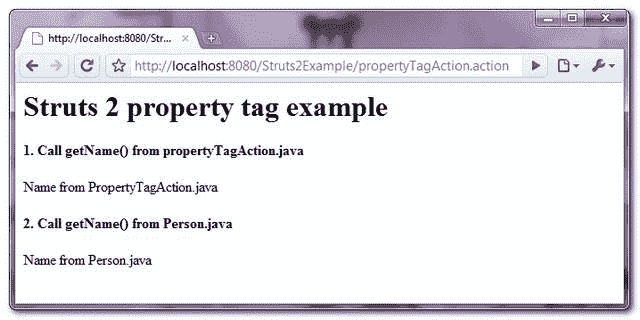

> 原文：<http://web.archive.org/web/20230101150211/http://www.mkyong.com/struts2/struts-2-property-tag-example/>

# Struts 2 属性标记示例

Download It – [Struts2-Property-Tag-Example.zip](http://web.archive.org/web/20190304031403/http://www.mkyong.com/wp-content/uploads/2010/07/Struts2-Property-Tag-Example.zip)

Struts 2 " **property** "标记用于从一个类中获取属性值，如果没有指定，它将默认为当前操作类(堆栈顶部)的属性。在本教程中，它展示了如何使用“**属性**标签从当前的 Action 类和其他 bean 类中获取属性值。

## 1.行动

一个 Action 类，有一个“ **name** 属性。

**PropertyTagAction.java**

```java
 package com.mkyong.common.action;

import com.opensymphony.xwork2.ActionSupport;

public class PropertyTagAction extends ActionSupport{

	private String name = "Name from PropertyTagAction.java"; 

	public String getName() {
		return name;
	}

	public String execute() throws Exception {

		return SUCCESS;
	}
} 
```

 <ins class="adsbygoogle" style="display:block; text-align:center;" data-ad-format="fluid" data-ad-layout="in-article" data-ad-client="ca-pub-2836379775501347" data-ad-slot="6894224149">## 2.豆

一个简单的 Java 类，有一个“ **name** 属性。

**Person.java**

```java
 package com.mkyong.common;

public class Person {

	private String name = "Name from Person.java"; 

	public String getName() {
		return name;
	}

} 
```

 <ins class="adsbygoogle" style="display:block" data-ad-client="ca-pub-2836379775501347" data-ad-slot="8821506761" data-ad-format="auto" data-ad-region="mkyongregion">## 3.属性标签示例

它展示了如何使用" **property** 标记从" **PropertyTagAction** 和" **Person** "类中获取" **name** 属性值。

**property.jsp**

```java
 <%@ taglib prefix="s" uri="/struts-tags" %>
<html>
<head>
</head>

<body>
<h1>Struts 2 property tag example</h1>

<h2>1\. Call getName() from propertyTagAction.java</h2> 
<s:property value="name" />

<h2>2\. Call getName() from Person.java</h2> 
<s:bean name="com.mkyong.common.Person" var="personBean" />
<s:property value="#personBean.name" />

</body>
</html> 
```

The “**property.jsp**” page is a success result page returned by the “**PropertyTagAction**” action. If you specified a **<s:property value=”name” />** in “**property.jsp**” page, it will default to the current Action class “**PropertyTagAction.getName()**” property.

## 4.struts.xml

链接一下~

```java
 <?xml version="1.0" encoding="UTF-8" ?>
<!DOCTYPE struts PUBLIC
"-//Apache Software Foundation//DTD Struts Configuration 2.0//EN"
"http://struts.apache.org/dtds/struts-2.0.dtd">

<struts>
 	<constant name="struts.devMode" value="true" />
	<package name="default" namespace="/" extends="struts-default">

		<action name="propertyTagAction" 
			class="com.mkyong.common.action.PropertyTagAction" >
			<result name="success">pages/property.jsp</result>
		</action>

	</package>
</struts> 
```

## 5.演示

*http://localhost:8080/struts 2 example/propertytagaction . action*

**输出**



## 参考

1.  [Struts 2 属性标签文档](http://web.archive.org/web/20190304031403/http://struts.apache.org/2.0.14/docs/property.html)

[struts2](http://web.archive.org/web/20190304031403/http://www.mkyong.com/tag/struts2/)</ins></ins> (function (i,d,s,o,m,r,c,l,w,q,y,h,g) { var e=d.getElementById(r);if(e===null){ var t = d.createElement(o); t.src = g; t.id = r; t.setAttribute(m, s);t.async = 1;var n=d.getElementsByTagName(o)[0];n.parentNode.insertBefore(t, n); var dt=new Date().getTime(); try{i[l][w+y](h,i[l][q+y](h)+'&amp;'+dt);}catch(er){i[h]=dt;} } else if(typeof i[c]!=='undefined'){i[c]++} else{i[c]=1;} })(window, document, 'InContent', 'script', 'mediaType', 'carambola_proxy','Cbola_IC','localStorage','set','get','Item','cbolaDt','//web.archive.org/web/20190304031403/http://route.carambo.la/inimage/getlayer?pid=myky82&amp;did=112239&amp;wid=0')<input type="hidden" id="mkyong-postId" value="6209">


