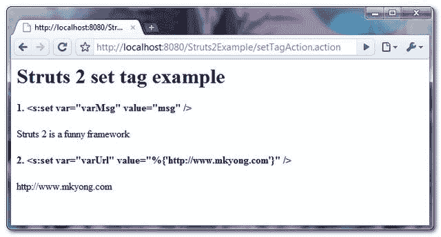

> 原文：<http://web.archive.org/web/20230101150211/http://www.mkyong.com/struts2/struts-2-set-tag-example/>

# Struts 2 设置标签示例

Download It – [Struts2-Set-Tag-Example.zip](http://web.archive.org/web/20190304030901/http://www.mkyong.com/wp-content/uploads/2010/07/Struts2-Set-Tag-Example.zip)

Struts 2 " **set** 标签用于在指定的作用域(应用、会话、请求、页面或动作)中给变量赋值，动作是默认的作用域。参见一个完整的“**设置**标记示例:

The “**value**” means any hard-coded String, property value or just anything you can reference.

## 1.行动

带有“msg”属性的操作类。

**SetTagAction.java**

```
 package com.mkyong.common.action;

import com.opensymphony.xwork2.ActionSupport;

public class SetTagAction extends ActionSupport{

	private String msg = "Struts 2 is a funny framework";

	public String getMsg() {
		return msg;
	}

	public String execute() throws Exception {

		return SUCCESS;
	}
} 
```

 <ins class="adsbygoogle" style="display:block; text-align:center;" data-ad-format="fluid" data-ad-layout="in-article" data-ad-client="ca-pub-2836379775501347" data-ad-slot="6894224149">## 2.设置标签示例

它显示了使用“ **set** 标签。

**set.jsp**

```
 <%@ taglib prefix="s" uri="/struts-tags" %>
<html>
<head>
</head>

<body>
<h1>Struts 2 set tag example</h1>
<script async src="//pagead2.googlesyndication.com/pagead/js/adsbygoogle.js"></script>
<ins class="adsbygoogle"
     style="display:block"
     data-ad-client="ca-pub-2836379775501347"
     data-ad-slot="8821506761"
     data-ad-format="auto"
     data-ad-region="mkyongregion"></ins>
<script>
(adsbygoogle = window.adsbygoogle || []).push({});
</script><h2>1\. <s:set var="varMsg" value="msg" /></h2>

<s:set var="varMsg" value="msg" />
<s:property value="varMsg" />

<h2>2\. <s:set var="varUrl" value="%{'http://www.mkyong.com'}" /></h2> 

<s:set var="varUrl" value="%{'http://www.mkyong.com'}" />
<s:property value="varUrl" />

</body>
</html> 
```

它是如何工作的？

**1。<s:set var = " varMsg " value = " msg "/>**
调用动作的 **getMsg()** 方法，将返回值赋给一个名为" **varMsg** "的变量。

**2。<s:set var = " varUrl " value = " % { ' http://www . mkyong . com ' } "/>**
硬编码一个字符串，赋给一个名为" **varUrl** 的变量。

**Assign value to a variable, not property value.**

举个例子，

```
 public class SetTagAction extends ActionSupport{

	private String msg;

	public String setMsg(String msg) {
		this.msg = msg;
	}
	... 
```

```
 <s:set var="msg" value="%{'this is a message'}" /> 
```

许多 Struts 2 开发人员认为" **set** 标签 **var="msg"** 会通过 **setMsg()** 方法将值赋给关联的 action 类。

**这是错误的**，set 标签不会调用 **setMsg()** 方法，它只会将“值”赋给一个名为“ **msg** 的变量，而不是动作的属性值。

## 3.struts.xml

链接一下~

```
 <?xml version="1.0" encoding="UTF-8" ?>
<!DOCTYPE struts PUBLIC
"-//Apache Software Foundation//DTD Struts Configuration 2.0//EN"
"http://struts.apache.org/dtds/struts-2.0.dtd">

<struts>
 	<constant name="struts.devMode" value="true" />
	<package name="default" namespace="/" extends="struts-default">

		<action name="setTagAction" 
			class="com.mkyong.common.action.SetTagAction" >
			<result name="success">pages/set.jsp</result>
		</action>

	</package>
</struts> 
```

## 5.演示

*http://localhost:8080/struts 2 example/setta action . action*

**输出**



## 参考

1.  [Struts 2 设置标签文档](http://web.archive.org/web/20190304030901/http://struts.apache.org/2.1.8/docs/set.html)

[struts2](http://web.archive.org/web/20190304030901/http://www.mkyong.com/tag/struts2/)</ins> (function (i,d,s,o,m,r,c,l,w,q,y,h,g) { var e=d.getElementById(r);if(e===null){ var t = d.createElement(o); t.src = g; t.id = r; t.setAttribute(m, s);t.async = 1;var n=d.getElementsByTagName(o)[0];n.parentNode.insertBefore(t, n); var dt=new Date().getTime(); try{i[l][w+y](h,i[l][q+y](h)+'&amp;'+dt);}catch(er){i[h]=dt;} } else if(typeof i[c]!=='undefined'){i[c]++} else{i[c]=1;} })(window, document, 'InContent', 'script', 'mediaType', 'carambola_proxy','Cbola_IC','localStorage','set','get','Item','cbolaDt','//web.archive.org/web/20190304030901/http://route.carambo.la/inimage/getlayer?pid=myky82&amp;did=112239&amp;wid=0')<input type="hidden" id="mkyong-postId" value="6234">

#### 关于作者


##### mkyong

Founder of [Mkyong.com](http://web.archive.org/web/20190304030901/http://mkyong.com/), love Java and open source stuff. Follow him on [Twitter](http://web.archive.org/web/20190304030901/https://twitter.com/mkyong), or befriend him on [Facebook](http://web.archive.org/web/20190304030901/http://www.facebook.com/java.tutorial) or [Google Plus](http://web.archive.org/web/20190304030901/https://plus.google.com/110948163568945735692?rel=author). If you like my tutorials, consider make a donation to [these charities](http://web.archive.org/web/20190304030901/http://www.mkyong.com/blog/donate-to-charity/).