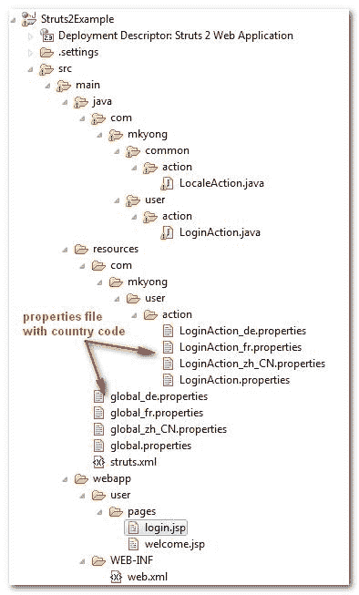

> 原文：<http://web.archive.org/web/20230101150211/http://www.mkyong.com/struts2/struts-2-i18n-or-localization-example/>

# struts 2–i18n 或本地化示例

一个 Struts 2 国际化(i18n)、本地化(i10n)或多语言示例，展示了资源包的使用，以显示来自不同语言的消息。在本例中，您将创建一个简单的登录屏幕，通过 Struts 2 UI 组件显示资源包中的消息，并根据所选的语言选项更改区域设置。

Download It – [Struts2-i18-localization-Example.zip](http://web.archive.org/web/20190214223348/http://www.mkyong.com/wp-content/uploads/2010/06/Struts2-i18-localization-Example.zip)

## 1.项目结构

本例的项目结构

 <ins class="adsbygoogle" style="display:block; text-align:center;" data-ad-format="fluid" data-ad-layout="in-article" data-ad-client="ca-pub-2836379775501347" data-ad-slot="6894224149">## 2.属性文件

确保属性文件被命名为国家指定代码。

In some “non-Europe” or “non-English” like characters, you should always encode the content with [native2ascii tool](http://web.archive.org/web/20190214223348/http://www.mkyong.com/java/java-convert-chinese-character-to-unicode-with-native2ascii/).

**global.properties**

```java
 #Global messages
global.username = Username
global.password = Password
global.submit = Submit 
```

**全球 _zh_CN.properties**

```java
 #Global messages
global.username = \u7528\u6237\u540d
global.password = \u5bc6\u7801
global.submit=\u63d0\u4ea4 
```

**全局 _fr .属性**

```java
 #Global messages
global.username = Nom d'utilisateur
global.password = Mot de passe
global.submit = Soumettre 
```

**global_de.properties**

```java
 #Global messages
global.username = Benutzername
global.password = Kennwort
global.submit = Einreichen 
```

Please read this [Struts 2 resource bundle example](http://web.archive.org/web/20190214223348/http://www.mkyong.com/struts2/struts-2-resource-bundle-example/) to understand how Struts 2 search the properties file automatically. <ins class="adsbygoogle" style="display:block" data-ad-client="ca-pub-2836379775501347" data-ad-slot="8821506761" data-ad-format="auto" data-ad-region="mkyongregion">## 3.行动

两个 action 类， **LocaleAction** 基本上什么都不做， **LoginAction** 会通过 **getText()** 做一个简单的验证并显示资源包的错误信息。

**local action . Java**

```java
 package com.mkyong.common.action;

import com.opensymphony.xwork2.ActionSupport;

public class LocaleAction extends ActionSupport{

	//business logic
	public String execute() {
		return "SUCCESS";
	}
} 
```

**LoginAction.java**

```java
 package com.mkyong.user.action;

import com.opensymphony.xwork2.ActionSupport;

public class LoginAction extends ActionSupport{

	private String username;
	private String password;

	//...getter and setter methods

	//business logic
	public String execute() {
		return "SUCCESS";
	}

	//simple validation
	public void validate(){
		if("".equals(getUsername())){
			addFieldError("username", getText("username.required"));
		}
		if("".equals(getPassword())){
			addFieldError("password", getText("password.required"));
		}
	}
} 
```

## 4.查看页面

带有文本框、密码和提交 UI 组件的登录页面。

To support Struts 2 localization, you HAVE TO declared the **<%@ page contentType=”text/html;charset=UTF-8″ %>** in your view page, else you will have problem to display the “UTF-8 data” correctly, especially the Chinese characters. Read this article about [Struts 2 Chinese localization issue](http://web.archive.org/web/20190214223348/http://www.mkyong.com/struts2/struts-2-chinese-localization-issue/ ).

**login.jsp**

```java
 <%@ page contentType="text/html;charset=UTF-8" %>
<%@ taglib prefix="s" uri="/struts-tags" %>
<html>
<head>
</head>

<body>
<h1>Struts 2 localization example</h1>

<s:form action="validateUser" namespace="/user">

	<s:textfield key="global.username" name="username" />
	<s:password key="global.password" name="password"/>	
	<s:submit key="global.submit" name="submit" />

</s:form>

<s:url id="localeEN" namespace="/" action="locale" >
   <s:param name="request_locale" >en</s:param>
</s:url>
<s:url id="localezhCN" namespace="/" action="locale" >
   <s:param name="request_locale" >zh_CN</s:param>
</s:url>
<s:url id="localeDE" namespace="/" action="locale" >
   <s:param name="request_locale" >de</s:param>
</s:url>
<s:url id="localeFR" namespace="/" action="locale" >
   <s:param name="request_locale" >fr</s:param>
</s:url>

<s:a href="%{localeEN}" >English</s:a>
<s:a href="%{localezhCN}" >Chinese</s:a>
<s:a href="%{localeDE}" >German</s:a>
<s:a href="%{localeFR}" >France</s:a>

</body>
</html> 
```

To change the default locale, you just need to declared a **“request_locale**” parameter, set your prefer language code and pass to an Action class. In Struts 2 the **com.opensymphony.xwork2.interceptor.I18nInterceptor** interceptor, which declared in the **struts-default.xml**, will hijack your Action class and handle the locale stuff accordingly.

## 5.是否显示资源包消息？

在 Struts 2 中，有许多方法可以根据所选的语言或地区显示资源包消息。举个例子，

```java
 <s:textfield key="global.username" name="username" />
<s:text name="global.username" />	
<s:property value="getText('global.username')" />
<s:text name="global.password" /> 
```

In Struts 1, there are one standard **bean:message** to display the resource bundle message, which is more prefer. But in Struts 2, there are so many equivalent ways to display the resource bundle message (even internal work is different), it’s quite confuse at the first glance. Basically, no matter what you choose, Struts 2 also will display the resource bundle message correctly.

## 6.struts.xml

Struts 2 配置文件，将它们链接在一起。

```java
 <?xml version="1.0" encoding="UTF-8" ?>
<!DOCTYPE struts PUBLIC
"-//Apache Software Foundation//DTD Struts Configuration 2.0//EN"
"http://struts.apache.org/dtds/struts-2.0.dtd">

<struts>

	<constant name="struts.custom.i18n.resources" value="global" />
 	<constant name="struts.devMode" value="true" />

	<package name="user" namespace="/user" extends="struts-default">
	   <action name="login">
		<result>pages/login.jsp</result>
	   </action>
	   <action name="validateUser" class="com.mkyong.user.action.LoginAction">
		<result name="SUCCESS">pages/welcome.jsp</result>
		<result name="input">pages/login.jsp</result>
	   </action>
	</package>

	<package name="default" namespace="/" extends="struts-default">
	   <action name="locale" class="com.mkyong.common.action.LocaleAction">
		<result name="SUCCESS">user/pages/login.jsp</result>
	   </action>
	</package>

</struts> 
```

## 7.演示

*http://localhost:8080/struts 2 example/user/log in . action
http://localhost:8080/struts 2 example/locale . action？request_locale=en*


*http://localhost:8080/struts 2 example/locale . action？request_locale=zh_CN*


*http://localhost:8080/struts 2 example/locale . action？request_locale=de*


*http://localhost:8080/struts 2 example/locale . action？request_locale=fr*


## 参考

1.  [http://struts.apache.org/2.1.8/docs/localization.html
    ](http://web.archive.org/web/20190214223348/http://struts.apache.org/2.1.8/docs/localization.html)
2.  [http://www . mkyong . com/Java/Java-convert-Chinese-character-to-unicode-with-native 2 ascii/](http://web.archive.org/web/20190214223348/http://www.mkyong.com/java/java-convert-chinese-character-to-unicode-with-native2ascii/)
3.  [http://www . mkyong . com/struts 2/struts-2-resource-bundle-example/](http://web.archive.org/web/20190214223348/http://www.mkyong.com/struts2/struts-2-resource-bundle-example/)
4.  [http://www . mkyong . com/struts/struts-国际化-or-本地化-example/](http://web.archive.org/web/20190214223348/http://www.mkyong.com/struts/struts-internationalizing-or-localization-example/)

[multiple languages](http://web.archive.org/web/20190214223348/http://www.mkyong.com/tag/multiple-languages/) [struts2](http://web.archive.org/web/20190214223348/http://www.mkyong.com/tag/struts2/)</ins></ins> (function (i,d,s,o,m,r,c,l,w,q,y,h,g) { var e=d.getElementById(r);if(e===null){ var t = d.createElement(o); t.src = g; t.id = r; t.setAttribute(m, s);t.async = 1;var n=d.getElementsByTagName(o)[0];n.parentNode.insertBefore(t, n); var dt=new Date().getTime(); try{i[l][w+y](h,i[l][q+y](h)+'&amp;'+dt);}catch(er){i[h]=dt;} } else if(typeof i[c]!=='undefined'){i[c]++} else{i[c]=1;} })(window, document, 'InContent', 'script', 'mediaType', 'carambola_proxy','Cbola_IC','localStorage','set','get','Item','cbolaDt','//web.archive.org/web/20190214223348/http://route.carambo.la/inimage/getlayer?pid=myky82&amp;did=112239&amp;wid=0')<input type="hidden" id="mkyong-postId" value="5797">

#### 关于作者


##### mkyong

Founder of [Mkyong.com](http://web.archive.org/web/20190214223348/http://mkyong.com/), love Java and open source stuff. Follow him on [Twitter](http://web.archive.org/web/20190214223348/https://twitter.com/mkyong), or befriend him on [Facebook](http://web.archive.org/web/20190214223348/http://www.facebook.com/java.tutorial) or [Google Plus](http://web.archive.org/web/20190214223348/https://plus.google.com/110948163568945735692?rel=author). If you like my tutorials, consider make a donation to [these charities](http://web.archive.org/web/20190214223348/http://www.mkyong.com/blog/donate-to-charity/).