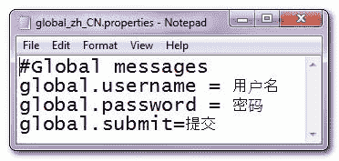
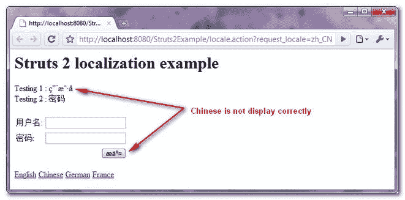
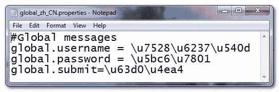
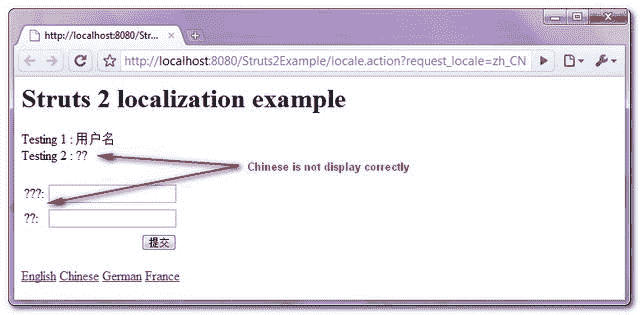
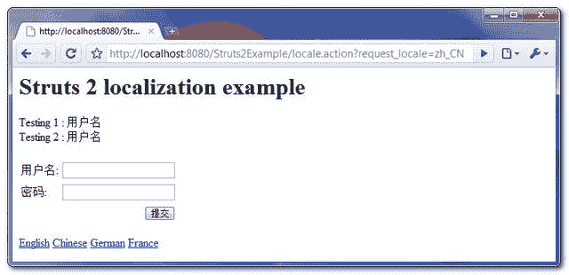

> 原文：<http://web.archive.org/web/20230101150211/http://www.mkyong.com/struts2/struts-2-chinese-localization-issue/>

# Struts 2 中文本地化问题

一个 Struts 2 i18n 显示中文字符的本地化问题…

## 案例 1:包含特殊字符的属性文件

一个属性文件以中文存储用户名、密码和提交信息。这个属性文件是以 UTF 8 格式创建的，但是内容不是用 native2ascii 编码的。



让我们尝试通过几个 UI 标签来显示中文字符。视图页面被声明为以带有 HTML meta 标签的 UTF-8 格式显示。

```java
 ...
<head>
<meta http-equiv="Content-Type" content="text/html; charset=UTF-8" />
</head>
...
<s:form action="validateUser">
	<s:textfield key="global.username" name="username"/>
	<s:password key="global.password" name="password"/>	
	<s:submit key="global.submit" name="submit" />

	<div>Testing 1 : <s:property value="getText('global.username')" /></div>
	<div>Testing 2 : <s:text name="global.password" /></div></br/>
</s:form>
...
<s:url id="localezhCN" namespace="/" action="locale" >
   <s:param name="request_locale" >zh_CN</s:param>
</s:url>
...
<s:a href="%{localezhCN}" >Chinese</s:a>
... 
```

**结果**



令人惊讶的是，下面三个 UI 标签能够正确显示中文消息，

```java
 <s:textfield key="global.username" name="username"/>
<s:password key="global.password" name="password"/>	
Testing 2 : <s:text name="global.password" /> 
```

但是“ **s:submit** ”和“ **getText()** ”都无法显示？

According to Java’s i18n documentation, to display a special character correctly with resource bundle, it must be precessed with the native2ascii tool.

在深入研究了 **TextProvider.getText()** 源代码后，它使用 resource bundle.getString()从资源包中检索消息，因此不正确的消息是合理的。但是为什么“ **s:text** ”、“ **s:textfield** ”和“ **s:password** ”能够正确显示中文信息，为什么“ **s:submit** ”会失败呢？我脑子里的问题太多了，让我们来看案例 2…

 <ins class="adsbygoogle" style="display:block; text-align:center;" data-ad-format="fluid" data-ad-layout="in-article" data-ad-client="ca-pub-2836379775501347" data-ad-slot="6894224149">## 案例 2:带有特殊字符的属性文件(编码)

这一次，使用 native2ascii 工具处理属性文件，并正确编码中文字符。



**结果**



结果完全相反，现在“ **s:submit** ”和“ **getText()** ”能够正确显示，但是其他 UI 组件都失败了。这是预期工作，因为 Struts 2 推荐 **getText()** 显示 i18n 或本地化消息。问题是，为什么“ **s:submit** 不一样？

 <ins class="adsbygoogle" style="display:block" data-ad-client="ca-pub-2836379775501347" data-ad-slot="8821506761" data-ad-format="auto" data-ad-region="mkyongregion">## 支柱 2..怎么了?

以下是我心中的一些疑问…

1.  为什么 s:submit 的表现如此不同？
2.  i18n 应该很简单，为什么 Struts 2 有这种问题？还是我误解了 Struts 2 i18n 的工作原理？
3.  为什么资源包中的消息有这么多显示方式？为什么不直接用一种方法分组呢？在 Struts 1 中，只使用“bean:message ”,为什么在 Struts 2 中看起来如此复杂？
4.  Struts 2 支持 XML 资源包吗？我只是不喜欢使用 native2ascii 工具将数据编码为 UTF 8 格式，这使得属性文件不可读。Apache Wicket 在这个问题上做得非常好，可能 Struts 2 应该借鉴一下。
5.  那么，如何在 Struts 2 中正确显示汉字呢？</ins> Many articles and tutorials are told that the following methods are able to display the message from resource bundle:

```java
 <s:text name="global.username"/>
<s:property value="getText('global.username')"/> 
```

但是，这仅适用于英语或一些“类似英语(欧洲)”的字符，例如法国、德国。但是对于中文或日文的“大方块”字符，两种方法将返回完全不同的输出。真的不知道如何将 Struts 2 本地化为中文和日文。

## 更新于…(2010 年 6 月 16 日)

从百度搜索引擎中挖掘解决方案，在其中一篇中文文章中找到了间接解决方案——[Struts 2 国际化实例](http://web.archive.org/web/20190601051037/http://hxzon00.blog.163.com/blog/static/10489241620088121449163/) 

## 解决办法

问题出在 HTML meta 标签上，

```java
 <head>
<meta http-equiv="Content-Type" content="text/html; charset=UTF-8" />
</head> 
```

In Struts 1, the above meta tag is required to display the UTF-8 data correctly, but this is not true for Struts 2.

在 Struts 2 中，meta 标签不再起作用，我们应该把 **< %@页面 content type = " text/html；charset = UTF-8 "%>**标签在查看页面的第一行。举个例子，

```java
 <%@ page contentType="text/html;charset=UTF-8" %>
<%@ taglib prefix="s" uri="/struts-tags" %>
<html>
<head>
</head>
... 
```

**结果**



所有的中文信息都显示正确。

## 对我之前问题的回答

1.  为什么 s:submit 的表现如此不同？答:对此不予置评
2.  i18n 应该很简单，为什么 Struts 2 有这种问题？还是我误解了 Struts 2 i18n 的工作原理？
    **答:一定要把 **< %@页 content type = " text/html；charset = UTF-8 "%>**"在查看页面的第一行。**
3.  为什么资源包中的消息有这么多显示方式？为什么不直接用一种方法分组呢？在 Struts 1 中，只使用“bean:message ”,为什么在 Struts 2 中看起来如此复杂？
    **A: s:text，key，getText()，name…，都能够正确渲染中文或 UTF 8 编码的数据，只要确保在视图页面中放入正确的“charset”即可。我仍然倾向于只使用一种方法来控制消息包(比如 Struts 1)，太多的等价选项只会让开发人员感到困惑。**
4.  Struts 2 支持 XML 资源包吗？我只是不喜欢使用 native2ascii 工具将数据编码为 UTF 8 格式，这使得属性文件不可读。Apache Wicket 在这个问题上做得非常好，可能 Struts 2 应该借鉴一下。
    **答:希望 Struts 2 能在下一个版本支持 XML 资源包。**
5.  那么，如何在 Struts 2 中正确显示汉字呢？
    **答:见上解。**

Download it – [Struts2-i18n-issue-Example](http://web.archive.org/web/20190601051037/http://www.mkyong.com/wp-content/uploads/2010/06/Struts2-i18n-issue-Example.zip)

## 参考

1.  [http://www . mkyong . com/Java/Java-convert-Chinese-character-to-unicode-with-native 2 ascii/](http://web.archive.org/web/20190601051037/http://www.mkyong.com/java/java-convert-chinese-character-to-unicode-with-native2ascii/)
2.  [http://forums.sun.com/thread.jspa?threadID=5185040](http://web.archive.org/web/20190601051037/http://forums.sun.com/thread.jspa?threadID=5185040)
3.  [http://www . mail-archive . com/user @ struts . Apache . org/msg 85490 . html](http://web.archive.org/web/20190601051037/http://www.mail-archive.com/user@struts.apache.org/msg85490.html)
4.  [http://www . code ranch . com/t/452139/Struts/application resources-properties-utf-characters # 2013 557](http://web.archive.org/web/20190601051037/http://www.coderanch.com/t/452139/Struts/applicationresources-properties-utf-characters#2013557)
5.  [http://struts.apache.org/2.1.8/docs/localization.html](http://web.archive.org/web/20190601051037/http://struts.apache.org/2.1.8/docs/localization.html)
6.  [http://hxzon 00 . blog . 163 . com/blog/static/10489241620088121449163/](http://web.archive.org/web/20190601051037/http://hxzon00.blog.163.com/blog/static/10489241620088121449163/)

[multiple languages](http://web.archive.org/web/20190601051037/https://www.mkyong.com/tag/multiple-languages/) [struts2](http://web.archive.org/web/20190601051037/https://www.mkyong.com/tag/struts2/)</ins> (function (i,d,s,o,m,r,c,l,w,q,y,h,g) { var e=d.getElementById(r);if(e===null){ var t = d.createElement(o); t.src = g; t.id = r; t.setAttribute(m, s);t.async = 1;var n=d.getElementsByTagName(o)[0];n.parentNode.insertBefore(t, n); var dt=new Date().getTime(); try{i[l][w+y](h,i[l][q+y](h)+'&amp;'+dt);}catch(er){i[h]=dt;} } else if(typeof i[c]!=='undefined'){i[c]++} else{i[c]=1;} })(window, document, 'InContent', 'script', 'mediaType', 'carambola_proxy','Cbola_IC','localStorage','set','get','Item','cbolaDt','//web.archive.org/web/20190601051037/https://route.carambo.la/inimage/getlayer?pid=myky82&amp;did=112239&amp;wid=0')<input type="hidden" id="mkyong-postId" value="5783">

#### 关于作者


##### mkyong

Founder of [Mkyong.com](http://web.archive.org/web/20190601051037/http://mkyong.com/), love Java and open source stuff. Follow him on [Twitter](http://web.archive.org/web/20190601051037/https://twitter.com/mkyong), or befriend him on [Facebook](http://web.archive.org/web/20190601051037/http://www.facebook.com/java.tutorial) or [Google Plus](http://web.archive.org/web/20190601051037/https://plus.google.com/110948163568945735692?rel=author). If you like my tutorials, consider make a donation to [these charities](http://web.archive.org/web/20190601051037/http://www.mkyong.com/blog/donate-to-charity/).