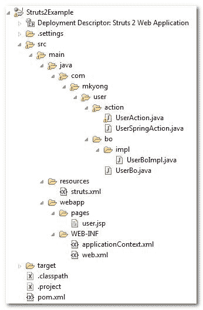

> 原文：<http://web.archive.org/web/20230101150211/http://www.mkyong.com/struts2/struts-2-spring-integration-example/>

# Struts 2 + Spring 集成示例

Download it – [Struts2-Spring-Integration-Example.zip](http://web.archive.org/web/20190718160929/http://www.mkyong.com/wp-content/uploads/2010/07/Struts2-Spring-Integration-Example.zip)

在本教程中，它展示了 Struts 2 和 Spring 之间的集成。

## 1.项目结构

这是本教程的项目文件夹结构。



## 2.Struts 2 + Spring 插件

要集成 Struts 2 和 Spring，获取并在项目类路径中包含"**Struts 2-Spring-plugin-XXX . jar**"库。

**pom.xml**

```
 <!-- Struts 2 -->
        <dependency>
                <groupId>org.apache.struts</groupId>
	        <artifactId>struts2-core</artifactId>
	        <version>2.1.8</version>
        </dependency>

	<!-- Spring framework --> 
	<dependency>
		<groupId>org.springframework</groupId>
		<artifactId>spring</artifactId>
		<version>2.5.6</version>
	</dependency>

	<dependency>
		<groupId>org.springframework</groupId>
		<artifactId>spring-web</artifactId>
		<version>2.5.6</version>
	</dependency>

	<!-- Struts 2 + Spring plugins -->
	<dependency>
                 <groupId>org.apache.struts</groupId>
	         <artifactId>struts2-spring-plugin</artifactId>
	         <version>2.1.8</version>
         </dependency> 
```

## 3.春天的听众

在 **web.xml** 文件中配置 Spring 监听器"**org . Spring framework . web . context . context loader listener**"。

**web.xml**

```
 <!DOCTYPE web-app PUBLIC
 "-//Sun Microsystems, Inc.//DTD Web Application 2.3//EN"
 "http://java.sun.com/dtd/web-app_2_3.dtd" >

<web-app>
  <display-name>Struts 2 Web Application</display-name>

  <filter>
	<filter-name>struts2</filter-name>
	<filter-class>
         org.apache.struts2.dispatcher.ng.filter.StrutsPrepareAndExecuteFilter
        </filter-class>
  </filter>

  <filter-mapping>
	<filter-name>struts2</filter-name>
	<url-pattern>/*</url-pattern>
  </filter-mapping>

  <listener>
    <listener-class>
      org.springframework.web.context.ContextLoaderListener
    </listener-class>
  </listener>

</web-app> 
```

## 3.注册春豆

在 **applicationContext.xml** 文件中注册所有 Spring 的 Beans，Spring 监听器将自动定位这个 xml 文件。

**applicationContext.xml**

```
 <beans 
xmlns:xsi="http://www.w3.org/2001/XMLSchema-instance"
xsi:schemaLocation="http://www.springframework.org/schema/beans
http://www.springframework.org/schema/beans/spring-beans-2.5.xsd">

	<bean id="userBo" class="com.mkyong.user.bo.impl.UserBoImpl" />

	<bean id="userSpringAction" class="com.mkyong.user.action.UserSpringAction">
		<property name="userBo" ref="userBo" />	
	</bean>

</beans> 
```

**UserBo.java**

```
 package com.mkyong.user.bo;

public interface UserBo{

	public void printUser();

} 
```

**UserBoImpl.java**

```
 package com.mkyong.user.bo.impl;

import com.mkyong.user.bo.UserBo;

public class UserBoImpl implements UserBo{

	public void printUser(){
		System.out.println("printUser() is executed...");
	}

} 
```

user springaction . Java

```
 package com.mkyong.user.action;

import com.mkyong.user.bo.UserBo;

public class UserSpringAction{

	//DI via Spring
	UserBo userBo;

	public UserBo getUserBo() {
		return userBo;
	}

	public void setUserBo(UserBo userBo) {
		this.userBo = userBo;
	}

	public String execute() throws Exception {

		userBo.printUser();
		return "success";

	}
} 
```

## 5.Struts.xml

在这里宣告了所有的关系。

```
 <?xml version="1.0" encoding="UTF-8" ?>
<!DOCTYPE struts PUBLIC
"-//Apache Software Foundation//DTD Struts Configuration 2.0//EN"
"http://struts.apache.org/dtds/struts-2.0.dtd">

<struts>
 	<constant name="struts.devMode" value="true" />

	<package name="default" namespace="/" extends="struts-default">

		<action name="userAction" 
			class="com.mkyong.user.action.UserAction" >
			<result name="success">pages/user.jsp</result>
		</action>

		<action name="userSpringAction" 
			class="userSpringAction" >
			<result name="success">pages/user.jsp</result>
		</action>

	</package>

</struts> 
```

## 6.演示

现在，所有 Struts 2 和 Spring 的集成工作都完成了，现在看下面的用例来访问 Spring 的"**userBo**bean。

*   案例 1:让 Spring 充当 Struts 2 操作类，并访问 Spring 的 bean。
*   案例 2:在 Struts 2 操作类中访问 Spring 的 bean。

## 案例 1

在这个例子中，**userpspringaction**作为 Struts 2 的 Action 类，你可以用普通的 Spring 方式来定义 Spring 的 **userBo** bean。

```
 //struts.xml
<action name="userSpringAction" 
	class="userSpringAction" >
	<result name="success">pages/user.jsp</result>
</action>

//applicationContext.xml
<bean id="userSpringAction" class="com.mkyong.user.action.UserSpringAction">
	<property name="userBo" ref="userBo" />	
</bean> 
```

要访问此操作，请使用以下 URL:*http://localhost:8080/struts 2 example/userpspringaction*

## 案例 2

默认情况下，Spring listener 通过匹配 bean 名称来启用**自动连接。因此，它会通过 **setUserBo()** 自动将 Spring 的“**userBo**”bean 传递给 UserAction。见下面 Struts 2 的动作:**

The Spring’s autowiring feature can change to **name**(default), **type**, **auto** or **constructor**, you may need to consult this [Struts 2 Spring plugin documentation](http://web.archive.org/web/20190718160929/http://struts.apache.org/2.x/docs/spring-plugin.html).

user action . Java

```
 package com.mkyong.user.action;

import com.mkyong.user.bo.UserBo;
import com.opensymphony.xwork2.ActionSupport;

public class UserAction extends ActionSupport{

	//DI via Spring
	UserBo userBo;

	public UserBo getUserBo() {
		return userBo;
	}

	public void setUserBo(UserBo userBo) {
		this.userBo = userBo;
	}

	public String execute() throws Exception {

		userBo.printUser();
		return SUCCESS;

	}
} 
```

要访问此操作，请使用 URL:*http://localhost:8080/struts 2 example/user action*

**WebApplicationContextUtils**
Alternatively, you can use the Spring’s generic **WebApplicationContextUtils** class to get the Spring’s bean directly.

```
 package com.mkyong.user.action;

import org.apache.struts2.ServletActionContext;
import org.springframework.web.context.WebApplicationContext;
import org.springframework.web.context.support.WebApplicationContextUtils;

import com.mkyong.user.bo.UserBo;
import com.opensymphony.xwork2.ActionSupport;

public class UserAction extends ActionSupport{

	public String execute() throws Exception {

		WebApplicationContext context =
			WebApplicationContextUtils.getRequiredWebApplicationContext(
                                    ServletActionContext.getServletContext()
                        );

		UserBo userBo1 = (UserBo)context.getBean("userBo");
		userBo1.printUser();

		return SUCCESS;

	}
} 
```

一篇非常冗长乏味的文章，请确保下载完整的项目源代码进行练习。

## 参考

1.  [Struts 2 Spring 插件文档](http://web.archive.org/web/20190718160929/http://struts.apache.org/2.x/docs/spring-plugin.html)
2.  [Struts + Spring 集成示例](http://web.archive.org/web/20190718160929/http://www.mkyong.com/struts/struts-spring-integration-example/)

[integration](http://web.archive.org/web/20190718160929/https://www.mkyong.com/tag/integration/) [spring](http://web.archive.org/web/20190718160929/https://www.mkyong.com/tag/spring/) [struts2](http://web.archive.org/web/20190718160929/https://www.mkyong.com/tag/struts2/)<input type="hidden" id="mkyong-postId" value="6285">

#### 关于作者


##### mkyong

Founder of [Mkyong.com](http://web.archive.org/web/20190718160929/http://mkyong.com/), love Java and open source stuff. Follow him on [Twitter](http://web.archive.org/web/20190718160929/https://twitter.com/mkyong). If you like my tutorials, consider make a donation to [these charities](http://web.archive.org/web/20190718160929/http://www.mkyong.com/blog/donate-to-charity/).