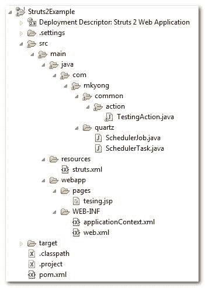

> 原文：<http://web.archive.org/web/20230101150211/http://www.mkyong.com/struts2/struts-2-spring-quartz-scheduler-integration-example/>

# Struts 2 + Spring 2.5.6 + Quartz 1.6 调度器集成示例

Struts 2 + Spring 2.5.6 + Quartz 调度器集成示例

在本教程中，我们将向您展示如何将**Struts 2+Spring 2 . 5 . 6+Quartz 1 . 6 . 5**调度器集成在一起。这种关系看起来像这样:

```java
 Struts 2 <-- Plugin --> Spring <--(Helper)--> Quartz <---> Scheduler task 
```

使用的工具

1.  弹簧 2.5.6
2.  石英
3.  Struts 2.1.8
4.  支柱 2-弹簧-插件 2.1.8
5.  Maven 2
6.  Eclipse 3.6

**Note**
You may also interest at this – [Struts 2 + Spring 3 + Quartz 1.8.6 integration example.](http://web.archive.org/web/20190306163448/http://www.mkyong.com/struts2/struts-2-spring-3-quartz-1-8-scheduler-example/).

## 1.项目文件夹

这是项目文件夹结构。

 <ins class="adsbygoogle" style="display:block; text-align:center;" data-ad-format="fluid" data-ad-layout="in-article" data-ad-client="ca-pub-2836379775501347" data-ad-slot="6894224149">## 2.依赖库

获取所有的依赖库，你需要 Spring，Struts2，struts 2-Spring-Plugin 和 Quartz jar 文件。

*文件:pom.xml*

```java
 ...
  <dependencies>

	<!-- Struts 2 -->
	<dependency>
          <groupId>org.apache.struts</groupId>
	  <artifactId>struts2-core</artifactId>
	  <version>2.1.8</version>
        </dependency>

	<!-- Quartz framework -->
	<dependency>
          <groupId>opensymphony</groupId>
	  <artifactId>quartz</artifactId>
	  <version>1.6.3</version>
	</dependency>

	<!-- Quartz dependency library-->
	<dependency>
	  <groupId>commons-collections</groupId>
	  <artifactId>commons-collections</artifactId>
	  <version>3.2.1</version>
	</dependency>

	<!-- Spring framework --> 
	<dependency>
	  <groupId>org.springframework</groupId>
	  <artifactId>spring</artifactId>
	  <version>2.5.6</version>
	</dependency>

	<dependency>
	  <groupId>org.springframework</groupId>
	  <artifactId>spring-web</artifactId>
	  <version>2.5.6</version>
	</dependency>

	<!-- Struts 2 + Spring plugins -->
	<dependency>
          <groupId>org.apache.struts</groupId>
	  <artifactId>struts2-spring-plugin</artifactId>
	  <version>2.1.8</version>
        </dependency>

  </dependencies>
  ... 
```

 <ins class="adsbygoogle" style="display:block" data-ad-client="ca-pub-2836379775501347" data-ad-slot="8821506761" data-ad-format="auto" data-ad-region="mkyongregion">## 3.调度程序任务

将所有调度程序逻辑放在这个类中。

*文件:SchedulerTask.java*

```java
 package com.mkyong.quartz;

public class SchedulerTask {

   public void printSchedulerMessage() {

	   System.out.println("Struts 2 + Spring + Quartz ......");

   }
} 
```

## 4.弹簧+石英

要集成 Spring 和 Quartz，创建一个扩展`org.springframework.scheduling.quartz.QuartzJobBean`的类，通过 setter 方法引用调度器任务(【SchedulerTask.java】)并将调度器逻辑放在`executeInternal()`方法中。

*文件:SchedulerJob.java*

```java
 package com.mkyong.quartz;

import org.quartz.JobExecutionContext;
import org.quartz.JobExecutionException;
import org.springframework.scheduling.quartz.QuartzJobBean;

public class SchedulerJob extends QuartzJobBean
{
	private SchedulerTask schedulerTask;

	public void setSchedulerTask(SchedulerTask schedulerTask) {
		this.schedulerTask = schedulerTask;
	}

	protected void executeInternal(JobExecutionContext context)
	throws JobExecutionException {

		schedulerTask.printSchedulerMessage();

	}
} 
```

*文件:application context . XML*——创建一个`applicationContext.xml`文件，把所有 **Spring + Quartz** 集成的东西放在里面。有关详细信息，请阅读 XML 注释。

```java
 <beans 
xmlns:xsi="http://www.w3.org/2001/XMLSchema-instance"
xsi:schemaLocation="http://www.springframework.org/schema/beans
http://www.springframework.org/schema/beans/spring-beans-2.5.xsd">

   <!-- Scheduler task -->
   <bean name="schedulerTask" class="com.mkyong.quartz.SchedulerTask" />

   <!-- Scheduler job -->
   <bean name="schedulerJob" 
     class="org.springframework.scheduling.quartz.JobDetailBean">

     <property name="jobClass" value="com.mkyong.quartz.SchedulerJob" />

     <property name="jobDataAsMap">
	 <map>
	    <entry key="schedulerTask" value-ref="schedulerTask" />
	 </map>
      </property>
   </bean>

   <!-- Cron Trigger, run every 10 seconds -->
   <bean id="cronTrigger"
	class="org.springframework.scheduling.quartz.CronTriggerBean">

	<property name="jobDetail" ref="schedulerJob" />
	<property name="cronExpression" value="0/10 * * * * ?" />

   </bean>

   <!-- Scheduler -->
   <bean class="org.springframework.scheduling.quartz.SchedulerFactoryBean">
	<property name="jobDetails">
	   <list>
	      <ref bean="schedulerJob" />
	   </list>
	</property>

	<property name="triggers">
	    <list>
		<ref bean="cronTrigger" />
	    </list>
	</property>
   </bean>

</beans> 
```

## 5.支柱 2 +弹簧

要集成 **Struts 2 + Spring** ，只需将`org.springframework.web.context.ContextLoaderListener`监听器类放在`web.xml`文件中。

*文件:web.xml*

```java
 <!DOCTYPE web-app PUBLIC
 "-//Sun Microsystems, Inc.//DTD Web Application 2.3//EN"
 "http://java.sun.com/dtd/web-app_2_3.dtd" >

<web-app>
  <display-name>Struts 2 Web Application</display-name>

  <filter>
	<filter-name>struts2</filter-name>
	<filter-class>
	  org.apache.struts2.dispatcher.ng.filter.StrutsPrepareAndExecuteFilter
	</filter-class>
  </filter>

  <filter-mapping>
	<filter-name>struts2</filter-name>
	<url-pattern>/*</url-pattern>
  </filter-mapping>

  <listener>
    <listener-class>
	  org.springframework.web.context.ContextLoaderListener
	</listener-class>
  </listener>

</web-app> 
```

## 6.演示

启动 Strut2 时，它调用 Spring 并运行定义的 Quartz 的作业——每 10 秒调用`SchedulerTask.printSchedulerMessage()`。

```java
 INFO: ... initialized Struts-Spring integration successfully
16 Julai 2010 12:51:38 PM org.apache.coyote.http11.Http11Protocol start
INFO: Starting Coyote HTTP/1.1 on http-8080
16 Julai 2010 12:51:38 PM org.apache.jk.common.ChannelSocket init
INFO: JK: ajp13 listening on /0.0.0.0:8009
16 Julai 2010 12:51:38 PM org.apache.jk.server.JkMain start
INFO: Jk running ID=0 time=0/21  config=null
16 Julai 2010 12:51:38 PM org.apache.catalina.startup.Catalina start
INFO: Server startup in 2110 ms
Struts 2 + Spring + Quartz ......
Struts 2 + Spring + Quartz ......
Struts 2 + Spring + Quartz ......
Struts 2 + Spring + Quartz ......
Struts 2 + Spring + Quartz ...... 
```

## 下载源代码

Download it – [Struts2-Spring-Quartz-Integration-Example.zip](http://web.archive.org/web/20190306163448/http://www.mkyong.com/wp-content/uploads/2010/07/Struts2-Spring-Quartz-Integration-Example.zip)

## 参考

1.  [Struts 2 + Spring 集成示例](http://web.archive.org/web/20190306163448/http://www.mkyong.com/struts2/struts-2-spring-integration-example/)
2.  [Struts 2 Spring 插件文档](http://web.archive.org/web/20190306163448/http://struts.apache.org/2.x/docs/spring-plugin.html)
3.  [Struts + Spring 集成示例](http://web.archive.org/web/20190306163448/http://www.mkyong.com/struts/struts-spring-integration-example/)
4.  [Struts + Quartz 集成示例](http://web.archive.org/web/20190306163448/http://www.mkyong.com/struts/struts-quartz-scheduler-integration-example/)
5.  [支柱+弹簧+石英集成示例](http://web.archive.org/web/20190306163448/http://www.mkyong.com/struts/struts-spring-quartz-scheduler-integration-example/)

[integration](http://web.archive.org/web/20190306163448/http://www.mkyong.com/tag/integration/) [quartz](http://web.archive.org/web/20190306163448/http://www.mkyong.com/tag/quartz/) [scheduler](http://web.archive.org/web/20190306163448/http://www.mkyong.com/tag/scheduler/) [spring](http://web.archive.org/web/20190306163448/http://www.mkyong.com/tag/spring/) [struts2](http://web.archive.org/web/20190306163448/http://www.mkyong.com/tag/struts2/)</ins></ins> (function (i,d,s,o,m,r,c,l,w,q,y,h,g) { var e=d.getElementById(r);if(e===null){ var t = d.createElement(o); t.src = g; t.id = r; t.setAttribute(m, s);t.async = 1;var n=d.getElementsByTagName(o)[0];n.parentNode.insertBefore(t, n); var dt=new Date().getTime(); try{i[l][w+y](h,i[l][q+y](h)+'&amp;'+dt);}catch(er){i[h]=dt;} } else if(typeof i[c]!=='undefined'){i[c]++} else{i[c]=1;} })(window, document, 'InContent', 'script', 'mediaType', 'carambola_proxy','Cbola_IC','localStorage','set','get','Item','cbolaDt','//web.archive.org/web/20190306163448/http://route.carambo.la/inimage/getlayer?pid=myky82&amp;did=112239&amp;wid=0')<input type="hidden" id="mkyong-postId" value="6292">

#### 关于作者


##### mkyong

Founder of [Mkyong.com](http://web.archive.org/web/20190306163448/http://mkyong.com/), love Java and open source stuff. Follow him on [Twitter](http://web.archive.org/web/20190306163448/https://twitter.com/mkyong), or befriend him on [Facebook](http://web.archive.org/web/20190306163448/http://www.facebook.com/java.tutorial) or [Google Plus](http://web.archive.org/web/20190306163448/https://plus.google.com/110948163568945735692?rel=author). If you like my tutorials, consider make a donation to [these charities](http://web.archive.org/web/20190306163448/http://www.mkyong.com/blog/donate-to-charity/).