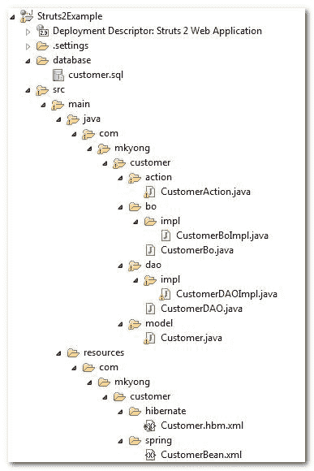
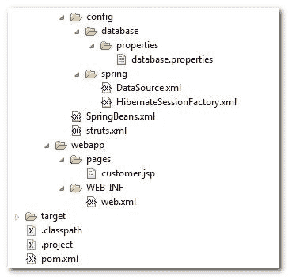
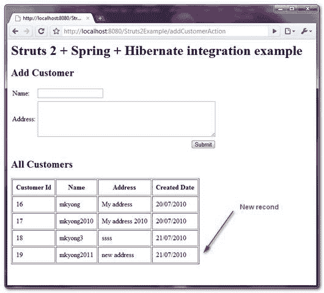

> 原文：<http://web.archive.org/web/20230101150211/http://www.mkyong.com/struts2/struts-2-spring-hibernate-integration-example/>

# Struts 2 + Spring + Hibernate 集成示例

Download it – [Struts2-Spring-Hibernate-Integration-Example.zip](http://web.archive.org/web/20190225100357/http://www.mkyong.com/wp-content/uploads/2010/07/Struts2-Spring-Hibernate-Integration-Example.zip)

在本教程中，展示了“ **Struts2 + Spring + Hibernate** 之间的集成。在继续之前，请务必检查以下教程。

1.  [Struts 2 + Hibernate 集成示例](http://web.archive.org/web/20190225100357/http://www.mkyong.com/struts2/struts-2-hibernate-integration-example/)
2.  [Struts 2 + Spring 集成示例](http://web.archive.org/web/20190225100357/http://www.mkyong.com/struts2/struts-2-spring-integration-example/)
3.  [Struts 1.x + Spring + Hibernate 集成示例](http://web.archive.org/web/20190225100357/http://www.mkyong.com/struts/struts-spring-hibernate-integration-example/)

查看集成步骤摘要:

1.  获取所有的依赖库(很多)。
2.  注册弹簧的 **ContextLoaderListener** 以整合支柱 2 和弹簧。
3.  使用 Spring 的 **LocalSessionFactoryBean** 来集成 Spring 和 Hibernate。
4.  完成，全部连接。

查看关系:

```java
 Struts 2 <-- (ContextLoaderListener) --> Spring <-- (LocalSessionFactoryBean) --> Hibernate 
```

This will be a very long tutorial with little explanation, make sure you check the above 3 articles for details explanation.

## 教程开始…

它将创建一个客户页面，添加客户和列出客户功能。前端使用 **Struts 2** 进行显示， **Spring** 作为依赖注入引擎， **Hibernate** 进行数据库操作。让我们开始…

 <ins class="adsbygoogle" style="display:block; text-align:center;" data-ad-format="fluid" data-ad-layout="in-article" data-ad-client="ca-pub-2836379775501347" data-ad-slot="6894224149">## 1.项目结构

项目文件夹结构。

 <ins class="adsbygoogle" style="display:block" data-ad-client="ca-pub-2836379775501347" data-ad-slot="8821506761" data-ad-format="auto" data-ad-region="mkyongregion">## 2.MySQL 表脚本

客户的表脚本。

```java
 DROP TABLE IF EXISTS `mkyong`.`customer`;
CREATE TABLE  `mkyong`.`customer` (
  `CUSTOMER_ID` bigint(20) unsigned NOT NULL AUTO_INCREMENT,
  `NAME` varchar(45) NOT NULL,
  `ADDRESS` varchar(255) NOT NULL,
  `CREATED_DATE` datetime NOT NULL,
  PRIMARY KEY (`CUSTOMER_ID`)
) ENGINE=InnoDB AUTO_INCREMENT=17 DEFAULT CHARSET=utf8; 
```

## 3.依赖库

本教程需要许多依赖库。

**支柱 2…**

```java
 <!-- Struts 2 -->
        <dependency>
	    <groupId>org.apache.struts</groupId>
	    <artifactId>struts2-core</artifactId>
	    <version>2.1.8</version>
        </dependency>
	<!-- Struts 2 + Spring plugins -->
	<dependency>
            <groupId>org.apache.struts</groupId>
	    <artifactId>struts2-spring-plugin</artifactId>
	    <version>2.1.8</version>
        </dependency> 
```

**MySQL…**

```java
 <!-- MySQL database driver -->
	<dependency>
		<groupId>mysql</groupId>
		<artifactId>mysql-connector-java</artifactId>
		<version>5.1.9</version>
	</dependency> 
```

**春天……**

```java
 <!-- Spring framework --> 
	<dependency>
		<groupId>org.springframework</groupId>
		<artifactId>spring</artifactId>
		<version>2.5.6</version>
	</dependency>
	<dependency>
		<groupId>org.springframework</groupId>
		<artifactId>spring-web</artifactId>
		<version>2.5.6</version>
	</dependency> 
```

**冬眠…**

```java
 <!-- Hibernate core -->
	<dependency>
		<groupId>org.hibernate</groupId>
		<artifactId>hibernate</artifactId>
		<version>3.2.7.ga</version>
	</dependency>

	<!-- Hibernate core library dependency start -->
	<dependency>
		<groupId>dom4j</groupId>
		<artifactId>dom4j</artifactId>
		<version>1.6.1</version>
	</dependency>

	<dependency>
		<groupId>commons-logging</groupId>
		<artifactId>commons-logging</artifactId>
		<version>1.1.1</version>
	</dependency>

	<dependency>
		<groupId>commons-collections</groupId>
		<artifactId>commons-collections</artifactId>
		<version>3.2.1</version>
	</dependency>

	<dependency>
		<groupId>cglib</groupId>
		<artifactId>cglib</artifactId>
		<version>2.2</version>
	</dependency>
	<!-- Hibernate core library dependency end -->

	<!-- Hibernate query library dependency start -->
	<dependency>
		<groupId>antlr</groupId>
		<artifactId>antlr</artifactId>
		<version>2.7.7</version>
	</dependency>
	<!-- Hibernate query library dependency end --> 
```

## 4.冬眠…

只需要模型和映射文件，因为 Spring 将处理 Hibernate 配置。

**Customer.java**–为客户表创建一个类。

```java
 package com.mkyong.customer.model;

import java.util.Date;

public class Customer implements java.io.Serializable {

	private Long customerId;
	private String name;
	private String address;
	private Date createdDate;

	//getter and setter methods
} 
```

**customer . hbm . XML**–客户的 Hibernate 映射文件。

```java
 <?xml version="1.0"?>
<!DOCTYPE hibernate-mapping PUBLIC "-//Hibernate/Hibernate Mapping DTD 3.0//EN"
"http://hibernate.sourceforge.net/hibernate-mapping-3.0.dtd">
<!-- Generated 20 Julai 2010 11:40:18 AM by Hibernate Tools 3.2.5.Beta -->
<hibernate-mapping>
    <class name="com.mkyong.customer.model.Customer" 
		table="customer" catalog="mkyong">
        <id name="customerId" type="java.lang.Long">
            <column name="CUSTOMER_ID" />
            <generator class="identity" />
        </id>
        <property name="name" type="string">
            <column name="NAME" length="45" not-null="true" />
        </property>
        <property name="address" type="string">
            <column name="ADDRESS" not-null="true" />
        </property>
        <property name="createdDate" type="timestamp">
            <column name="CREATED_DATE" length="19" not-null="true" />
        </property>
    </class>
</hibernate-mapping> 
```

## 5.Struts 2…

实现 Bo 和 DAO 设计模式。Spring 将在 Spring bean 配置文件中 DI 所有的 Bo 和 DAO。在 DAO 中，make 它扩展 Spring 的 **HibernateDaoSupport** 来集成 Spring 和 Hibernate 的集成。

**CustomerBo.java**

```java
 package com.mkyong.customer.bo;

import java.util.List;
import com.mkyong.customer.model.Customer;

public interface CustomerBo{

	void addCustomer(Customer customer);
	List<Customer> listCustomer();

} 
```

**CustomerBoImpl.java**

```java
 package com.mkyong.customer.bo.impl;

import java.util.List;
import com.mkyong.customer.bo.CustomerBo;
import com.mkyong.customer.dao.CustomerDAO;
import com.mkyong.customer.model.Customer;

public class CustomerBoImpl implements CustomerBo{

	CustomerDAO customerDAO;
	//DI via Spring
	public void setCustomerDAO(CustomerDAO customerDAO) {
		this.customerDAO = customerDAO;
	}

	//call DAO to save customer
	public void addCustomer(Customer customer){
		customerDAO.addCustomer(customer);
	}

	//call DAO to return customers
	public List<Customer> listCustomer(){
		return customerDAO.listCustomer();
	}
} 
```

**CustomerDAO.java**

```java
 package com.mkyong.customer.dao;

import java.util.List;
import com.mkyong.customer.model.Customer;

public interface CustomerDAO{

	void addCustomer(Customer customer);
	List<Customer> listCustomer();	

} 
```

**CustomerDAOImpl.java**

```java
 package com.mkyong.customer.dao.impl;

import java.util.List;
import org.springframework.orm.hibernate3.support.HibernateDaoSupport;
import com.mkyong.customer.dao.CustomerDAO;
import com.mkyong.customer.model.Customer;

public class CustomerDAOImpl extends HibernateDaoSupport 
    implements CustomerDAO{

	//add the customer
	public void addCustomer(Customer customer){
		getHibernateTemplate().save(customer);
	}

	//return all the customers in list
	public List<Customer> listCustomer(){
		return getHibernateTemplate().find("from Customer");		
	}

} 
```

**CustomerAction.java**–支柱 2 动作不再需要伸出**动作支架**，弹簧会处理它。

```java
 package com.mkyong.customer.action;

import java.util.ArrayList;
import java.util.Date;
import java.util.List;

import com.mkyong.customer.bo.CustomerBo;
import com.mkyong.customer.model.Customer;
import com.opensymphony.xwork2.ModelDriven;

public class CustomerAction implements ModelDriven{

	Customer customer = new Customer();
	List<Customer> customerList = new ArrayList<Customer>();

	CustomerBo customerBo;
	//DI via Spring
	public void setCustomerBo(CustomerBo customerBo) {
		this.customerBo = customerBo;
	}

	public Object getModel() {
		return customer;
	}

	public List<Customer> getCustomerList() {
		return customerList;
	}

	public void setCustomerList(List<Customer> customerList) {
		this.customerList = customerList;
	}

	//save customer
	public String addCustomer() throws Exception{

		//save it
		customer.setCreatedDate(new Date());
		customerBo.addCustomer(customer);

		//reload the customer list
		customerList = null;
		customerList = customerBo.listCustomer();

		return "success";

	}

	//list all customers
	public String listCustomer() throws Exception{

		customerList = customerBo.listCustomer();

		return "success";

	}

} 
```

## 6.春天…

几乎所有的配置都是在这里完成的，毕竟 Spring 是专门做集成工作的:)。

**customer bean . XML**–声明春天的豆子:Action、BO、DAO。

```java
 <?xml version="1.0" encoding="UTF-8"?>
<beans 
	xmlns:xsi="http://www.w3.org/2001/XMLSchema-instance"
	xsi:schemaLocation="http://www.springframework.org/schema/beans 
	http://www.springframework.org/schema/beans/spring-beans-2.5.xsd">

 	<bean id="customerAction" class="com.mkyong.customer.action.CustomerAction">
		<property name="customerBo" ref="customerBo" />	
	</bean>

	<bean id="customerBo" class="com.mkyong.customer.bo.impl.CustomerBoImpl" >
		<property name="customerDAO" ref="customerDAO" />
	</bean>

   	<bean id="customerDAO" class="com.mkyong.customer.dao.impl.CustomerDAOImpl" >
		<property name="sessionFactory" ref="sessionFactory" />
	</bean>

</beans> 
```

**database . properties**–声明数据库细节。

```java
 jdbc.driverClassName=com.mysql.jdbc.Driver
jdbc.url=jdbc:mysql://localhost:3306/mkyong
jdbc.username=root
jdbc.password=password 
```

**data source . XML**–创建一个数据源 bean。

```java
 <beans 
xmlns:xsi="http://www.w3.org/2001/XMLSchema-instance"
xsi:schemaLocation="http://www.springframework.org/schema/beans
http://www.springframework.org/schema/beans/spring-beans-2.5.xsd">

 <bean 
   class="org.springframework.beans.factory.config.PropertyPlaceholderConfigurer">
   <property name="location">
     <value>WEB-INF/classes/config/database/properties/database.properties</value>
   </property>
</bean>

  <bean id="dataSource" 
         class="org.springframework.jdbc.datasource.DriverManagerDataSource">
	<property name="driverClassName" value="${jdbc.driverClassName}" />
	<property name="url" value="${jdbc.url}" />
	<property name="username" value="${jdbc.username}" />
	<property name="password" value="${jdbc.password}" />
  </bean>

</beans> 
```

**hibernatesessionfactory . XML**–创建一个 **sessionFactory** bean 来集成 Spring 和 Hibernate。

```java
 <?xml version="1.0" encoding="UTF-8"?>
<beans 
xmlns:xsi="http://www.w3.org/2001/XMLSchema-instance"
xsi:schemaLocation="http://www.springframework.org/schema/beans
http://www.springframework.org/schema/beans/spring-beans-2.5.xsd">

<!-- Hibernate session factory -->
<bean id="sessionFactory" 
    class="org.springframework.orm.hibernate3.LocalSessionFactoryBean">

    <property name="dataSource">
      <ref bean="dataSource"/>
    </property>

    <property name="hibernateProperties">
       <props>
         <prop key="hibernate.dialect">org.hibernate.dialect.MySQLDialect</prop>
         <prop key="hibernate.show_sql">true</prop>
       </props>
    </property>

    <property name="mappingResources">
		<list>
          <value>com/mkyong/customer/hibernate/Customer.hbm.xml</value>
		</list>
    </property>	

</bean>
</beans> 
```

**Spring beans . XML**–创建一个核心 Spring 的 bean 配置文件，作为中心 bean 管理。

```java
 <beans 
xmlns:xsi="http://www.w3.org/2001/XMLSchema-instance"
xsi:schemaLocation="http://www.springframework.org/schema/beans
http://www.springframework.org/schema/beans/spring-beans-2.5.xsd">

	<!-- Database Configuration -->
	<import resource="config/spring/DataSource.xml"/>
	<import resource="config/spring/HibernateSessionFactory.xml"/>

	<!-- Beans Declaration -->
	<import resource="com/mkyong/customer/spring/CustomerBean.xml"/>

</beans> 
```

## 7.JSP 页面

显示带有 Struts 2 标记的元素的 JSP 页面。

**customer.jsp**

```java
 <%@ taglib prefix="s" uri="/struts-tags" %>
<html>
<head>
</head>

<body>
<h1>Struts 2 + Spring + Hibernate integration example</h1>

<h2>Add Customer</h2>
<s:form action="addCustomerAction" >
  <s:textfield name="name" label="Name" value="" />
  <s:textarea name="address" label="Address" value="" cols="50" rows="5" />
  <s:submit />
</s:form>

<h2>All Customers</h2>

<s:if test="customerList.size() > 0">
<table border="1px" cellpadding="8px">
	<tr>
		<th>Customer Id</th>
		<th>Name</th>
		<th>Address</th>
		<th>Created Date</th>
	</tr>
	<s:iterator value="customerList" status="userStatus">
		<tr>
			<td><s:property value="customerId" /></td>
			<td><s:property value="name" /></td>
			<td><s:property value="address" /></td>
			<td><s:date name="createdDate" format="dd/MM/yyyy" /></td>
		</tr>
	</s:iterator>
</table>
</s:if>
<br/>
<br/>

</body>
</html> 
```

## 8.struts.xml

全部链接起来~

```java
 <?xml version="1.0" encoding="UTF-8" ?>
<!DOCTYPE struts PUBLIC
"-//Apache Software Foundation//DTD Struts Configuration 2.0//EN"
"http://struts.apache.org/dtds/struts-2.0.dtd">

<struts>
 	<constant name="struts.devMode" value="true" />

	<package name="default" namespace="/" extends="struts-default">

		<action name="addCustomerAction" 
			class="customerAction" method="addCustomer" >
		    <result name="success">pages/customer.jsp</result>
		</action>

		<action name="listCustomerAction"
			class="customerAction" method="listCustomer" >
		    <result name="success">pages/customer.jsp</result>
		</action>

	</package>

</struts> 
```

## 9.支柱 2 +弹簧

要集成 Struts 2 和 Spring，只需注册 **ContextLoaderListener** 监听器类，定义一个“ **contextConfigLocation** 参数，让 Spring container 解析“ **SpringBeans.xml** ”而不是默认的“ **applicationContext.xml** ”。

**web.xml**

```java
 <!DOCTYPE web-app PUBLIC
 "-//Sun Microsystems, Inc.//DTD Web Application 2.3//EN"
 "http://java.sun.com/dtd/web-app_2_3.dtd" >

<web-app>
  <display-name>Struts 2 Web Application</display-name>

  <filter>
	<filter-name>struts2</filter-name>
	<filter-class>
	  org.apache.struts2.dispatcher.ng.filter.StrutsPrepareAndExecuteFilter
	</filter-class>
  </filter>

  <filter-mapping>
	<filter-name>struts2</filter-name>
	<url-pattern>/*</url-pattern>
  </filter-mapping>

  <context-param>
	<param-name>contextConfigLocation</param-name>
	<param-value>/WEB-INF/classes/SpringBeans.xml</param-value>
  </context-param>

  <listener>
    <listener-class>
      org.springframework.web.context.ContextLoaderListener
    </listener-class>
  </listener>

</web-app> 
```

## 10.演示

测试一下:*http://localhost:8080/struts 2 example/listcustomeraction . action*



## 参考

1.  [Struts 2 + Hibernate 集成示例](http://web.archive.org/web/20190225100357/http://www.mkyong.com/struts2/struts-2-hibernate-integration-example/)
2.  [Struts 2 + Spring 集成示例](http://web.archive.org/web/20190225100357/http://www.mkyong.com/struts2/struts-2-spring-integration-example/)
3.  [带有完整 Hibernate 插件的 Struts 2 + Hibernate 示例](http://web.archive.org/web/20190225100357/http://www.mkyong.com/struts2/struts-2-hibernate-integration-with-full-hibernate-plugin/)
4.  [Struts 1.x + Spring + Hibernate 集成示例](http://web.archive.org/web/20190225100357/http://www.mkyong.com/struts/struts-spring-hibernate-integration-example/)

[hibernate](http://web.archive.org/web/20190225100357/http://www.mkyong.com/tag/hibernate/) [integration](http://web.archive.org/web/20190225100357/http://www.mkyong.com/tag/integration/) [spring](http://web.archive.org/web/20190225100357/http://www.mkyong.com/tag/spring/) [struts2](http://web.archive.org/web/20190225100357/http://www.mkyong.com/tag/struts2/)</ins></ins> (function (i,d,s,o,m,r,c,l,w,q,y,h,g) { var e=d.getElementById(r);if(e===null){ var t = d.createElement(o); t.src = g; t.id = r; t.setAttribute(m, s);t.async = 1;var n=d.getElementsByTagName(o)[0];n.parentNode.insertBefore(t, n); var dt=new Date().getTime(); try{i[l][w+y](h,i[l][q+y](h)+'&amp;'+dt);}catch(er){i[h]=dt;} } else if(typeof i[c]!=='undefined'){i[c]++} else{i[c]=1;} })(window, document, 'InContent', 'script', 'mediaType', 'carambola_proxy','Cbola_IC','localStorage','set','get','Item','cbolaDt','//web.archive.org/web/20190225100357/http://route.carambo.la/inimage/getlayer?pid=myky82&amp;did=112239&amp;wid=0')<input type="hidden" id="mkyong-postId" value="6373">


