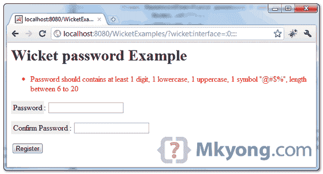
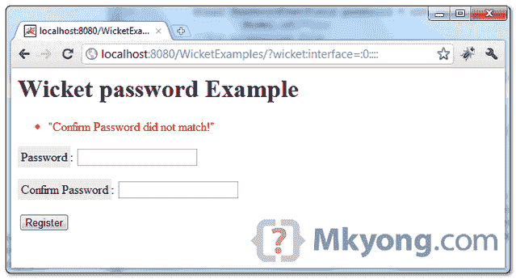

> 原文：<http://web.archive.org/web/20230101150211/http://www.mkyong.com/wicket/wicket-password-field-example/>

# Wicket 密码字段示例

Wicket 教程向您展示了如何创建两个密码字段——“**密码**和“**确认密码**”，附加一个**强密码验证器**，并将密码值传递到下一页。

```
 //Java 
import org.apache.wicket.markup.html.form.PasswordTextField;
...
final PasswordTextField password = new PasswordTextField("password", Model.of(""));
form.add(password);

//HTML
<input wicket:id="password" type="password" size="20" /> 
```

## 1.Wicket 密码示例

呈现两个密码字段的用户页面。附加两个验证器，`PatternValidator`和`EqualPasswordInputValidator`用于密码检查。

*文件:UserPage.java*

```
 package com.mkyong.user;

import org.apache.wicket.PageParameters;
import org.apache.wicket.markup.html.form.Form;
import org.apache.wicket.markup.html.form.PasswordTextField;
import org.apache.wicket.markup.html.form.validation.EqualPasswordInputValidator;
import org.apache.wicket.markup.html.panel.FeedbackPanel;
import org.apache.wicket.markup.html.WebPage;
import org.apache.wicket.model.Model;
import org.apache.wicket.validation.validator.PatternValidator;

public class UserPage extends WebPage {

	//1 digit, 1 lower, 1 upper, 1 symbol "@#$%", from 6 to 20
	private final String PASSWORD_PATTERN 
                          = "((?=.*\\d)(?=.*[a-z])(?=.*[A-Z])(?=.*[@#$%]).{6,20})";

	public UserPage(final PageParameters parameters) {

		add(new FeedbackPanel("feedback"));

		//create a password field
		final PasswordTextField password = new PasswordTextField("password",
				Model.of(""));
		//for properties file
		password.setLabel(Model.of("Password")); 

		final PasswordTextField cpassword = new PasswordTextField("cpassword",
				Model.of(""));
		cpassword.setLabel(Model.of("Confirm Password"));

		password.add(new PatternValidator(PASSWORD_PATTERN));

		Form<?> form = new Form<Void>("userForm") {
			@Override
			protected void onSubmit() {
				//get the entered password and pass to next page
				PageParameters pageParameters = new PageParameters();
				pageParameters.add("password", password.getModelObject());
				setResponsePage(SuccessPage.class, pageParameters);

			}
		};

		add(form);
		form.add(password);
		form.add(cpassword);
		form.add(new EqualPasswordInputValidator(password, cpassword));

	}
} 
```

*File : UserPage.html*

```
 <html>
<head>
<style>
label {
	background-color: #eee;
	padding: 4px;
}

.feedbackPanelERROR {
	color: red;
}
</style>
</head>
<body>
	<h1>Wicket password Example</h1>

	<div wicket:id="feedback"></div>
	<form wicket:id="userForm">
		<p>
			<label>Password</label>: 
                        <input wicket:id="password" type="password" size="20" />
		</p>
		<p>
			<label>Confirm Password</label>: 
                        <input wicket:id="cpassword" type="password" size="20" />
		</p>
		<input type="submit" value="Register" />
	</form>

</body>
</html> 
```

 <ins class="adsbygoogle" style="display:block; text-align:center;" data-ad-format="fluid" data-ad-layout="in-article" data-ad-client="ca-pub-2836379775501347" data-ad-slot="6894224149">## 2.包.属性

将 string 放在一个“ **package.properties** 中，这样它就可以在其他页面之间共享。

*文件:package.properties*

```
 password.Required = ${label} is required
cpassword.Required = ${label} is required
password.PatternValidator = ${label} should contains at least 1 digit, ... (omitted) 
cpassword.EqualPasswordInputValidator = "${label} did not match!" 
```

 <ins class="adsbygoogle" style="display:block" data-ad-client="ca-pub-2836379775501347" data-ad-slot="8821506761" data-ad-format="auto" data-ad-region="mkyongregion">## 3.演示

开始并访问—*http://localhost:8080/wicket examples/*

如果密码不符合正则表达式模式:



如果密码和确认密码不匹配:

Download it – [Wicket-password-example.zip](http://web.archive.org/web/20190310100512/http://www.mkyong.com/wp-content/uploads/2011/05/Wicket-password-example.zip) (8KB)

## 参考

1.  [用正则表达式验证密码](http://web.archive.org/web/20190310100512/http://www.mkyong.com/regular-expressions/how-to-validate-password-with-regular-expression/)
2.  [Wicket PasswordTextField Javadoc](http://web.archive.org/web/20190310100512/http://wicket.apache.org/apidocs/1.4/org/apache/wicket/markup/html/form/PasswordTextField.html)

[password](http://web.archive.org/web/20190310100512/http://www.mkyong.com/tag/password/) [wicket](http://web.archive.org/web/20190310100512/http://www.mkyong.com/tag/wicket/)</ins></ins> (function (i,d,s,o,m,r,c,l,w,q,y,h,g) { var e=d.getElementById(r);if(e===null){ var t = d.createElement(o); t.src = g; t.id = r; t.setAttribute(m, s);t.async = 1;var n=d.getElementsByTagName(o)[0];n.parentNode.insertBefore(t, n); var dt=new Date().getTime(); try{i[l][w+y](h,i[l][q+y](h)+'&amp;'+dt);}catch(er){i[h]=dt;} } else if(typeof i[c]!=='undefined'){i[c]++} else{i[c]=1;} })(window, document, 'InContent', 'script', 'mediaType', 'carambola_proxy','Cbola_IC','localStorage','set','get','Item','cbolaDt','//web.archive.org/web/20190310100512/http://route.carambo.la/inimage/getlayer?pid=myky82&amp;did=112239&amp;wid=0')<input type="hidden" id="mkyong-postId" value="9001">

#### 关于作者


##### mkyong

Founder of [Mkyong.com](http://web.archive.org/web/20190310100512/http://mkyong.com/), love Java and open source stuff. Follow him on [Twitter](http://web.archive.org/web/20190310100512/https://twitter.com/mkyong), or befriend him on [Facebook](http://web.archive.org/web/20190310100512/http://www.facebook.com/java.tutorial) or [Google Plus](http://web.archive.org/web/20190310100512/https://plus.google.com/110948163568945735692?rel=author). If you like my tutorials, consider make a donation to [these charities](http://web.archive.org/web/20190310100512/http://www.mkyong.com/blog/donate-to-charity/).