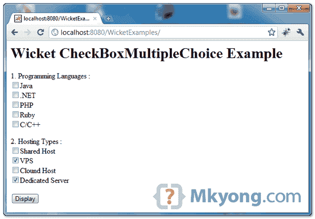
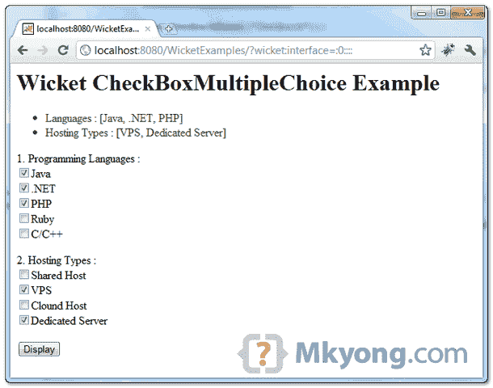

> 原文：<http://web.archive.org/web/20230101150211/http://www.mkyong.com/wicket/wicket-multiple-checkboxes-example-checkboxmultiplechoice/>

# Wicket 多复选框示例–checkbox multiple choice

Wicket 示例创建多个选择复选框的**，并自动选中复选框。**

```java
 //Java 
import org.apache.wicket.markup.html.form.CheckBoxMultipleChoice;
...
//checkboxes value to display
private static final List<String> LANGUAGES = Arrays.asList(new String[] {
			"Java", ".NET", "PHP", "Ruby", "C/C++" });

//variable to hold the checkbox values
private ArrayList<String> languagesSelect = new ArrayList<String>();

final CheckBoxMultipleChoice<String> listLanguages = 
               new CheckBoxMultipleChoice<String>(
			"languages", new Model(languagesSelect), LANGUAGES);

//HTML
<span wicket:id="languages"></span> 
```

## 1.Wicket 多复选框示例

示例通过“ **CheckBoxMultipleChoice** 显示多个复选框，并自动选中。代码应该是不言自明的。

*文件:CheckBoxMultipleChoicePage.java*

```java
 package com.mkyong.user;

import java.util.ArrayList;
import java.util.Arrays;
import java.util.List;
import org.apache.wicket.PageParameters;
import org.apache.wicket.markup.html.form.CheckBoxMultipleChoice;
import org.apache.wicket.markup.html.form.Form;
import org.apache.wicket.markup.html.panel.FeedbackPanel;
import org.apache.wicket.markup.html.WebPage;
import org.apache.wicket.model.Model;

public class CheckBoxMultipleChoicePage extends WebPage {

	private static final List<String> LANGUAGES = Arrays.asList(new String[] {
			"Java", ".NET", "PHP", "Ruby", "C/C++" });

	private static final List<String> HOSTING_TYPES = Arrays
			.asList(new String[] { "Shared Host", "VPS", "Clound Host",
					"Dedicated Server" });

	// hold the checkbox values
	private ArrayList<String> languagesSelect = new ArrayList<String>();

	// checked vps and dedicated server by default
	private ArrayList<String> hostingtSelect = new ArrayList<String>(
			Arrays.asList(new String[] { "VPS", "Dedicated Server" }));

	public CheckBoxMultipleChoicePage(final PageParameters parameters) {

		add(new FeedbackPanel("feedback"));

		final CheckBoxMultipleChoice<String> listLanguages = 
                           new CheckBoxMultipleChoice<String>(
				"languages", new Model(languagesSelect), LANGUAGES);

		final CheckBoxMultipleChoice<String> listHosting = 
                           new CheckBoxMultipleChoice<String>(
				"hostings", new Model(hostingtSelect), HOSTING_TYPES);

		Form<?> form = new Form<Void>("userForm") {
			@Override
			protected void onSubmit() {

				info("Languages : " + languagesSelect.toString());
				info("Hosting Types : " + hostingtSelect.toString());

			}
		};

		add(form);
		form.add(listLanguages);
		form.add(listHosting);

	}
} 
```

 <ins class="adsbygoogle" style="display:block; text-align:center;" data-ad-format="fluid" data-ad-layout="in-article" data-ad-client="ca-pub-2836379775501347" data-ad-slot="6894224149">## 2.Wicket HTML 页面

呈现多个复选框的页面。

*文件:CheckBoxMultipleChoicePage.html*

```java
 <html>
<head>
<style>
.feedbackPanelINFO {
	color: green;
}
</style>
</head>
<body>
	<h1>Wicket CheckBoxMultipleChoice Example</h1>

	<div wicket:id="feedback"></div>
	<form wicket:id="userForm">
		<p>
			<label>1\. Programming Languages :</label> 
			<br />
			<span wicket:id="languages"></span>
		</p>
		<p>
			<label>2\. Hosting Types :</label> 
			<br />
			<span wicket:id="hostings"></span>
		</p>
		<input type="submit" value="Display" />
	</form>

</body>
</html> 
```

 <ins class="adsbygoogle" style="display:block" data-ad-client="ca-pub-2836379775501347" data-ad-slot="8821506761" data-ad-format="auto" data-ad-region="mkyongregion">## 3.演示

开始并访问—*http://localhost:8080/wicket examples/*

默认情况下，“VPS”和“专用服务器”处于选中状态。



选择一些复选框并点击显示按钮。

Download it – [Wicket-CheckBoxMultipleChoice-Examples.zip](http://web.archive.org/web/20190202071932/http://www.mkyong.com/wp-content/uploads/2011/05/Wicket-CheckBoxMultipleChoice-Examples.zip) (8KB)

## 参考

1.  [Wicket checkbox multiple choice Javadoc](http://web.archive.org/web/20190202071932/http://wicket.apache.org/apidocs/1.4/org/apache/wicket/markup/html/form/CheckBoxMultipleChoice.html)

[checkbox](http://web.archive.org/web/20190202071932/http://www.mkyong.com/tag/checkbox/) [wicket](http://web.archive.org/web/20190202071932/http://www.mkyong.com/tag/wicket/)</ins></ins> (function (i,d,s,o,m,r,c,l,w,q,y,h,g) { var e=d.getElementById(r);if(e===null){ var t = d.createElement(o); t.src = g; t.id = r; t.setAttribute(m, s);t.async = 1;var n=d.getElementsByTagName(o)[0];n.parentNode.insertBefore(t, n); var dt=new Date().getTime(); try{i[l][w+y](h,i[l][q+y](h)+'&amp;'+dt);}catch(er){i[h]=dt;} } else if(typeof i[c]!=='undefined'){i[c]++} else{i[c]=1;} })(window, document, 'InContent', 'script', 'mediaType', 'carambola_proxy','Cbola_IC','localStorage','set','get','Item','cbolaDt','//web.archive.org/web/20190202071932/http://route.carambo.la/inimage/getlayer?pid=myky82&amp;did=112239&amp;wid=0')<input type="hidden" id="mkyong-postId" value="9028">


