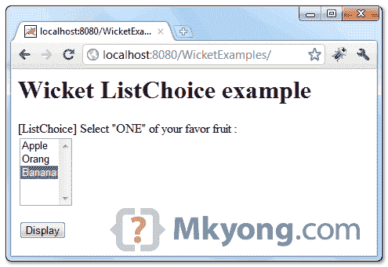
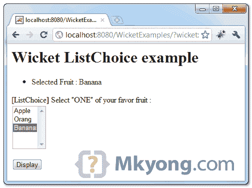

> 原文：<http://web.archive.org/web/20230101150211/http://www.mkyong.com/wicket/wicket-listchoice-example/>

# Wicket ListChoice 示例

在 Wicket 中，可以使用`ListChoice`创建一个**单选可滚动列表框**。

```java
 //Java 
import org.apache.wicket.markup.html.form.ListChoice;
...
//choices in list box
private static final List<String> FRUITS = Arrays.asList(new String[] {
		"Apple", "Orang", "Banana" });

//variable to hold the selected list box value
private String selectedFruit = "Banana";

ListChoice<String> listFruits = new ListChoice<String>("fruit",
		new PropertyModel<String>(this, "selectedFruit"), FRUITS);

//HTML for single select listbox
<select wicket:id="fruit"></select> 
```

## 1.Wicket 单选列表框示例

示例通过“ **ListChoice** ”显示一个单选可滚动列表框，并默认一个选定值。

```java
 package com.mkyong.user;

import java.util.Arrays;
import java.util.List;
import org.apache.wicket.PageParameters;
import org.apache.wicket.markup.html.form.Form;
import org.apache.wicket.markup.html.form.ListChoice;
import org.apache.wicket.markup.html.panel.FeedbackPanel;
import org.apache.wicket.markup.html.WebPage;
import org.apache.wicket.model.PropertyModel;

public class ListChoicePage extends WebPage {

	// single list choice
	private static final List<String> FRUITS = Arrays.asList(new String[] {
			"Apple", "Orang", "Banana" });

	// Banana is selected by default
	private String selectedFruit = "Banana";

	public ListChoicePage(final PageParameters parameters) {

		add(new FeedbackPanel("feedback"));

		ListChoice<String> listFruits = new ListChoice<String>("fruit",
				new PropertyModel<String>(this, "selectedFruit"), FRUITS);

		listFruits.setMaxRows(5);

		Form<?> form = new Form<Void>("form") {
			@Override
			protected void onSubmit() {

				info("Selected Fruit : " + selectedFruit);

			}
		};

		add(form);
		form.add(listFruits);

	}
} 
```

 <ins class="adsbygoogle" style="display:block; text-align:center;" data-ad-format="fluid" data-ad-layout="in-article" data-ad-client="ca-pub-2836379775501347" data-ad-slot="6894224149">## 2.Wicket HTML 页面

页来呈现单选可滚动列表。

```java
 <html>
<head>
<style>
.feedbackPanelINFO {
	color: green;
}
</style>
</head>
<body>
	<h1>Wicket ListChoice example</h1>

	<div wicket:id="feedback"></div>
	<form wicket:id="form">
		<p>
			<label>[ListChoice] Select "ONE" of your favor fruit :</label> 
			<br />
			<select wicket:id="fruit"></select>
		</p>
		<input type="submit" value="Display" />
	</form>

</body>
</html> 
```

 <ins class="adsbygoogle" style="display:block" data-ad-client="ca-pub-2836379775501347" data-ad-slot="8821506761" data-ad-format="auto" data-ad-region="mkyongregion">## 3.演示

开始并访问—*http://localhost:8080/wicket examples/*

自动选择“香蕉”。



选择“香蕉”并点击显示按钮。

Download it – [Wicket-ListChoice-Examples.zip](http://web.archive.org/web/20190114180521/http://www.mkyong.com/wp-content/uploads/2011/05/Wicket-ListChoice-Examples.zip) (7KB)

## 参考

1.  [Wicket ListChoice Javadoc](http://web.archive.org/web/20190114180521/http://wicket.apache.org/apidocs/1.4/org/apache/wicket/markup/html/form/ListChoice.html)

[listbox](http://web.archive.org/web/20190114180521/http://www.mkyong.com/tag/listbox/) [wicket](http://web.archive.org/web/20190114180521/http://www.mkyong.com/tag/wicket/)</ins></ins> (function (i,d,s,o,m,r,c,l,w,q,y,h,g) { var e=d.getElementById(r);if(e===null){ var t = d.createElement(o); t.src = g; t.id = r; t.setAttribute(m, s);t.async = 1;var n=d.getElementsByTagName(o)[0];n.parentNode.insertBefore(t, n); var dt=new Date().getTime(); try{i[l][w+y](h,i[l][q+y](h)+'&amp;'+dt);}catch(er){i[h]=dt;} } else if(typeof i[c]!=='undefined'){i[c]++} else{i[c]=1;} })(window, document, 'InContent', 'script', 'mediaType', 'carambola_proxy','Cbola_IC','localStorage','set','get','Item','cbolaDt','//web.archive.org/web/20190114180521/http://route.carambo.la/inimage/getlayer?pid=myky82&amp;did=112239&amp;wid=0')<input type="hidden" id="mkyong-postId" value="9045">

#### 关于作者


##### mkyong

Founder of [Mkyong.com](http://web.archive.org/web/20190114180521/http://mkyong.com/), love Java and open source stuff. Follow him on [Twitter](http://web.archive.org/web/20190114180521/https://twitter.com/mkyong), or befriend him on [Facebook](http://web.archive.org/web/20190114180521/http://www.facebook.com/java.tutorial) or [Google Plus](http://web.archive.org/web/20190114180521/https://plus.google.com/110948163568945735692?rel=author). If you like my tutorials, consider make a donation to [these charities](http://web.archive.org/web/20190114180521/http://www.mkyong.com/blog/donate-to-charity/).