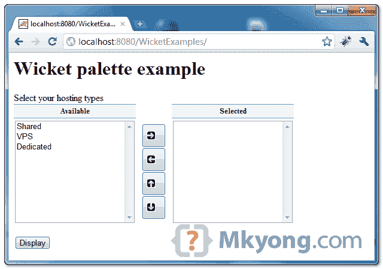
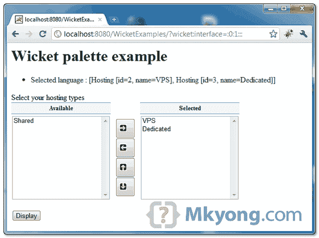

> 原文：<http://web.archive.org/web/20230101150211/http://www.mkyong.com/wicket/wicket-palette-example/>

# Wicket 调色板示例

Wicket 扩展带有一个特殊的" **Palette** "组件，它呈现两个选择框，并允许用户将项目从一个选择框移动到另一个选择框。

*图:调色板组件*



```java
 //Java
import org.apache.wicket.extensions.markup.html.form.palette.Palette;

final Palette<Hosting> palette = new Palette<Hosting>("palette",
	new ListModel<Hosting>(selected),
	new CollectionModel<Hosting>(listHosting),
	renderer, 10, true);

//HTML
<span wicket:id="palette"></span> 
```

## 调色板签名

```java
 Palette(String id, 
	IModel<List<T>> model, 
	IModel<? extends Collection<? extends T>> choicesModel, 
	IChoiceRenderer<T> choiceRenderer, 
	int rows, boolean allowOrder) 
```

1.  id–组件 id
2.  模型模型–代表用户选择的集合
3.  choicesmodelmodel——代表所有可用选项的集合
4.  choiceRenderer–用于渲染选项的渲染。这必须使用对象的唯一 id，而不是索引
5.  行数——不滚动时屏幕上可见的选项数量
6.  Allow order–允许用户上下移动选择

**Note**
Pretty hard to understand, right? Never mind, read following complete Wicket Palette example. <ins class="adsbygoogle" style="display:block; text-align:center;" data-ad-format="fluid" data-ad-layout="in-article" data-ad-client="ca-pub-2836379775501347" data-ad-slot="6894224149">## 1.Wicket 扩展

要使用"**调色板**，你需要"**wicket-extensions**jar。

*文件:pom.xml*

```java
 <project ...>

	<dependencies>

		<dependency>
			<groupId>org.apache.wicket</groupId>
			<artifactId>wicket-extensions</artifactId>
			<version>1.4.17</version>
		</dependency>

	</dependencies>

</project> 
```

 <ins class="adsbygoogle" style="display:block" data-ad-client="ca-pub-2836379775501347" data-ad-slot="8821506761" data-ad-format="auto" data-ad-region="mkyongregion">## 2.调色板的模型

创建一个模型类，以表示选择框中的选择。

```java
 package com.mkyong.user;

import java.io.Serializable;

public class Hosting implements Serializable {

	String id;
	String name;

	//getter, setter, constructor and toString() methods

} 
```

## 3.调色板示例

示例将上述托管模型放入调色板组件，并使用`ChoiceRenderer`来决定显示什么。它应该是不言自明的。

```java
 package com.mkyong.user;

import java.util.ArrayList;
import java.util.List;
import org.apache.wicket.PageParameters;
import org.apache.wicket.extensions.markup.html.form.palette.Palette;
import org.apache.wicket.markup.html.form.ChoiceRenderer;
import org.apache.wicket.markup.html.form.Form;
import org.apache.wicket.markup.html.form.IChoiceRenderer;
import org.apache.wicket.markup.html.panel.FeedbackPanel;
import org.apache.wicket.markup.html.WebPage;
import org.apache.wicket.model.util.CollectionModel;
import org.apache.wicket.model.util.ListModel;

public class PalettePage extends WebPage {

	private static final List<Hosting> listHosting;
	static
	{
		listHosting = new ArrayList<Hosting>();
		listHosting.add(new Hosting("1", "Shared"));
		listHosting.add(new Hosting("2", "VPS"));
		listHosting.add(new Hosting("3", "Dedicated"));
	}

	private List<Hosting> selected = new ArrayList<Hosting>();

	public PalettePage(final PageParameters parameters) {

		add(new FeedbackPanel("feedback"));

		Form<?> form = new Form<Void>("form") {
			@Override
			protected void onSubmit() {

				info("Selected language : " + selected);

			}
		};

		add(form);

		//make VPS selected by default
		//selected.add(new Hosting("2", "VPS"));

		IChoiceRenderer<Hosting> renderer = new ChoiceRenderer<Hosting>("name","id");

		final Palette<Hosting> palette = new Palette<Hosting>("palette",
				new ListModel<Hosting>(selected),
				new CollectionModel<Hosting>(listHosting),
				renderer, 10, true);

		form.add(palette);

	}
} 
```

**How to make certain value selected by default.**
In this case, to make “VPS” selected by default, add this into the “**selected**” variable :

```java
 selected.add(new Hosting("2", "VPS")); 
```

## 4.HTML 页面

完整的 HTML 源代码。

```java
 <html>
<head>
<style>
.feedbackPanelINFO {
	color: green;
}
</style>
</head>
<body>
	<h1>Wicket palette example</h1>

	<div wicket:id="feedback"></div>
	<form wicket:id="form">
		<p>
			<label>Select your hosting types </label> 
			<br /> 

			<span wicket:id="palette"></span>

		</p>
		<input type="submit" value="Display" />
	</form>

</body>
</html> 
```

## 5.演示

开始并访问—*http://localhost:8080/wicket examples/*

选择并移动一些项目，然后点选显示按钮。



*P.S,“向上排序”和“向下排序”按钮仅适用于选定的项目(右侧选择框)。*

Download it – [Wicket-Palette-Example.zip](http://web.archive.org/web/20190306164510/http://www.mkyong.com/wp-content/uploads/2011/05/Wicket-Palette-Example.zip) (8KB)

## 参考

1.  [Wicket 调色板 Javadoc](http://web.archive.org/web/20190306164510/http://wicket.apache.org/apidocs/1.4/org/apache/wicket/extensions/markup/html/form/palette/Palette.html)
2.  [Wicket choice renderer Javadoc](http://web.archive.org/web/20190306164510/http://wicket.apache.org/apidocs/1.4/org/apache/wicket/markup/html/form/ChoiceRenderer.html)

[wicket](http://web.archive.org/web/20190306164510/http://www.mkyong.com/tag/wicket/)


