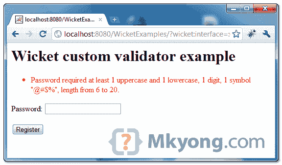

> 原文：<http://web.archive.org/web/20230101150211/http://www.mkyong.com/wicket/create-custom-validator-in-wicket/>

# 在 Wicket 中创建自定义验证器

在本教程中，您将创建一个自定义密码验证器，并将其附加到密码字段。

请参见创建自定义验证程序的总结步骤:

1.实现`IValidator`。

```java
 import org.apache.wicket.validation.IValidator;

public class StrongPasswordValidator implements IValidator<String>{
	...
} 
```

2.超越`validate(IValidatable <string>validatable)</string>`。

```java
 public class StrongPasswordValidator implements IValidator<String>{
	...
	@Override
	public void validate(IValidatable<String> validatable) {

		//get input from attached component
		final String field = validatable.getValue();

	}
} 
```

3.将自定义验证程序附加到表单组件。

```java
 public class CustomValidatorPage extends WebPage {

	public CustomValidatorPage(final PageParameters parameters) {

  	    final PasswordTextField password = new PasswordTextField("password",Model.of(""));
		//attached custom validator to password field
		password.add(new StrongPasswordValidator());

		//...
	}

} 
```

## 完整示例

参见下面的 Wicket 示例，创建一个定制的密码验证器，并在密码与预定义的模式不匹配时显示一条错误消息。

 <ins class="adsbygoogle" style="display:block; text-align:center;" data-ad-format="fluid" data-ad-layout="in-article" data-ad-client="ca-pub-2836379775501347" data-ad-slot="6894224149">## 1.StrongPasswordValidator

自定义密码验证程序。

```java
 package com.mkyong.user;

import java.util.regex.Pattern;

import org.apache.wicket.validation.IValidatable;
import org.apache.wicket.validation.IValidator;
import org.apache.wicket.validation.ValidationError;

public class StrongPasswordValidator implements IValidator<String> {

	private final String PASSWORD_PATTERN 
                              = "((?=.*\\d)(?=.*[a-z])(?=.*[A-Z])(?=.*[@#$%]).{6,20})";

	private final Pattern pattern;

	StrongPasswordValidator() {
		pattern = Pattern.compile(PASSWORD_PATTERN);
	}

	@Override
	public void validate(IValidatable<String> validatable) {

		final String password = validatable.getValue();

		// validate password
		if (pattern.matcher(password).matches() == false) {

			//Message from key "StrongPasswordValidator.not-strong-password"
			error(validatable, "not-strong-password");

		}

	}

	private void error(IValidatable<String> validatable, String errorKey) {
		ValidationError error = new ValidationError();
		error.addMessageKey(getClass().getSimpleName() + "." + errorKey);
		validatable.error(error);
	}

} 
```

*文件:package.properties*

```java
 StrongPasswordValidator.not-strong-password = Password required at least ... (omitted) 
```

 <ins class="adsbygoogle" style="display:block" data-ad-client="ca-pub-2836379775501347" data-ad-slot="8821506761" data-ad-format="auto" data-ad-region="mkyongregion">## 2.附加到组件

将上述自定义验证程序附加到密码字段。

```java
 package com.mkyong.user;

import org.apache.wicket.PageParameters;
import org.apache.wicket.markup.html.form.Form;
import org.apache.wicket.markup.html.form.PasswordTextField;
import org.apache.wicket.markup.html.panel.FeedbackPanel;
import org.apache.wicket.markup.html.WebPage;
import org.apache.wicket.model.Model;

public class CustomValidatorPage extends WebPage {

	public CustomValidatorPage(final PageParameters parameters) {

		add(new FeedbackPanel("feedback"));

		final PasswordTextField password 
                                = new PasswordTextField("password",Model.of(""));

		//attached custom validator to password field
		password.add(new StrongPasswordValidator());

		Form<?> form = new Form<Void>("form") {
			@Override
			protected void onSubmit() {
				info("Done");
			}
		};

		add(form);
		form.add(password);

	}

} 
```

```java
 <html>
<head>
<style>
.feedbackPanelERROR {
	color: red;
}
</style>
</head>
<body>
	<h1>Wicket custom validator example</h1>

	<div wicket:id="feedback"></div>
	<form wicket:id="form">
		<p>
			<label>Password</label>: 
                        <input wicket:id="password" type="password" size="20" />
		</p>
		        <input type="submit" value="Register" />
	</form>

</body>
</html> 
```

## 3.演示

开始并访问—*http://localhost:8080/wicket examples/*

键入弱密码，则从自定义验证程序返回并显示错误消息。

Download it – [Wicket-Custom-Validator-Example.zip](http://web.archive.org/web/20190310101943/http://www.mkyong.com/wp-content/uploads/2011/06/Wicket-Custom-Validator-Example.zip) (9KB)

## 参考

1.  [Wicket IValidator Javadoc](http://web.archive.org/web/20190310101943/http://wicket.apache.org/apidocs/1.4/org/apache/wicket/validation/IValidator.html)
2.  [Wicket PasswordTextField 示例](http://web.archive.org/web/20190310101943/http://www.mkyong.com/wicket/wicket-password-field-example/)
3.  [强密码的正则表达式](http://web.archive.org/web/20190310101943/http://www.mkyong.com/regular-expressions/how-to-validate-password-with-regular-expression/)

[validator](http://web.archive.org/web/20190310101943/http://www.mkyong.com/tag/validator/) [wicket](http://web.archive.org/web/20190310101943/http://www.mkyong.com/tag/wicket/)</ins></ins> (function (i,d,s,o,m,r,c,l,w,q,y,h,g) { var e=d.getElementById(r);if(e===null){ var t = d.createElement(o); t.src = g; t.id = r; t.setAttribute(m, s);t.async = 1;var n=d.getElementsByTagName(o)[0];n.parentNode.insertBefore(t, n); var dt=new Date().getTime(); try{i[l][w+y](h,i[l][q+y](h)+'&amp;'+dt);}catch(er){i[h]=dt;} } else if(typeof i[c]!=='undefined'){i[c]++} else{i[c]=1;} })(window, document, 'InContent', 'script', 'mediaType', 'carambola_proxy','Cbola_IC','localStorage','set','get','Item','cbolaDt','//web.archive.org/web/20190310101943/http://route.carambo.la/inimage/getlayer?pid=myky82&amp;did=112239&amp;wid=0')<input type="hidden" id="mkyong-postId" value="9108">

#### 关于作者


##### mkyong

Founder of [Mkyong.com](http://web.archive.org/web/20190310101943/http://mkyong.com/), love Java and open source stuff. Follow him on [Twitter](http://web.archive.org/web/20190310101943/https://twitter.com/mkyong), or befriend him on [Facebook](http://web.archive.org/web/20190310101943/http://www.facebook.com/java.tutorial) or [Google Plus](http://web.archive.org/web/20190310101943/https://plus.google.com/110948163568945735692?rel=author). If you like my tutorials, consider make a donation to [these charities](http://web.archive.org/web/20190310101943/http://www.mkyong.com/blog/donate-to-charity/).