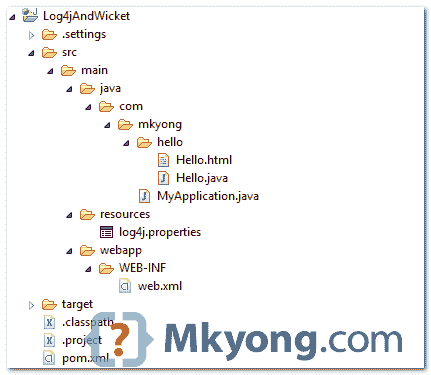
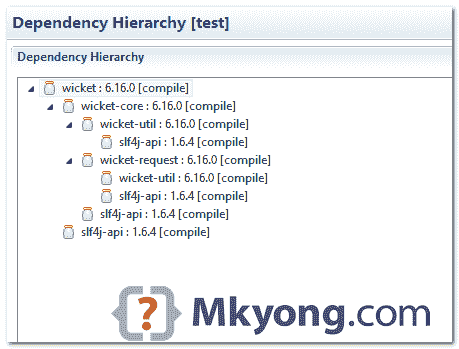
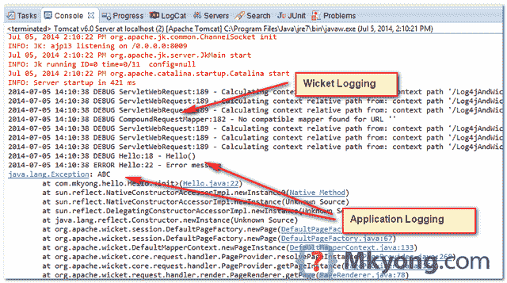
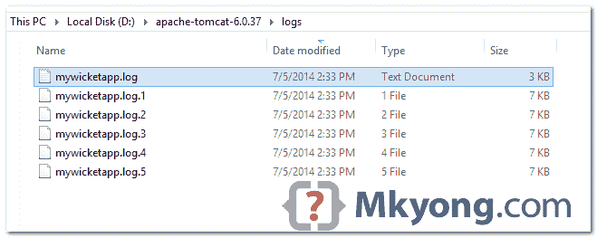

# Wicket + Log4j 集成示例

> 原文：<http://web.archive.org/web/20230101150211/http://www.mkyong.com/wicket/wicket-log4j-integration-example/>


在本教程中，我们将向您展示如何将 log4j 框架与 Wicket web 应用程序集成。Wicket 框架使用 SLF4j APIs，以确保 Log4j 声明了`slf4j-log4j12`依赖。

检查项目环境:

1.  SLF4j 1.7.7
2.  Log4j 1.2.17
3.  检票口
4.  maven3
5.  tomcat6
6.  日食开普勒 4.3

## 1.项目目录

审查最终的项目结构。



## 2.项目相关性

声明 Wicket 和 slf4j-log4j12 依赖项。

pom.xml

```
 <properties>
		<wicket.version>6.16.0</wicket.version>
		<slf4j.version>1.7.7</slf4j.version>
	</properties>

	<dependencies>

		<dependency>
			<groupId>org.apache.wicket</groupId>
			<artifactId>wicket-core</artifactId>
			<version>${wicket.version}</version>
		</dependency>

		<dependency>
			<groupId>org.slf4j</groupId>
			<artifactId>slf4j-log4j12</artifactId>
			<version>${slf4j.version}</version>
		</dependency>

	</dependencies> 
```

*图:Eclipse pom 编辑器中的 pom.xml，依赖层次*



## 3.Log4j 属性

像往常一样，创建一个 log4j.properties 文件，并将其放入 resources 文件夹。请参考步骤 1。

log4j.properties

```
 # Root logger option
log4j.rootLogger=DEBUG, stdout, file

# Redirect log messages to console
log4j.appender.stdout=org.apache.log4j.ConsoleAppender
log4j.appender.stdout.Target=System.out
log4j.appender.stdout.layout=org.apache.log4j.PatternLayout
log4j.appender.stdout.layout.ConversionPattern=%d{yyyy-MM-dd HH:mm:ss} %-5p %c{1}:%L - %m%n

# Redirect log messages to a log file
log4j.appender.file=org.apache.log4j.RollingFileAppender
log4j.appender.file.File=${catalina.home}/logs/mywicketapp.log
log4j.appender.file.MaxFileSize=5KB
log4j.appender.file.MaxBackupIndex=5
log4j.appender.file.layout=org.apache.log4j.PatternLayout
log4j.appender.file.layout.ConversionPattern=%d{yyyy-MM-dd HH:mm:ss} %-5p %c{1}:%L - %m%n 
```

## 4.消息记录

使用 log4j 记录调试和错误消息的示例。

Hello.java

```
 package com.mkyong.hello;

import org.apache.log4j.Logger;
import org.apache.wicket.markup.html.WebPage;
import org.apache.wicket.markup.html.basic.Label;

public class Hello extends WebPage {

	// Get logger
	private static final Logger logger = Logger.getLogger(Hello.class);

	private static final long serialVersionUID = 1L;

	public Hello() {

		// logs debug
		if (logger.isDebugEnabled()) {
			logger.debug("Hello()");
		}

		// logs exception
		logger.error("Error message", new Exception("ABC"));

		add(new Label("message", "Wicket + Log4j"));

	}
} 
```

## 5.演示

运行 Wicket web 应用程序，例如:*http://localhost:8080/log 4 jandwicket/*。Wicket 和应用程序日志都将显示在控制台上，并输出到一个文件中。



*图 5.1 : Eclipse 控制台*



*图 5.2 :D:\ Apache-Tomcat-6 . 0 . 37 \ logs \ mywicketapp . log*

## 下载源代码

Download it – [WicketAndLog4j.zip](http://web.archive.org/web/20220618160426/http://www.mkyong.com/wp-content/uploads/2011/05/WicketAndLog4j.zip)(10 KB)

## 参考

2.  [阿帕奇检票口](http://web.archive.org/web/20220618160426/https://wicket.apache.org/start/download.html)
3.  [log4j 1.2 官方页面](http://web.archive.org/web/20220618160426/https://logging.apache.org/log4j/1.2/)
4.  [log4j hello world 示例](http://web.archive.org/web/20220618160426/http://www.mkyong.com/logging/log4j-hello-world-example/)

<input type="hidden" id="mkyong-current-postId" value="8936">