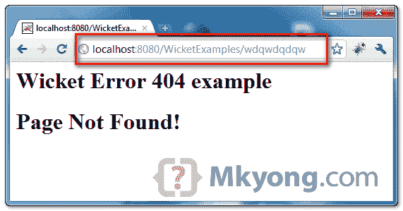

# 在 Wicket 中配置 404 错误页面

> 原文：<http://web.archive.org/web/20230101150211/http://www.mkyong.com/wicket/how-do-configure-404-error-page-in-wicket-solution/>

总是建议为“404 页面未找到”错误定制一个漂亮的错误页面。本指南向您展示了如何在 Wicket 中配置 404 错误页面。

## 1.错误页面

为 Wicket 创建错误页面和类。

```
 package com.mkyong.user;

import org.apache.wicket.PageParameters;
import org.apache.wicket.markup.html.WebPage;
import org.apache.wicket.markup.html.basic.Label;

public class ErrorPage404 extends WebPage {

	public ErrorPage404(final PageParameters parameters) {

		add(new Label("404", "Page Not Found!"));

	}
} 
```

```
 <html>
<body>
	<h1>Wicket Error 404 example</h1>

	<h1><span wicket:id="404"></span></h1> 

</body>
</html> 
```

## 2.将 404 放在 web.xml 中

在 **web.xml** 文件中指定“404 错误代码”，将常见的“404 错误”路由到 wicket 的“/error404”文件路径。

```
 <?xml version="1.0" encoding="ISO-8859-1"?>
<web-app ...>

	<filter>
		<filter-name>wicket.wicketTest</filter-name>
		<filter-class>org.apache.wicket.protocol.http.WicketFilter</filter-class>
		<init-param>
			<param-name>applicationClassName</param-name>
			<param-value>com.mkyong.WicketApplication</param-value>
		</init-param>
	</filter>

	<filter-mapping>
		<filter-name>wicket.wicketTest</filter-name>
		<url-pattern>/*</url-pattern>
		<dispatcher>REQUEST</dispatcher>
		<dispatcher>ERROR</dispatcher>
	</filter-mapping>

	<error-page>
		<error-code>404</error-code>
		<location>/error404</location>
	</error-page>

</web-app> 
```

**Note**
Both dispatcher tags “`REQUEST`” and “`ERROR`” are required.

## 3.将错误与页面匹配

在 Wicket 应用程序中，覆盖 **init()** ，将“ **/error404** ”匹配到错误页面“【ErrorPage404.html】”。

```
 public class WicketApplication extends WebApplication {

	@Override
	protected void init() {

		mount(new QueryStringUrlCodingStrategy("error404",ErrorPage404.class));

	}

} 
```

## 4.演示

搞定，现在所有找不到的 URL，“404 页面找不到”错误，会重定向到“/error404”，而“/error404”会显示“ErrorPage404.html”文件

*图:如果没有找到 URL(404)，显示您的自定义错误页面。*

<noscript></noscript>

Download it – [Wicket-404-Example.zip](http://web.archive.org/web/20201109040639/http://www.mkyong.com/wp-content/uploads/2009/05/Wicket-404-Example.zip) (8KB)Tags : [404](http://web.archive.org/web/20201109040639/https://mkyong.com/tag/404/) [wicket](http://web.archive.org/web/20201109040639/https://mkyong.com/tag/wicket/)<input type="hidden" id="mkyong-current-postId" value="1429">

### 相关文章

*   [Wordpress 更新帖子后显示 404？](/web/20201109040639/https://mkyong.com/blog/wordpress-display-404-after-updated-post/)
*   [如何在 Eclipse 中设置 Wicket 示例](/web/20201109040639/https://mkyong.com/wicket/how-do-setup-wicket-examples-in-eclipse/)
*   [Java . lang . classnotfoundexception:org . slf4j . impl .](/web/20201109040639/https://mkyong.com/wicket/java-lang-classnotfoundexception-org-slf4j-impl-staticloggerbinder/)
*   [Wicket 文本框示例](/web/20201109040639/https://mkyong.com/wicket/wicket-textbox-example/)
*   [Wicket 属性模型示例](/web/20201109040639/https://mkyong.com/wicket/wicket-propertymodel-example/)

*   [Wicket Hello World 示例](/web/20201109040639/https://mkyong.com/wicket/wicket-hello-world-example-with-maven-tutorial/)
*   [Wicket + Log4j 集成示例](/web/20201109040639/https://mkyong.com/wicket/wicket-log4j-integration-example/)
*   [启用 org.apache.wicket.util.r 的调试消息](/web/20201109040639/https://mkyong.com/wicket/enable-debug-messages-for-org-apache-wicket-util-resource/)
*   [如何改变 Wicket 中 html 文件的位置](/web/20201109040639/https://mkyong.com/wicket/how-do-change-the-html-file-location-wicket/)
*   [如何在 Wicket 中获取 servlet context](/web/20201109040639/https://mkyong.com/wicket/how-do-get-servletcontext-in-wicket/)