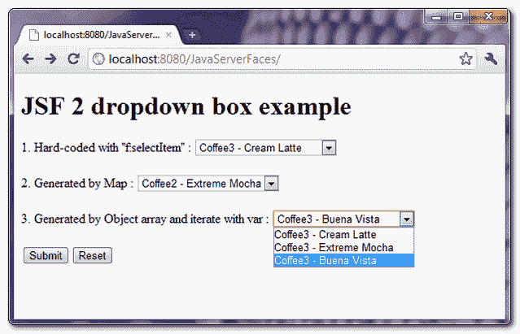
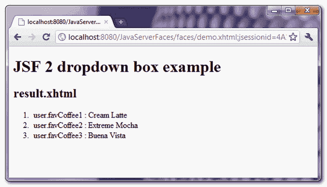

> 原文：<http://web.archive.org/web/20230101150211/http://www.mkyong.com/jsf2/jsf-2-dropdown-box-example/>

# JSF 2 下拉框示例

在 JSF， **< h:selectOneMenu / >** 标签用于呈现一个下拉框——HTML 选择元素，属性为“ **size=1** ”。

```java
 //JSF...
<h:selectOneMenu value="#{user.favCoffee1}">
   	<f:selectItem itemValue="Cream Latte" itemLabel="Coffee3 - Cream Latte" />
   	<f:selectItem itemValue="Extreme Mocha" itemLabel="Coffee3 - Extreme Mocha" />
   	<f:selectItem itemValue="Buena Vista" itemLabel="Coffee3 - Buena Vista" />
</h:selectOneMenu>

//HTML output...
<select name="j_idt6:j_idt8" size="1">	
	<option value="Cream Latte">Coffee3 - Cream Latte</option> 
	<option value="Extreme Mocha">Coffee3 - Extreme Mocha</option> 
	<option value="Buena Vista">Coffee3 - Buena Vista</option> 
</select> 
```

## h:选择一个菜单示例

一个 JSF 2.0 的例子，展示了使用" **h:selectOneMenu** "标签来呈现一个下拉框，并以 3 种不同的方式填充数据:

1.  “**f:selecti item**标签中的硬核值。
2.  用 Map 生成值，并将其放入“**f:selecti items**标签中。
3.  用一个对象数组生成值，放入“ **f:selectItems** ”标签，然后用“ **var** 属性表示值。

 <ins class="adsbygoogle" style="display:block; text-align:center;" data-ad-format="fluid" data-ad-layout="in-article" data-ad-client="ca-pub-2836379775501347" data-ad-slot="6894224149">## 1.支撑豆

用于保存和生成下拉框值数据的后备 bean。

```java
 package com.mkyong;

import java.io.Serializable;
import java.util.LinkedHashMap;
import java.util.Map;
import javax.faces.bean.ManagedBean;
import javax.faces.bean.SessionScoped;

@ManagedBean(name="user")
@SessionScoped
public class UserBean implements Serializable{

	public String favCoffee1;
	public String favCoffee2;
	public String favCoffee3;

	public String getFavCoffee1() {
		return favCoffee1;
	}

	public void setFavCoffee1(String favCoffee1) {
		this.favCoffee1 = favCoffee1;
	}

	public String getFavCoffee2() {
		return favCoffee2;
	}

	public void setFavCoffee2(String favCoffee2) {
		this.favCoffee2 = favCoffee2;
	}

	public String getFavCoffee3() {
		return favCoffee3;
	}

	public void setFavCoffee3(String favCoffee3) {
		this.favCoffee3 = favCoffee3;
	}

	//Generated by Map
	private static Map<String,Object> coffee2Value;
	static{
		coffee2Value = new LinkedHashMap<String,Object>();
		coffee2Value.put("Coffee2 - Cream Latte", "Cream Latte"); //label, value
		coffee2Value.put("Coffee2 - Extreme Mocha", "Extreme Mocha");
		coffee2Value.put("Coffee2 - Buena Vista", "Buena Vista");
	}

	public Map<String,Object> getFavCoffee2Value() {
		return coffee2Value;
	}

	//Generated by Object array
	public static class Coffee{
		public String coffeeLabel;
		public String coffeeValue;

		public Coffee(String coffeeLabel, String coffeeValue){
			this.coffeeLabel = coffeeLabel;
			this.coffeeValue = coffeeValue;
		}

		public String getCoffeeLabel(){
			return coffeeLabel;
		}

		public String getCoffeeValue(){
			return coffeeValue;
		}

	}

	public Coffee[] coffee3List;

	public Coffee[] getFavCoffee3Value() {

		coffee3List = new Coffee[3];
		coffee3List[0] = new Coffee("Coffee3 - Cream Latte", "Cream Latte");
		coffee3List[1] = new Coffee("Coffee3 - Extreme Mocha", "Extreme Mocha");
		coffee3List[2] = new Coffee("Coffee3 - Buena Vista", "Buena Vista");

		return coffee3List;

	}

} 
```

 <ins class="adsbygoogle" style="display:block" data-ad-client="ca-pub-2836379775501347" data-ad-slot="8821506761" data-ad-format="auto" data-ad-region="mkyongregion">## 2.JSF·佩奇

演示“ **h:selectOneMenu** ”标签使用的 JSF 页面。

```java
 <?xml version="1.0" encoding="UTF-8"?>
<!DOCTYPE html PUBLIC "-//W3C//DTD XHTML 1.0 Transitional//EN" 
"http://www.w3.org/TR/xhtml1/DTD/xhtml1-transitional.dtd">
<html    
      xmlns:h="http://java.sun.com/jsf/html"
      xmlns:f="http://java.sun.com/jsf/core"
      >
    <h:body>

    	<h1>JSF 2 dropdown box example</h1>
    	<h:form>

	    1\. Hard-coded with "f:selectItem" : 
   		<h:selectOneMenu value="#{user.favCoffee1}">
   			<f:selectItem itemValue="Cream Latte" itemLabel="Coffee3 - Cream Latte" />
   			<f:selectItem itemValue="Extreme Mocha" itemLabel="Coffee3 - Extreme Mocha" />
   			<f:selectItem itemValue="Buena Vista" itemLabel="Coffee3 - Buena Vista" />
   		</h:selectOneMenu>

		<br /><br />

	    2\. Generated by Map :
   		<h:selectOneMenu value="#{user.favCoffee2}">
   			<f:selectItems value="#{user.favCoffee2Value}" />
   		</h:selectOneMenu>

	        <br /><br />

	    3\. Generated by Object array and iterate with var :
   		<h:selectOneMenu value="#{user.favCoffee3}">
   			<f:selectItems value="#{user.favCoffee3Value}" var="c"
   			itemLabel="#{c.coffeeLabel}" itemValue="#{c.coffeeValue}" />
   		</h:selectOneMenu>

	        <br /><br />

    	        <h:commandButton value="Submit" action="result" />
	        <h:commandButton value="Reset" type="reset" />

    	</h:form>
    </h:body>
</html> 
```

result.xhtml…

```java
 <?xml version="1.0" encoding="UTF-8"?>
<!DOCTYPE html PUBLIC "-//W3C//DTD XHTML 1.0 Transitional//EN" 
"http://www.w3.org/TR/xhtml1/DTD/xhtml1-transitional.dtd">
<html    
      xmlns:h="http://java.sun.com/jsf/html"
      >

    <h:body>

    	<h1>JSF 2 dropdown box example</h1>

    	<h2>result.xhtml</h2>

    	<ol>
    		<li>user.favCoffee1 : #{user.favCoffee1}</li>
    		<li>user.favCoffee2 : #{user.favCoffee2}</li>
    		<li>user.favCoffee3 : #{user.favCoffee3}</li>
    	</ol>
    </h:body>

</html> 
```

## 3.演示



单击“提交”按钮时，链接到“result.xhtml”页面并显示已提交的下拉框值。



## 如何预选下拉框值？

如果“**f:selecti items**”标签的值与“ **h:selectOneMenu** 标签的“值”匹配，则选择该标签的值。在上面的示例中，如果您将“favCoffee1”属性设置为“Extreme Mocha”:

```java
 @ManagedBean(name="user")
@SessionScoped
public class UserBean{

	public String favCoffee1 = "Extreme Mocha";

	//... 
```

“favCoffee1”下拉框，值“极端摩卡”被默认选中。

## 下载源代码

Download It – [JSF-2-Dropdown-Box-Example.zip](http://web.archive.org/web/20190303045449/http://www.mkyong.com/wp-content/uploads/2010/10/JSF-2-Dropdown-Box-Example.zip) (10KB)

#### 参考

1.  [JSF < h:选择一个菜单/ > JavaDoc](http://web.archive.org/web/20190303045449/https://javaserverfaces.dev.java.net/nonav/docs/2.0/pdldocs/facelets/h/selectOneMenu.html)

[下拉菜单](http://web.archive.org/web/20190303045449/http://www.mkyong.com/tag/dropdown/)[JSF 2](http://web.archive.org/web/20190303045449/http://www.mkyong.com/tag/jsf2/)</ins></ins>  (function (i,d,s,o,m,r,c,l,w,q,y,h,g) { var e=d.getElementById(r);if(e===null){ var t = d.createElement(o); t.src = g; t.id = r; t.setAttribute(m, s);t.async = 1;var n=d.getElementsByTagName(o)[0];n.parentNode.insertBefore(t, n); var dt=new Date().getTime(); try{i[l][w+y](h,i[l][q+y](h)+'&amp;'+dt);}catch(er){i[h]=dt;} } else if(typeof i[c]!=='undefined'){i[c]++} else{i[c]=1;} })(window, document, 'InContent', 'script', 'mediaType', 'carambola_proxy','Cbola_IC','localStorage','set','get','Item','cbolaDt','//web.archive.org/web/20190303045449/http://route.carambo.la/inimage/getlayer?pid=myky82&amp;did=112239&amp;wid=0')<input type="hidden" id="mkyong-postId" value="7303">

#### 关于作者


##### mkyong

Founder of [Mkyong.com](http://web.archive.org/web/20190303045449/http://mkyong.com/), love Java and open source stuff. Follow him on [Twitter](http://web.archive.org/web/20190303045449/https://twitter.com/mkyong), or befriend him on [Facebook](http://web.archive.org/web/20190303045449/http://www.facebook.com/java.tutorial) or [Google Plus](http://web.archive.org/web/20190303045449/https://plus.google.com/110948163568945735692?rel=author). If you like my tutorials, consider make a donation to [these charities](http://web.archive.org/web/20190303045449/http://www.mkyong.com/blog/donate-to-charity/).