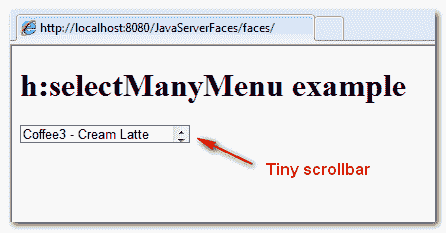
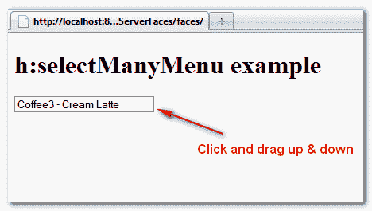
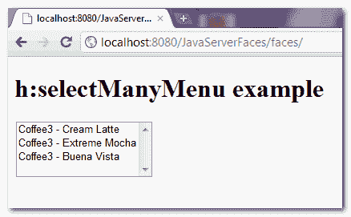

# JSF 2 多选下拉框示例

> 原文：<http://web.archive.org/web/20230101150211/http://www.mkyong.com/jsf2/jsf-2-multiple-select-dropdown-box-example/>

在 JSF，**<h:selectmany menu/>**标签用于呈现一个多选下拉框——HTML select 元素，带有“ **multiple** ”和“ **size=1** ”属性。

```
 //JSF...
<h:selectManyMenu value="#{user.favCoffee1}">
   	<f:selectItem itemValue="Cream Latte" itemLabel="Coffee3 - Cream Latte" />
   	<f:selectItem itemValue="Extreme Mocha" itemLabel="Coffee3 - Extreme Mocha" />
   	<f:selectItem itemValue="Buena Vista" itemLabel="Coffee3 - Buena Vista" />
</h:selectManyMenu>

//HTML output...
<select name="j_idt6:j_idt8" multiple="multiple" size="1">	
	<option value="Cream Latte">Coffee3 - Cream Latte</option>
	<option value="Extreme Mocha">Coffee3 - Extreme Mocha</option>
	<option value="Buena Vista">Coffee3 - Buena Vista</option>
</select> 
```

然而， **h:selectManyMenu** 标签的使用**极不推荐**，因为它们在不同的互联网浏览器中显示不一致，见图:

## 1.Internet Explorer 8

一个小滚动条来操作下拉框的值。

<noscript></noscript>


## 2.火狐 3.6.10

没有滚动条，看起来像一个普通的“文本框”，但你可以点击“文本框”和“上下拖动”或“上下键”来操纵值。

<noscript></noscript>


## 3.谷歌浏览器

在 Google Chrome 中，无论是<< select element with "multiple" and size="1" attribute - " **h:selectManyMenu** "标签> >还是< <带有" multiple "和 size="total of records "属性的 select 元素- " **h:selectManyListbox** "标签> >都是显示精确的布局。

<noscript></noscript>


## 结论

忘了“ **h:selectManyMenu** ”标签吧，真的没有理由用它。“ [h:selectManyListbox](http://web.archive.org/web/20201226142747/http://www.mkyong.com/jsf2/jsf-2-multiple-select-listbox-example/) ”标签是一个很好的选择。

#### 参考

1.  [JSF < h:选择菜单/ > JavaDoc](http://web.archive.org/web/20201226142747/https://javaserverfaces.dev.java.net/nonav/docs/2.0/pdldocs/facelets/h/selectManyMenu.html)
2.  [JSF 2h:选定的列表框 103](http://web.archive.org/web/20201226142747/http://www.mkyong.com/jsf2/jsf-2-multiple-select-listbox-example/)

标签:[drop down](http://web.archive.org/web/20201226142747/https://mkyong.com/tag/dropdown/)[JSF 2](http://web.archive.org/web/20201226142747/https://mkyong.com/tag/jsf2/)<input type="hidden" id="mkyong-current-postId" value="7311">

### 相关文章

*   [JSF2 drop-down box example](/web/20201226142747/https://mkyong.com/jsf2/jsf-2-dropdown-box-example/)
*   [How to do it in jQuery](/web/20201226142747/https://mkyong.com/jquery/how-to-set-a-dropdown-box-value-in-jquery/)
*   Set the drop-down box value in

*   [How to use Struts 2 【T1]](/web/20201226142747/https://mkyong.com/struts2/how-to-auto-select-drop-down-box-value-in-struts-2/)
*   Automatically select the value struts 2 < s from the drop-down box [: select the drop-down box > as an example](/web/20201226142747/https://mkyong.com/struts2/struts-2-sselect-drop-down-box-example/)
*   [Struts 2 < s:combobox >组合框示例](/web/20201226142747/https://mkyong.com/struts2/struts-2-scombobox-combo-box-example/)
*   [Struts 2<s:double select<](/web/20201226142747/https://mkyong.com/struts2/struts-2-sdoubleselect-example/)