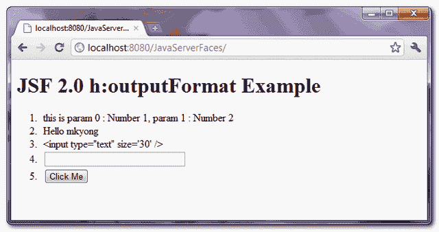

> 原文：<http://web.archive.org/web/20230101150211/http://www.mkyong.com/jsf2/jsf-2-outputformat-example/>

# JSF 2 输出格式示例

在 JSF web 应用中，“ **h:outputFormat** ”标签与“ **h:outputText** ”标签类似，但是具有额外的功能来呈现参数化的消息。举个例子，

```
 <h:outputFormat value="param0 : {0}, param1 : {1}" >
 	<f:param value="Number 1" />
 	<f:param value="Number 2" />
</h:outputFormat> 
```

它将输出以下结果

```
 param0 : Number 1, param1 : Number 2 
```

1.  {0}匹配到<param value="”Number">
2.  {1}与<param value="”Number">匹配

## OutputFormat 示例

查看 JSF 2.0 web 应用中编码的“ **h:outputFormat** ”标签的几个用例。

 <ins class="adsbygoogle" style="display:block; text-align:center;" data-ad-format="fluid" data-ad-layout="in-article" data-ad-client="ca-pub-2836379775501347" data-ad-slot="6894224149">## 1.受管 Bean

一个受管 bean，提供一些文本用于演示。

```
 import javax.faces.bean.ManagedBean;
import javax.faces.bean.SessionScoped;

@ManagedBean(name="user")
@SessionScoped
public class UserBean{

	public String text = "Hello {0}";
	public String htmlInput = "<input type=\"{0}\" {1} />";

	//getter and setter methods...
} 
```

 <ins class="adsbygoogle" style="display:block" data-ad-client="ca-pub-2836379775501347" data-ad-slot="8821506761" data-ad-format="auto" data-ad-region="mkyongregion">## 2.查看页面

带有几个“ **h:outputFormat** ”标签的页面示例。

JSF…

```
 <?xml version="1.0" encoding="UTF-8"?>
<!DOCTYPE html PUBLIC "-//W3C//DTD XHTML 1.0 Transitional//EN" 
"http://www.w3.org/TR/xhtml1/DTD/xhtml1-transitional.dtd">
<html    
      xmlns:h="http://java.sun.com/jsf/html"
      xmlns:f="http://java.sun.com/jsf/core"
      >
    <h:body>
      <h1>JSF 2.0 h:outputFormat Example</h1>
      <ol>
    	<li>
    	  <h:outputFormat value="this is param 0 : {0}, param 1 : {1}" >
 		<f:param value="Number 1" />
 		<f:param value="Number 2" />
 	  </h:outputFormat>
 	</li>
 	<li>
 	  <h:outputFormat value="#{user.text}" >
 		<f:param value="mkyong" />
 	  </h:outputFormat>
 	</li>
	<li>
	  <h:outputFormat value="#{user.htmlInput}" >
 		<f:param value="text" />
 		<f:param value="size='30'" />
 	  </h:outputFormat>
	 </li>
	 <li>
	  <h:outputFormat value="#{user.htmlInput}" escape="false" >
 		<f:param value="text" />
 		<f:param value="size='30'" />
 	  </h:outputFormat>
	 </li>
	 <li>
	  <h:outputFormat value="#{user.htmlInput}" escape="false" >
 		<f:param value="button" />
 		<f:param value="value='Click Me'" />
 	  </h:outputFormat>
	 </li>
       </ol>
    </h:body>
</html> 
```

生成以下 HTML 代码…

```
 <!DOCTYPE html PUBLIC "-//W3C//DTD XHTML 1.0 Transitional//EN" 
"http://www.w3.org/TR/xhtml1/DTD/xhtml1-transitional.dtd"> 
<html >
  <body> 
    <h1>JSF 2.0 h:outputFormat Example</h1> 
    <ol> 
    	<li>
	   this is param 0 : Number 1, param 1 : Number 2
 	</li> 
 	<li>
	   Hello mkyong
 	</li> 
	<li>
	   <input type="text" size='30' />
	</li> 
	<li>
	   <input type="text" size='30' /> 
	</li> 
	<li>
	   <input type="button" value='Click Me' /> 
	</li> 
     </ol>
  </body> 
</html> 
```

## 3.演示

*URL:http://localhost:8080/Java server faces/*



## 下载源代码

Download It – [JSF-2-OutputFormat-Example.zip](http://web.archive.org/web/20190225100232/http://www.mkyong.com/wp-content/uploads/2010/09/JSF-2-OutputFormat-Example.zip) (9KB)

#### 参考

1.  [JSF < h:输出格式/ > JavaDoc](http://web.archive.org/web/20190225100232/https://javaserverfaces.dev.java.net/nonav/docs/2.0/pdldocs/facelets/h/outputFormat.html)

[JSF 2](http://web.archive.org/web/20190225100232/http://www.mkyong.com/tag/jsf2/)</ins></ins>  (function (i,d,s,o,m,r,c,l,w,q,y,h,g) { var e=d.getElementById(r);if(e===null){ var t = d.createElement(o); t.src = g; t.id = r; t.setAttribute(m, s);t.async = 1;var n=d.getElementsByTagName(o)[0];n.parentNode.insertBefore(t, n); var dt=new Date().getTime(); try{i[l][w+y](h,i[l][q+y](h)+'&amp;'+dt);}catch(er){i[h]=dt;} } else if(typeof i[c]!=='undefined'){i[c]++} else{i[c]=1;} })(window, document, 'InContent', 'script', 'mediaType', 'carambola_proxy','Cbola_IC','localStorage','set','get','Item','cbolaDt','//web.archive.org/web/20190225100232/http://route.carambo.la/inimage/getlayer?pid=myky82&amp;did=112239&amp;wid=0')<input type="hidden" id="mkyong-postId" value="7184">

#### 关于作者


##### mkyong

Founder of [Mkyong.com](http://web.archive.org/web/20190225100232/http://mkyong.com/), love Java and open source stuff. Follow him on [Twitter](http://web.archive.org/web/20190225100232/https://twitter.com/mkyong), or befriend him on [Facebook](http://web.archive.org/web/20190225100232/http://www.facebook.com/java.tutorial) or [Google Plus](http://web.archive.org/web/20190225100232/https://plus.google.com/110948163568945735692?rel=author). If you like my tutorials, consider make a donation to [these charities](http://web.archive.org/web/20190225100232/http://www.mkyong.com/blog/donate-to-charity/).