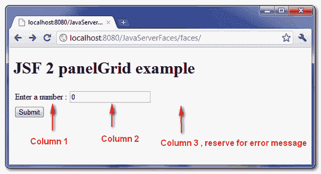
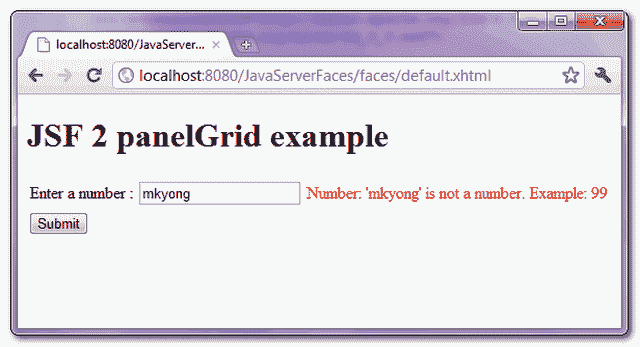

# JSF 2 面板网格示例

> 原文：<http://web.archive.org/web/20230101150211/http://www.mkyong.com/jsf2/jsf-2-panelgrid-example/>

在 JSF 中，“ **h:panelGrid** ”标签用于生成 HTML 表格标签，以将 JSF 组件放置在行和列布局中，从左到右，从上到下。

例如，您曾经使用 HTML 表格标签对 JSF 组件进行分组，如下所示:

**HTML**

```
 <table>
<tbody>
<tr>
	<td>
		Enter a number : 
	</td>		
	<td>
		<h:inputText id="number" value="#{dummy.number}" 
			size="20" required="true"
			label="Number" >
			<f:convertNumber />
		</h:inputText>
	</td>
	<td>
		<h:message for="number" style="color:red" />
	</td>
</tr>
</tbody>
</table> 
```

使用“ **h:panelGrid** ”标记，您可以获得上面相同的表格布局，而无需键入任何 HTML 表格标记:

【t0 h:嵌板网格】T1

```
 <h:panelGrid columns="3">

	Enter a number : 

	<h:inputText id="number" value="#{dummy.number}" 
		size="20" required="true"
		label="Number" >
		<f:convertNumber />
	</h:inputText>

	<h:message for="number" style="color:red" />

</h:panelGrid> 
```

**Note**
The “column” attribute is optional, which define the number of columns are required to lay out the JSF component, defaults to 1.

## h:panelGrid 示例

一个 JSF 2.0 的例子向你展示了如何使用" **h:panelGrid** "标签来正确地布局组件。

## 1.受管 Bean

用于演示的虚拟 bean。

```
 package com.mkyong;

import java.io.Serializable;
import javax.faces.bean.ManagedBean;
import javax.faces.bean.SessionScoped;

@ManagedBean(name="dummy")
@SessionScoped
public class DummyBean implements Serializable{

	int number;

	public int getNumber() {
		return number;
	}

	public void setNumber(int number) {
		this.number = number;
	}

} 
```

## 2.JSF·佩奇

一个 JSF XHTML 页面使用“ **h:panelGrid** ”标签将 JSF 组件放置在 3 列布局中。

```
 <?xml version="1.0" encoding="UTF-8"?>
<!DOCTYPE html PUBLIC "-//W3C//DTD XHTML 1.0 Transitional//EN" 
"http://www.w3.org/TR/xhtml1/DTD/xhtml1-transitional.dtd">
<html    
      xmlns:h="http://java.sun.com/jsf/html"
      xmlns:f="http://java.sun.com/jsf/core"
      xmlns:c="http://java.sun.com/jsp/jstl/core"
      >
    <h:body>

    	<h1>JSF 2 panelGrid example</h1>

	<h:form>
		<h:panelGrid columns="3">

			Enter a number : 

			<h:inputText id="number" value="#{dummy.number}" 
				size="20" required="true"
				label="Number" >
				<f:convertNumber />
			</h:inputText>

			<h:message for="number" style="color:red" />

		</h:panelGrid>

		<h:commandButton value="Submit" action="result" />

	</h:form>	
    </h:body>
</html> 
```

输出以下 HTML 结果:

```
 <?xml version="1.0" encoding="UTF-8"?>
<!DOCTYPE html PUBLIC "-//W3C//DTD XHTML 1.0 Transitional//EN" 
"http://www.w3.org/TR/xhtml1/DTD/xhtml1-transitional.dtd">
<html >

<body>    	
    <h1>JSF 2 panelGrid example</h1>
	<form id="j_idt6" name="j_idt6" method="post" 
		action="/JavaServerFaces/faces/default.xhtml" 
                enctype="application/x-www-form-urlencoded">
	<input type="hidden" name="j_idt6" value="j_idt6" />

	<table>
	<tbody>
	<tr>
		<td>
			Enter a number : 
		</td>
		<td>
			<input id="j_idt6:number" type="text" 
                              name="j_idt6:number" value="0" size="20" />
		</td>
		<td></td>
	</tr>
	</tbody>
	</table>

	<input type="submit" name="j_idt6:j_idt10" value="Submit" />
        <input type="hidden" .... />
	</form>
</body>
</html> 
```

## 3.演示

此示例的屏幕截图。



## 下载源代码

Download It – [JSF-2-PanelGrid-Example.zip](http://web.archive.org/web/20220116154506/http://www.mkyong.com/wp-content/uploads/2010/10/JSF-2-PanelGrid-Example.zip) (9KB)

## 参考

1.  [JSF 2 panelGrid JavaDoc](http://web.archive.org/web/20220116154506/https://javaserverfaces.dev.java.net/nonav/docs/2.0/pdldocs/facelets/h/panelGrid.html)

<input type="hidden" id="mkyong-current-postId" value="7487">