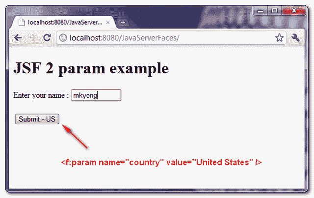
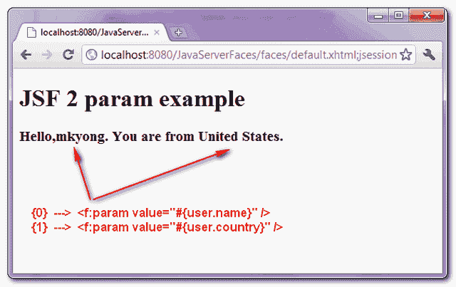

> 原文：<http://web.archive.org/web/20230101150211/http://www.mkyong.com/jsf2/jsf-2-param-example/>

# JSF 2 参数示例

在 JSF 中，“ **f:param** ”标签允许你传递一个参数给一个组件，但是它的行为是不同的，取决于它附加的组件的类型。举个例子，

## 1\. f:param + h:输出格式

如果将一个“ *f:param* ”标记附加到“ *h:outputFormat* ”上，该参数就指定了占位符。

```java
 <h:outputFormat value="Hello,{0}. You are from {1}.">
	<f:param value="JSF User" />
	<f:param value="China" />
</h:outputFormat> 
```

下面是输出结果——“**你好，JSF 用户。你来自中国**”。

 <ins class="adsbygoogle" style="display:block; text-align:center;" data-ad-format="fluid" data-ad-layout="in-article" data-ad-client="ca-pub-2836379775501347" data-ad-slot="6894224149">## 2.f:参数+其他组件

如果您将一个“ *f:param* ”标签附加到其他组件上，如“ *h:commandButton* ”，该参数将被转换为请求参数。

```java
 <h:commandButton id="submitButton" 
	value="Submit - US" action="#{user.outcome}">
	<f:param name="country" value="China" />
</h:commandButton> 
```

在用户 bean 中，您可以像这样取回参数值:

```java
 Map<String,String> params = 
		FacesContext.getExternalContext().getRequestParameterMap();

	String countrry = params.get("country"); 
```

 <ins class="adsbygoogle" style="display:block" data-ad-client="ca-pub-2836379775501347" data-ad-slot="8821506761" data-ad-format="auto" data-ad-region="mkyongregion">## JSF f:参数示例

下面是一个 JSF 2.0 应用程序，展示了在“ **h:commandButton** 和“ **h:outputFormat** 组件中使用 **f:param** 标记。

## 1.受管 Bean

简单的托管 bean。

*UserBean.java*

```java
 package com.mkyong;

import java.util.Map;

import javax.faces.bean.ManagedBean;
import javax.faces.bean.SessionScoped;
import javax.faces.context.FacesContext;

@ManagedBean(name="user")
@SessionScoped
public class UserBean{

	public String name;
	public String country;

	public String outcome(){

		FacesContext fc = FacesContext.getCurrentInstance();
		this.country = getCountryParam(fc);

		return "result";
	}

	//get value from "f:param"
	public String getCountryParam(FacesContext fc){

		Map<String,String> params = fc.getExternalContext().getRequestParameterMap();
		return params.get("country");

	}

	//getter and setter methods

} 
```

## 2.JSF·佩奇

两个 JSF 页面用于演示。

*default.xhtml*

```java
 <?xml version="1.0" encoding="UTF-8"?>
<!DOCTYPE html PUBLIC "-//W3C//DTD XHTML 1.0 Transitional//EN" 
"http://www.w3.org/TR/xhtml1/DTD/xhtml1-transitional.dtd">
<html    
      xmlns:h="http://java.sun.com/jsf/html"
      xmlns:f="http://java.sun.com/jsf/core"
      >

    <h:body>

    <h1>JSF 2 param example</h1>

      <h:form id="form">

	Enter your name :
	<h:inputText size="10" value="#{user.name}" />

	<br /><br />

	<h:commandButton id="submitButton" 
		value="Submit - US" action="#{user.outcome}">

		<f:param name="country" value="United States" />

	</h:commandButton>

      </h:form>

    </h:body>
</html> 
```

*result.xhtml*

```java
 <?xml version="1.0" encoding="UTF-8"?>
<!DOCTYPE html PUBLIC "-//W3C//DTD XHTML 1.0 Transitional//EN" 
"http://www.w3.org/TR/xhtml1/DTD/xhtml1-transitional.dtd">
<html    
      xmlns:h="http://java.sun.com/jsf/html"
      xmlns:f="http://java.sun.com/jsf/core"
      >

    <h:body>

    <h1>JSF 2 param example</h1>

     <h2>
     <h:outputFormat value="Hello,{0}. You are from {1}.">
	 <f:param value="#{user.name}" />
	 <f:param value="#{user.country}" />
     </h:outputFormat>
     </h2>

    </h:body>

</html> 
```

## 3.演示

输入您的姓名，例如“mkyong”，然后点击按钮。



显示格式化的消息，“姓名”来自用户输入，“国家”来自按钮参数。



## 下载源代码

Download It – [JSF-2-Param-Example.zip](http://web.archive.org/web/20190216232832/http://www.mkyong.com/wp-content/uploads/2010/11/JSF-2-Param-Example.zip) (10KB)

## 参考

1.  JSF f:帕拉姆贾瓦德克

[jsf2](http://web.archive.org/web/20190216232832/http://www.mkyong.com/tag/jsf2/)


