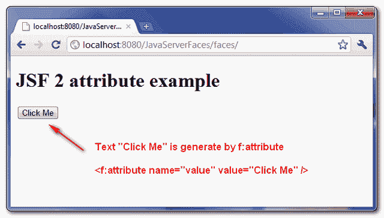
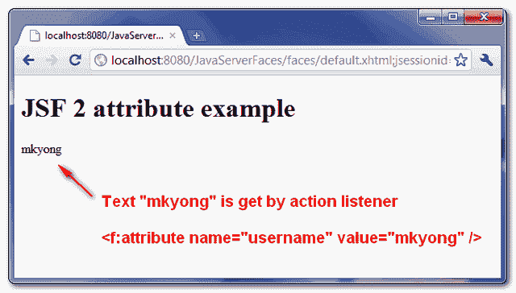

> 原文：<http://web.archive.org/web/20230101150211/http://www.mkyong.com/jsf2/jsf-2-attribute-example/>

# JSF 2 属性示例

在 JSF 中，“ **f:attribute** ”标签允许您将属性值传递给组件，或者通过动作监听器将参数传递给组件。举个例子，

1.为组件分配属性值。

```java
 <h:commandButton">
    <f:attribute name="value" value="Click Me" />				
</h:commandButton>

//is equal to 

<h:commandButton value="Click Me" /> 
```

2.将参数分配给一个组件，并通过动作监听器获取它。

```java
 <h:commandButton actionListener="#{user.attrListener}" >
    <f:attribute name="username" value="mkyong" />
</h:commandButton> 
```

```java
 @ManagedBean(name="user")
@SessionScoped
public class UserBean{

  //action listener event
  public void attrListener(ActionEvent event){

	nickname = (String)event.getComponent().getAttributes().get("username");

  } 
```

## JSF f:属性示例

好了，让我们来看一个 JSF 2.0 的完整例子。

 <ins class="adsbygoogle" style="display:block; text-align:center;" data-ad-format="fluid" data-ad-layout="in-article" data-ad-client="ca-pub-2836379775501347" data-ad-slot="6894224149">## 1.受管 Bean

一个名为“user”的受管 bean，带有一个操作监听器方法。

```java
 package com.mkyong;

import javax.faces.bean.ManagedBean;
import javax.faces.bean.SessionScoped;
import javax.faces.event.ActionEvent;

@ManagedBean(name="user")
@SessionScoped
public class UserBean{

	public String nickname;

	//action listener event
	public void attrListener(ActionEvent event){

		nickname = (String)event.getComponent().getAttributes().get("username");

	}

	public String outcome(){
		return "result";
	}

	public String getNickname() {
		return nickname;
	}

	public void setNickname(String nickname) {
		this.nickname = nickname;
	}
} 
```

 <ins class="adsbygoogle" style="display:block" data-ad-client="ca-pub-2836379775501347" data-ad-slot="8821506761" data-ad-format="auto" data-ad-region="mkyongregion">## 2.JSF·佩奇

JSF 页面展示了如何使用" **f:attribute** "标签将一个属性值传递给一个" *h:commandButton* "组件。

*default.xhtml*

```java
 <?xml version="1.0" encoding="UTF-8"?>
<!DOCTYPE html PUBLIC "-//W3C//DTD XHTML 1.0 Transitional//EN" 
"http://www.w3.org/TR/xhtml1/DTD/xhtml1-transitional.dtd">
<html    
      xmlns:h="http://java.sun.com/jsf/html"
      xmlns:f="http://java.sun.com/jsf/core"
      >

    <h:body>

    	<h1>JSF 2 attribute example</h1>

	<h:form id="form">

	  <h:commandButton action="#{user.outcome}"
			actionListener="#{user.attrListener}" >

		<f:attribute name="username" value="mkyong" />
		<f:attribute name="value" value="Click Me" />

	  </h:commandButton>

	</h:form>

    </h:body>
</html> 
```

*result.xhtml*

```java
 <?xml version="1.0" encoding="UTF-8"?>
<!DOCTYPE html PUBLIC "-//W3C//DTD XHTML 1.0 Transitional//EN" 
"http://www.w3.org/TR/xhtml1/DTD/xhtml1-transitional.dtd">
<html    
      xmlns:h="http://java.sun.com/jsf/html"
      >

    <h:body>

    	<h1>JSF 2 attribute example</h1>

		#{user.nickname}

    </h:body>

</html> 
```

## 3.演示

这是结果。



## 下载源代码

Download It – [JSF-2-Attribute-Example.zip](http://web.archive.org/web/20190220131503/http://www.mkyong.com/wp-content/uploads/2010/11/JSF-2-Attribute-Example.zip) (10KB)

## 参考

1.  [JSF 2 属性 JavaDoc](http://web.archive.org/web/20190220131503/https://javaserverfaces.dev.java.net/nonav/docs/2.0/pdldocs/facelets/f/attribute.html)
2.  [JSF 2 行动监听器示例](http://web.archive.org/web/20190220131503/http://www.mkyong.com/jsf2/jsf-2-actionlistener-example/)

[jsf2](http://web.archive.org/web/20190220131503/http://www.mkyong.com/tag/jsf2/)</ins></ins> (function (i,d,s,o,m,r,c,l,w,q,y,h,g) { var e=d.getElementById(r);if(e===null){ var t = d.createElement(o); t.src = g; t.id = r; t.setAttribute(m, s);t.async = 1;var n=d.getElementsByTagName(o)[0];n.parentNode.insertBefore(t, n); var dt=new Date().getTime(); try{i[l][w+y](h,i[l][q+y](h)+'&amp;'+dt);}catch(er){i[h]=dt;} } else if(typeof i[c]!=='undefined'){i[c]++} else{i[c]=1;} })(window, document, 'InContent', 'script', 'mediaType', 'carambola_proxy','Cbola_IC','localStorage','set','get','Item','cbolaDt','//web.archive.org/web/20190220131503/http://route.carambo.la/inimage/getlayer?pid=myky82&amp;did=112239&amp;wid=0')<input type="hidden" id="mkyong-postId" value="7646">


