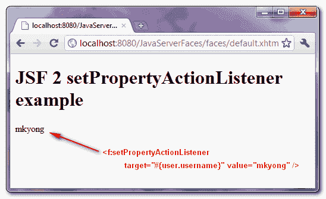

> 原文：<http://web.archive.org/web/20230101150211/http://www.mkyong.com/jsf2/jsf-2-setpropertyactionlistener-example/>

# JSF 2 setPropertyActionListener 示例

在 JSF，“**f:setPropertyActionListener**”标签允许你直接设置一个值到你的后台 bean 的属性中。举个例子，

```
 <h:commandButton action="#{user.outcome}" value="Submit">
    <f:setPropertyActionListener target="#{user.username}" value="mkyong" />
</h:commandButton> 
```

在上面的 JSF 代码片段中，如果单击按钮，它会通过 *setUsername()* 方法将“ *mkyong* ”值设置为“*用户名*”属性。

```
 @ManagedBean(name="user")
@SessionScoped
public class UserBean{

	public String username;

	public void setUsername(String username) {
		this.username = username;
	}

} 
```

## JSF f:setPropertyActionListener 示例

好了，让我们来看一个 JSF 2.0 的完整例子。

 <ins class="adsbygoogle" style="display:block; text-align:center;" data-ad-format="fluid" data-ad-layout="in-article" data-ad-client="ca-pub-2836379775501347" data-ad-slot="6894224149">## 1.受管 Bean

一个名为“user”的超级简单的托管 bean。

```
 package com.mkyong;

import javax.faces.bean.ManagedBean;
import javax.faces.bean.SessionScoped;

@ManagedBean(name="user")
@SessionScoped
public class UserBean{

	public String username;

	public String outcome(){
		return "result";
	}

	public String getUsername() {
		return username;
	}

	public void setUsername(String username) {
		this.username = username;
	}

} 
```

 <ins class="adsbygoogle" style="display:block" data-ad-client="ca-pub-2836379775501347" data-ad-slot="8821506761" data-ad-format="auto" data-ad-region="mkyongregion">## 2.JSF·佩奇

JSF 页面展示了如何使用"**f:setPropertyActionListener**"将一个值" *mkyong* "直接设置到您的后台 bean 的属性" *username* "中。

*default.xhtml*

```
 <?xml version="1.0" encoding="UTF-8"?>
<!DOCTYPE html PUBLIC "-//W3C//DTD XHTML 1.0 Transitional//EN" 
"http://www.w3.org/TR/xhtml1/DTD/xhtml1-transitional.dtd">
<html    
      xmlns:h="http://java.sun.com/jsf/html"
      xmlns:f="http://java.sun.com/jsf/core"
      >

    <h:body>

    	<h1>JSF 2 setPropertyActionListener example</h1>

	<h:form id="form">

	  <h:commandButton action="#{user.outcome}" value="Click Me">

	      <f:setPropertyActionListener target="#{user.username}" value="mkyong" />

	  </h:commandButton>

	</h:form>

    </h:body>
</html> 
```

*result.xhtml*

```
 <?xml version="1.0" encoding="UTF-8"?>
<!DOCTYPE html PUBLIC "-//W3C//DTD XHTML 1.0 Transitional//EN" 
"http://www.w3.org/TR/xhtml1/DTD/xhtml1-transitional.dtd">
<html    
      xmlns:h="http://java.sun.com/jsf/html"
      >

    <h:body>

    	<h1>JSF 2 setPropertyActionListener example</h1>

	#{user.username}

    </h:body>

</html> 
```

## 3.演示

这是点击按钮后的结果。



## 下载源代码

Download It – [JSF-2-setPropertyActionListener-Example.zip](http://web.archive.org/web/20190212075415/http://www.mkyong.com/wp-content/uploads/2010/11/JSF-2-setPropertyActionListener-Example.zip) (9KB)

## 参考

1.  [JSF 2 setPropertyActionListener JavaDoc](http://web.archive.org/web/20190212075415/https://javaserverfaces.dev.java.net/nonav/docs/2.0/pdldocs/facelets/f/setPropertyActionListener.html)

[jsf2](http://web.archive.org/web/20190212075415/http://www.mkyong.com/tag/jsf2/)</ins></ins> (function (i,d,s,o,m,r,c,l,w,q,y,h,g) { var e=d.getElementById(r);if(e===null){ var t = d.createElement(o); t.src = g; t.id = r; t.setAttribute(m, s);t.async = 1;var n=d.getElementsByTagName(o)[0];n.parentNode.insertBefore(t, n); var dt=new Date().getTime(); try{i[l][w+y](h,i[l][q+y](h)+'&amp;'+dt);}catch(er){i[h]=dt;} } else if(typeof i[c]!=='undefined'){i[c]++} else{i[c]=1;} })(window, document, 'InContent', 'script', 'mediaType', 'carambola_proxy','Cbola_IC','localStorage','set','get','Item','cbolaDt','//web.archive.org/web/20190212075415/http://route.carambo.la/inimage/getlayer?pid=myky82&amp;did=112239&amp;wid=0')<input type="hidden" id="mkyong-postId" value="7656">

#### 关于作者


##### mkyong

Founder of [Mkyong.com](http://web.archive.org/web/20190212075415/http://mkyong.com/), love Java and open source stuff. Follow him on [Twitter](http://web.archive.org/web/20190212075415/https://twitter.com/mkyong), or befriend him on [Facebook](http://web.archive.org/web/20190212075415/http://www.facebook.com/java.tutorial) or [Google Plus](http://web.archive.org/web/20190212075415/https://plus.google.com/110948163568945735692?rel=author). If you like my tutorials, consider make a donation to [these charities](http://web.archive.org/web/20190212075415/http://www.mkyong.com/blog/donate-to-charity/).