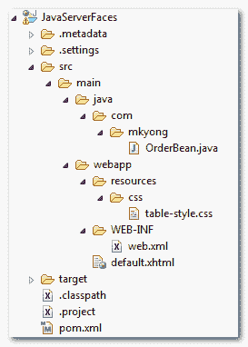

> 原文：<http://web.archive.org/web/20230101150211/http://www.mkyong.com/jsf2/jsf-2-datatable-example/>

# JSF 2 数据表示例

在 JSF 中，“ **h:dataTable** ”标签用于以 HTML 表格格式显示数据。下面的 JSF 2.0 示例向您展示了如何使用“ **h:dataTable** ”标记来循环遍历“订单”对象的数组，并以 HTML 表格格式显示它。

## 1.项目文件夹

本例的项目文件夹结构。



## 2.受管 bean

一个名为“order”的受管 bean 初始化了数组对象供以后使用。

**OrderBean.java**

```java
 package com.mkyong;

import java.io.Serializable;
import java.math.BigDecimal;
import javax.faces.bean.ManagedBean;
import javax.faces.bean.SessionScoped;

@ManagedBean(name="order")
@SessionScoped
public class OrderBean implements Serializable{

	private static final long serialVersionUID = 1L;

	private static final Order[] orderList = new Order[] {

		new Order("A0001", "Intel CPU", 
				new BigDecimal("700.00"), 1),
		new Order("A0002", "Harddisk 10TB", 
				new BigDecimal("500.00"), 2),
		new Order("A0003", "Dell Laptop", 
				new BigDecimal("11600.00"), 8),
		new Order("A0004", "Samsung LCD", 
				new BigDecimal("5200.00"), 3),
		new Order("A0005", "A4Tech Mouse", 
				new BigDecimal("100.00"), 10)
	};

	public Order[] getOrderList() {

		return orderList;

	}

	public static class Order{

		String orderNo;
		String productName;
		BigDecimal price;
		int qty;

		public Order(String orderNo, String productName, 
                                BigDecimal price, int qty) {

			this.orderNo = orderNo;
			this.productName = productName;
			this.price = price;
			this.qty = qty;
		}

		//getter and setter methods
	}
} 
```

## 3.半铸钢ˌ钢性铸铁(Cast Semi-Steel)

创建一个 CSS 文件来设置表格布局的样式。

**table-style.css**

```java
 .order-table{   
	border-collapse:collapse;
}

.order-table-header{
	text-align:center;
	background:none repeat scroll 0 0 #E5E5E5;
	border-bottom:1px solid #BBBBBB;
	padding:16px;
}

.order-table-odd-row{
	text-align:center;
	background:none repeat scroll 0 0 #FFFFFFF;
	border-top:1px solid #BBBBBB;
}

.order-table-even-row{
	text-align:center;
	background:none repeat scroll 0 0 #F9F9F9;
	border-top:1px solid #BBBBBB;
} 
```

## 4.h:数据表

一个 JSF 2.0 xhtml 页面，展示了如何使用" **h:dataTable** "标签来循环访问" order "对象的数组。这个例子应该是不言自明的。

**default.xhtml**

```java
 <?xml version="1.0" encoding="UTF-8"?>
<!DOCTYPE html PUBLIC "-//W3C//DTD XHTML 1.0 Transitional//EN" 
"http://www.w3.org/TR/xhtml1/DTD/xhtml1-transitional.dtd">
<html    
      xmlns:h="http://java.sun.com/jsf/html"
      xmlns:f="http://java.sun.com/jsf/core"
      xmlns:ui="http://java.sun.com/jsf/facelets"
      >
    <h:head>
    	<h:outputStylesheet library="css" name="table-style.css"  />
    </h:head>
    <h:body>

    	<h1>JSF 2 dataTable example</h1>

    		<h:dataTable value="#{order.orderList}" var="o"
    			styleClass="order-table"
    			headerClass="order-table-header"
    			rowClasses="order-table-odd-row,order-table-even-row"
    		>

    			<h:column>
    				<!-- column header -->
    				<f:facet name="header">Order No</f:facet>
    				<!-- row record -->
    				#{o.orderNo}
    			</h:column>

    			<h:column>
    				<f:facet name="header">Product Name</f:facet>
    				#{o.productName}
    			</h:column>

    			<h:column>
    				<f:facet name="header">Price</f:facet>
    				#{o.price}
    			</h:column>

    			<h:column>
    				<f:facet name="header">Quantity</f:facet>
    				#{o.qty}
    			</h:column>

    		</h:dataTable>

    </h:body>
</html> 
```

生成这个 HTML 输出

```java
 <!DOCTYPE html PUBLIC "-//W3C//DTD XHTML 1.0 Transitional//EN" 
"http://www.w3.org/TR/xhtml1/DTD/xhtml1-transitional.dtd"> 
<html >
	<head>
	   <link type="text/css" rel="stylesheet" 
	      href="/JavaServerFaces/faces/javax.faces.resource/table-style.css?ln=css" />
	</head>
	<body> 

	<h1>JSF 2 dataTable example</h1>

	<table class="order-table"> 

  	  <thead> 
		<tr> 
		<th class="order-table-header" scope="col">Order No</th> 
		<th class="order-table-header" scope="col">Product Name</th> 
		<th class="order-table-header" scope="col">Price</th> 
		<th class="order-table-header" scope="col">Quantity</th> 
		</tr> 
	  </thead> 

	  <tbody> 
		<tr class="order-table-odd-row"> 
			<td>A0001</td> 
			<td>Intel CPU</td> 
			<td>700.00</td> 
			<td>1</td> 
		</tr> 
		<tr class="order-table-even-row"> 
			<td>A0002</td> 
			<td>Harddisk 10TB</td> 
			<td>500.00</td> 
			<td>2</td> 
		</tr> 
		<tr class="order-table-odd-row"> 
			<td>A0003</td> 
			<td>Dell Laptop</td> 
			<td>11600.00</td> 
			<td>8</td> 
		</tr> 
		<tr class="order-table-even-row"> 
			<td>A0004</td> 
			<td>Samsung LCD</td> 
			<td>5200.00</td> 
			<td>3</td> 
		</tr> 
		<tr class="order-table-odd-row"> 
			<td>A0005</td> 
			<td>A4Tech Mouse</td> 
			<td>100.00</td> 
			<td>10</td> 		
		</tr> 
	  </tbody> 
	 </table> 
      </body> 	
</html> 
```

## 6.演示

URL:*http://localhost:8080/Java server faces/default . XHTML*

Download It – [JSF-2-DataTable-Example.zip](http://web.archive.org/web/20190705140941/http://www.mkyong.com/wp-content/uploads/2010/10/JSF-2-DataTable-Example.zip) (11KB)

## 参考

1.  [JSF<h:dataTable/>JavaDoc](http://web.archive.org/web/20190705140941/https://javaserverfaces.dev.java.net/nonav/docs/2.0/pdldocs/facelets/h/dataTable.html)
2.  [JSF<h:column/>JavaDoc](http://web.archive.org/web/20190705140941/https://javaserverfaces.dev.java.net/nonav/docs/2.0/pdldocs/facelets/h/column.html)
3.  [JSF<f:facet/>JavaDoc](http://web.archive.org/web/20190705140941/https://javaserverfaces.dev.java.net/nonav/docs/2.0/pdldocs/facelets/f/facet.html)
4.  [JSF 新协议资源捆绑示例](http://web.archive.org/web/20190705140941/http://www.mkyong.com/jsf2/jsf-2-0-and-resource-bundles-example/)

[datatable](http://web.archive.org/web/20190705140941/https://www.mkyong.com/tag/datatable/) [jsf2](http://web.archive.org/web/20190705140941/https://www.mkyong.com/tag/jsf2/) (function (i,d,s,o,m,r,c,l,w,q,y,h,g) { var e=d.getElementById(r);if(e===null){ var t = d.createElement(o); t.src = g; t.id = r; t.setAttribute(m, s);t.async = 1;var n=d.getElementsByTagName(o)[0];n.parentNode.insertBefore(t, n); var dt=new Date().getTime(); try{i[l][w+y](h,i[l][q+y](h)+'&amp;'+dt);}catch(er){i[h]=dt;} } else if(typeof i[c]!=='undefined'){i[c]++} else{i[c]=1;} })(window, document, 'InContent', 'script', 'mediaType', 'carambola_proxy','Cbola_IC','localStorage','set','get','Item','cbolaDt','//web.archive.org/web/20190705140941/https://route.carambo.la/inimage/getlayer?pid=myky82&amp;did=112239&amp;wid=0')<input type="hidden" id="mkyong-postId" value="7363">

#### 关于作者


##### mkyong

Founder of [Mkyong.com](http://web.archive.org/web/20190705140941/http://mkyong.com/), love Java and open source stuff. Follow him on [Twitter](http://web.archive.org/web/20190705140941/https://twitter.com/mkyong). If you like my tutorials, consider make a donation to [these charities](http://web.archive.org/web/20190705140941/http://www.mkyong.com/blog/donate-to-charity/).