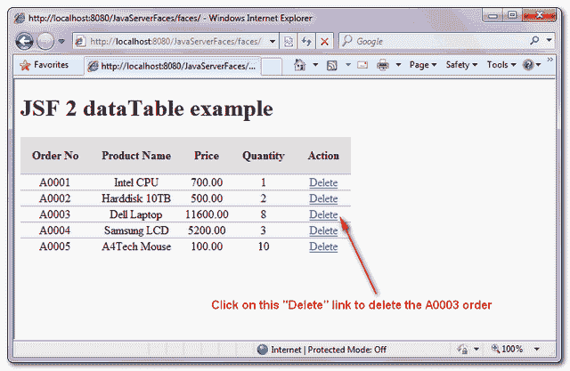
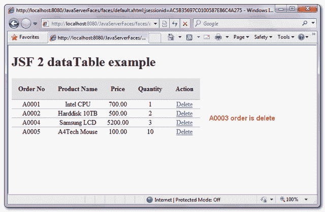

# 如何删除 JSF 数据表中的行

> 原文：<http://web.archive.org/web/20230101150211/http://www.mkyong.com/jsf2/how-to-delete-row-in-jsf-datatable/>

这个例子是对前面的 [JSF 2 数据表例子](http://web.archive.org/web/20210210194311/http://www.mkyong.com/jsf2/jsf-2-datatable-example/)的增强，通过添加一个“删除”函数来删除数据表中的行。

## 删除概念

整体概念非常简单:

1.在每一行的末尾分配一个“删除”链接。

```
 //...
<h:dataTable value="#{order.orderList}" var="o">

<h:column>

    <f:facet name="header">Action</f:facet>

    <h:commandLink value="Delete" action="#{order.deleteAction(o)}" />

</h:column> 
```

2.如果单击了“删除”链接，则将当前行对象传递给 deleteAction()。在 deleteAction()方法中，只是从“列表”中删除当前行对象并返回到当前页面。

```
 public String deleteAction(Order order) {

	orderList.remove(order);
	return null;
} 
```

freestar.config.enabled_slots.push({ placementName: "mkyong_incontent_1", slotId: "mkyong_incontent_1" });

## 例子

一个 JSF 2.0 的例子来实现上述概念，删除数据表中的行。

## 1.受管 Bean

一个名为“order”的托管 bean，不言自明。

```
 package com.mkyong;

import java.io.Serializable;
import java.math.BigDecimal;
import java.util.ArrayList;
import java.util.Arrays;

import javax.faces.bean.ManagedBean;
import javax.faces.bean.SessionScoped;

@ManagedBean(name="order")
@SessionScoped
public class OrderBean implements Serializable{

	private static final long serialVersionUID = 1L;

	private static final ArrayList<Order> orderList = 
		new ArrayList<Order>(Arrays.asList(

		new Order("A0001", "Intel CPU", 
				new BigDecimal("700.00"), 1),
		new Order("A0002", "Harddisk 10TB", 
				new BigDecimal("500.00"), 2),
		new Order("A0003", "Dell Laptop", 
				new BigDecimal("11600.00"), 8),
		new Order("A0004", "Samsung LCD", 
				new BigDecimal("5200.00"), 3),
		new Order("A0005", "A4Tech Mouse", 
				new BigDecimal("100.00"), 10)
	));

	public ArrayList<Order> getOrderList() {

		return orderList;

	}

	public String deleteAction(Order order) {

		orderList.remove(order);
		return null;
	}

	public static class Order{

		String orderNo;
		String productName;
		BigDecimal price;
		int qty;

		public Order(String orderNo, String productName, 
				BigDecimal price, int qty) {
			this.orderNo = orderNo;
			this.productName = productName;
			this.price = price;
			this.qty = qty;
		}

		//getter and setter methods
	}
} 
```

## 2.JSF·佩奇

JSF 页面显示带有 dataTable 标记的数据，并创建一个“删除”链接来删除行记录。

```
 <?xml version="1.0" encoding="UTF-8"?>
<!DOCTYPE html PUBLIC "-//W3C//DTD XHTML 1.0 Transitional//EN" 
"http://www.w3.org/TR/xhtml1/DTD/xhtml1-transitional.dtd">
<html    
      xmlns:h="http://java.sun.com/jsf/html"
      xmlns:f="http://java.sun.com/jsf/core"
      xmlns:ui="http://java.sun.com/jsf/facelets"
      >
    <h:head>
    	<h:outputStylesheet library="css" name="table-style.css"  />
    </h:head>
    <h:body>

    	<h1>JSF 2 dataTable example</h1>
    	<h:form>
    		<h:dataTable value="#{order.orderList}" var="o"
    			styleClass="order-table"
    			headerClass="order-table-header"
    			rowClasses="order-table-odd-row,order-table-even-row"
    		>

    		<h:column>

    			<f:facet name="header">Order No</f:facet>
    			#{o.orderNo}

    		</h:column>

    		<h:column>

    			<f:facet name="header">Product Name</f:facet>
    			#{o.productName}

    		</h:column>

    		<h:column>

    			<f:facet name="header">Price</f:facet>
    			#{o.price}

    		</h:column>

    		<h:column>

    			<f:facet name="header">Quantity</f:facet>
    			#{o.qty}

    		</h:column>

    		<h:column>

    			<f:facet name="header">Action</f:facet>

    			<h:commandLink value="Delete" 
                                action="#{order.deleteAction(o)}" />

    		</h:column>

    		</h:dataTable>

    	</h:form>
    </h:body>
</html> 
```

## 3.演示

从上到下，显示被删除的行记录。

<noscript></noscript>


<noscript></noscript>


## 下载源代码

Download It – [JSF-2-DataTable-Delete-Example.zip](http://web.archive.org/web/20210210194311/http://www.mkyong.com/wp-content/uploads/2010/10/JSF-2-DataTable-Delete-Example.zip) (10KB)Tags : [datatable](http://web.archive.org/web/20210210194311/https://mkyong.com/tag/datatable/) [delete](http://web.archive.org/web/20210210194311/https://mkyong.com/tag/delete/) [jsf2](http://web.archive.org/web/20210210194311/https://mkyong.com/tag/jsf2/)freestar.config.enabled_slots.push({ placementName: "mkyong_leaderboard_btf", slotId: "mkyong_leaderboard_btf" });<input type="hidden" id="mkyong-current-postId" value="7398">