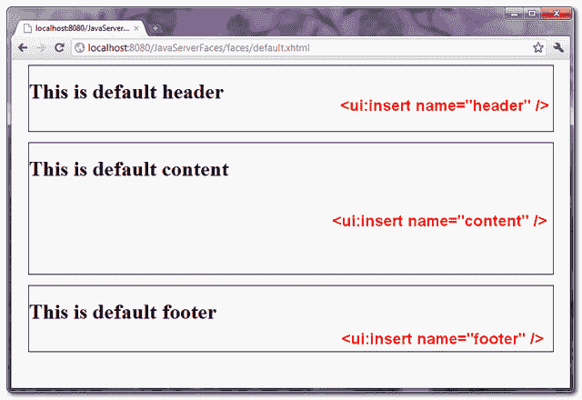

# 使用 Facelets 的 JSF 2 模板示例

> 原文：<http://web.archive.org/web/20230101150211/http://www.mkyong.com/jsf2/jsf-2-templating-with-facelets-example/>

在 web 应用程序中，大多数页面都遵循相似 web 界面布局和样式，例如，相同的页眉和页脚。在 JSF 2.0 中，你可以很容易地使用 Facelets 标签来提供一个标准的 web 界面布局，事实上，它看起来与 [Apache Tiles 框架](http://web.archive.org/web/20210507161023/https://tiles.apache.org/)很相似。

在本例中，它展示了使用 4 个 Facelets 标记从模板构建页面:

1.  **ui:插入**–用于模板文件，定义加载模板的文件将要替换的内容。内容可以替换为“ui:define”标签。
2.  **ui:define**–用匹配的“ui:insert”标签定义插入模板的内容。
3.  **ui:include**——类似于 JSP 的“jsp:include”，包含来自另一个 XHTML 页面的内容。
4.  **ui:composition**–如果与“template”属性一起使用，则加载指定的模板，该标签的子标签定义模板布局；否则，它就是一组元素，可以插入到某个地方。此外，JSF 删除了“ui:composition”标签之外的所有标签。

## 1.型板布置

在 JSF 2.0 中，模板文件只是一个普通的 XHTML 文件，很少有 JSF facelets 标签来定义模板布局。

*文件:commonLayout.xhtml*

```
 <?xml version="1.0" encoding="UTF-8"?>
<!DOCTYPE html PUBLIC "-//W3C//DTD XHTML 1.0 Transitional//EN" 
"http://www.w3.org/TR/xhtml1/DTD/xhtml1-transitional.dtd">
<html    
      xmlns:h="http://java.sun.com/jsf/html"
      xmlns:ui="http://java.sun.com/jsf/facelets"
      >

    <h:head>
	<h:outputStylesheet name="common-style.css" library="css" />
    </h:head>

    <h:body>

	<div id="page">

	    <div id="header">
		<ui:insert name="header" >
		  <ui:include src="/template/common/commonHeader.xhtml" />
		</ui:insert>
	    </div>

	    <div id="content">
	  	<ui:insert name="content" >
	 	  <ui:include src="/template/common/commonContent.xhtml" />
	   	</ui:insert>
	    </div>

	    <div id="footer">
	    	<ui:insert name="footer" >
	    	  <ui:include src="/template/common/commonFooter.xhtml" />
	    	</ui:insert>
    	    </div>

        </div>

    </h:body>
</html> 
```

在这个模板中，它定义了一个标准的 web 布局:

1.  使用" **h:outputStylesheet** "标记在 head 中包含一个 CSS 文件，以设计整个页面布局的样式。
2.  使用“ **ui:insert** 标签定义三个可替换的部分:页眉、内容和页脚。
3.  使用模板时，如果没有指定替换，则使用“ **ui:include** 标签提供默认内容。

## 2.页眉、内容和页脚

三个默认页面内容。

*文件:commonHeader.xhtml*

```
 <?xml version="1.0" encoding="UTF-8"?>
<!DOCTYPE html PUBLIC "-//W3C//DTD XHTML 1.0 Transitional//EN" 
"http://www.w3.org/TR/xhtml1/DTD/xhtml1-transitional.dtd">
<html    
      xmlns:ui="http://java.sun.com/jsf/facelets"
      >
    <body>
	    <ui:composition>

		<h1>This is default header</h1>

	    </ui:composition>
    </body>
</html> 
```

*文件:commonContent.xhtml*

```
 <?xml version="1.0" encoding="UTF-8"?>
<!DOCTYPE html PUBLIC "-//W3C//DTD XHTML 1.0 Transitional//EN" 
"http://www.w3.org/TR/xhtml1/DTD/xhtml1-transitional.dtd">
<html    
      xmlns:ui="http://java.sun.com/jsf/facelets"
      >
    <body>
	    <ui:composition>

		<h1>This is default content</h1>

	    </ui:composition>
    </body>
</html> 
```

*文件:commonFooter.xhtml*

```
 <?xml version="1.0" encoding="UTF-8"?>
<!DOCTYPE html PUBLIC "-//W3C//DTD XHTML 1.0 Transitional//EN" 
"http://www.w3.org/TR/xhtml1/DTD/xhtml1-transitional.dtd">
<html    
      xmlns:ui="http://java.sun.com/jsf/facelets"
      >
    <body>
	    <ui:composition>

		<h1>This is default footer</h1>

	    </ui:composition>
    </body>
</html> 
```

当这些页面被插入到模板文件中时，所有在“`ui:composition`”之外的标签都将被删除。举个例子，

*文件:commonHeader.xhtml*

```
 <?xml version="1.0" encoding="UTF-8"?>
<!DOCTYPE html PUBLIC "-//W3C//DTD XHTML 1.0 Transitional//EN" 
"http://www.w3.org/TR/xhtml1/DTD/xhtml1-transitional.dtd">
<html    
      xmlns:ui="http://java.sun.com/jsf/facelets"
      >
    <body>
	    ALL TAGS ABOVE THIS LINE WILL BE REMOVED BY JSF
	    <ui:composition>

		<h1>This is default header</h1>

	    </ui:composition>
	    ALL TAGS BELOW THIS LINE WILL BE REMOVED BY JSF
    </body>
</html> 
```

JSF 只取下列元素并插入到模板文件中

```
 <ui:composition>

	<h1>This is default header</h1>

</ui:composition> 
```

当插入到“commonLayout”模板中时，它变成了…

*文件:commonLayout.xhtml*

```
 ...
    <h:body>

	<div id="page">

	    <div id="header">
		<h1>This is default header</h1>
	    </div>
	... 
```

## 3.使用模板

要使用现有的模板，例如"`commonLayout.xhtml`"，您可以使用带有" template "属性的"`ui:composition`"标记。参见以下两个例子:

*文件:default.xhtml*

```
 <?xml version="1.0" encoding="UTF-8"?>
<!DOCTYPE html PUBLIC "-//W3C//DTD XHTML 1.0 Transitional//EN" 
"http://www.w3.org/TR/xhtml1/DTD/xhtml1-transitional.dtd">
<html    
      xmlns:h="http://java.sun.com/jsf/html"
      xmlns:ui="http://java.sun.com/jsf/facelets"
      >
    <h:body>

    	<ui:composition template="template/common/commonLayout.xhtml">

    	</ui:composition>

    </h:body>

</html> 
```

这个 JSF 页面加载“commonLayout.xhtml”模板并显示所有默认页面内容。



*文件:page1.xhtml*

```
 <?xml version="1.0" encoding="UTF-8"?>
<!DOCTYPE html PUBLIC "-//W3C//DTD XHTML 1.0 Transitional//EN" 
"http://www.w3.org/TR/xhtml1/DTD/xhtml1-transitional.dtd">
<html    
      xmlns:h="http://java.sun.com/jsf/html"
      xmlns:ui="http://java.sun.com/jsf/facelets"
      >
    <h:body>

    	<ui:composition template="/template/common/commonLayout.xhtml">

    		<ui:define name="content">
    			<h2>This is page1 content</h2>
    		</ui:define>

		<ui:define name="footer">
    			<h2>This is page1 Footer</h2>
    		</ui:define>

    	</ui:composition>

    </h:body>

</html> 
```

这个 JSF 页面加载一个“commonLayout.xhtml”模板，并使用“ui:define”标记来覆盖模板文件中定义的“ui:insert”标记。

**Note**
As long as the name of the “**ui:define**” tag is matched to the name of the “**ui:insert**” tag, which defined in template, the “ui:insert” content is replaced.

## 下载源代码

Download It – [JSF-2-Facelets-Template-Example.zip](http://web.archive.org/web/20210507161023/http://www.mkyong.com/wp-content/uploads/2010/10/JSF-2-Facelets-Template-Example.zip) (12KB)

#### 引用

1.  [阿帕奇瓷砖框架](http://web.archive.org/web/20210507161023/https://tiles.apache.org/)
2.  [【JSF】ui:包含“JavaDoc](http://web.archive.org/web/20210507161023/https://javaserverfaces.dev.java.net/nonav/docs/2.0/pdldocs/facelets/ui/include.html)
3.  [JSF“ui:插入“JavaDoc](http://web.archive.org/web/20210507161023/https://javaserverfaces.dev.java.net/nonav/docs/2.0/pdldocs/facelets/ui/insert.html)
4.  [JSF“ui:定义“JavaDoc](http://web.archive.org/web/20210507161023/https://javaserverfaces.dev.java.net/nonav/docs/2.0/pdldocs/facelets/ui/define.html)
5.  [JSF“ui:composition”JavaDoc](http://web.archive.org/web/20210507161023/https://javaserverfaces.dev.java.net/nonav/docs/2.0/pdldocs/facelets/ui/composition.html)

标签: [jsf2](http://web.archive.org/web/20210507161023/https://mkyong.com/tag/jsf2/) [模板](http://web.archive.org/web/20210507161023/https://mkyong.com/tag/template/)