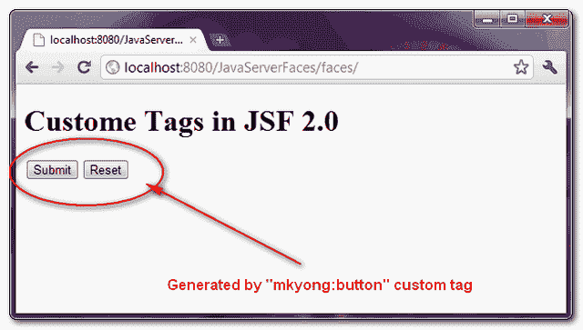

# JSF 2.0 中的自定义标签

> 原文：<http://web.archive.org/web/20230101150211/http://www.mkyong.com/jsf2/custom-tags-in-jsf-2-0/>

在 JSF 2.0 中，您可以创建自定义标签来呈现预定义内容。定制标签看起来像普通的 JSF 标签，使用“ **ui:composition** ”将内容插入页面。

以下是在 JSF 2.0 中创建自定义标签的步骤概要。

1.  使用:ui:composition "标记在 XHTML 页面中创建预定义的内容。
2.  在标记库描述符中声明自定义标记。
3.  在 web.xml 中注册标记库描述符。

## 自定义标签示例

创建自定义标签的指南，它将在页面中插入两个预定义的提交和重置按钮。

## 1.自定义标签

创建一个普通的 XHTML 文件来实现定制标记，它使用“ui:composition”标记将提交和重置按钮组合在一起。

**we b-INF/tags/com/mkyong/button . XHTML**

```java
 <?xml version="1.0" encoding="UTF-8"?>
<!DOCTYPE html PUBLIC "-//W3C//DTD XHTML 1.0 Transitional//EN" 
"http://www.w3.org/TR/xhtml1/DTD/xhtml1-transitional.dtd">
<html    
      xmlns:h="http://java.sun.com/jsf/html"
      xmlns:ui="http://java.sun.com/jsf/facelets"
      >
    <h:body>
       <ui:composition>

		<h:commandButton type="submit" value="#{buttonSubmitLabel}" />
		<h:commandButton type="reset" value="#{buttonResetLabel}" />

       </ui:composition>
    </h:body>
</html> 
```

## 2.标签库

在标记库描述符文件中定义自定义标记细节。

1.  **命名空间**–该标签库的命名空间，创建一个唯一的名称以避免冲突。
2.  **标记名**–自定义标记名。
3.  **源**–自定义标签的实现。

**we b-INF \ mkyong . taglib . XML**

```java
 <?xml version="1.0"?>
<!DOCTYPE facelet-taglib PUBLIC
  "-//Sun Microsystems, Inc.//DTD Facelet Taglib 1.0//EN"
  "http://java.sun.com/dtd/facelet-taglib_1_0.dtd">
<facelet-taglib>
    <namespace>http://mkyong.com/facelets</namespace>
    <tag>
	<tag-name>button</tag-name>
	<source>tags/com/mkyong/button.xhtml</source>
    </tag>
</facelet-taglib> 
```

## 3.在 web.xml 中注册

在 web.xml 文件中注册标记库。

```java
 <!-- Load custom tag into JSF web application -->
 <context-param>
    <param-name>facelets.LIBRARIES</param-name>
    <param-value>/WEB-INF/mkyong.taglib.xml</param-value>
 </context-param> 
```

## 4.使用自定义标签

要使用自定义标签，您必须在顶部声明它的名称空间，并像普通的 JSF 标签一样使用它。

```java
 <?xml version="1.0" encoding="UTF-8"?>
<!DOCTYPE html PUBLIC "-//W3C//DTD XHTML 1.0 Transitional//EN" 
"http://www.w3.org/TR/xhtml1/DTD/xhtml1-transitional.dtd">
<html    
      xmlns:h="http://java.sun.com/jsf/html"
      xmlns:ui="http://java.sun.com/jsf/facelets"
      xmlns:mkyong="http://mkyong.com/facelets"
      >
    <h:body>
    	<h1>Custome Tags in JSF 2.0</h1>

    	<mkyong:button 
    		buttonSubmitLabel="Submit" 
    		buttonResetLabel="Reset" />

    </h:body>
</html> 
```

“mkyong:button”自定义标记将呈现一个提交按钮和一个重置按钮。



## 下载源代码

Download It – [JSF-2-Custom-Tag-Example.zip](http://web.archive.org/web/20210507160319/http://www.mkyong.com/wp-content/uploads/2010/10/JSF-2-Custom-Tag-Example.zip) (11KB)Tags : [custom tag](http://web.archive.org/web/20210507160319/https://mkyong.com/tag/custom-tag/) [jsf2](http://web.archive.org/web/20210507160319/https://mkyong.com/tag/jsf2/)<input type="hidden" id="mkyong-current-postId" value="7347">