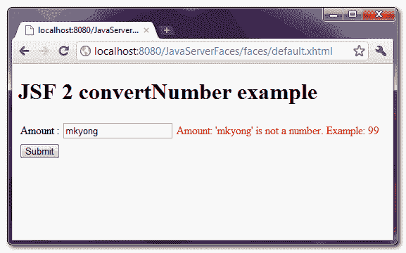
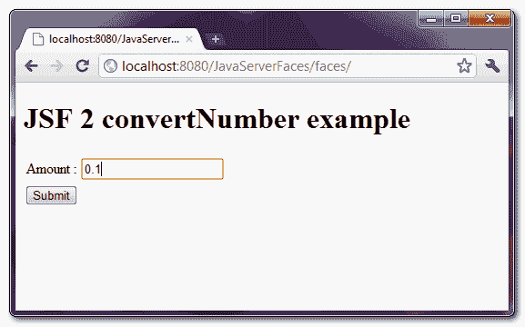
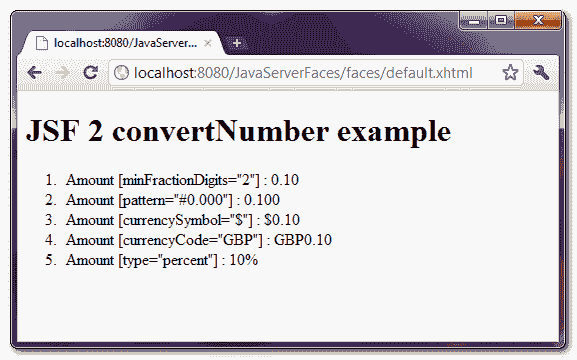

> 原文：<http://web.archive.org/web/20230101150211/http://www.mkyong.com/jsf2/jsf-2-convertnumber-example/>

# JSF 新协议转换编号示例

在 JSF，“ **f:convertNumber** ”是一个标准的转换器，将字符串转换成指定的“数字”格式。此外，它还用作验证器来确保输入值是有效的数字。请参见以下常用示例:

**注**:假设#{receipt.amount}包含一个“ **0.1** 值。

**1。minFractionDigits 属性**

```java
 <h:outputText value="#{receipt.amount}" >
	<f:convertNumber minFractionDigits="2" />
</h:outputText> 
```

将值显示为“0.10”。

**2。图案属性**

```java
 <h:outputText value="#{receipt.amount}" >
	<f:convertNumber pattern="#0.000" />
</h:outputText> 
```

将值显示为“0.100”。

**Note**
The pattern format is defined in [java.text.DecimalFormat](http://web.archive.org/web/20190214233710/http://download.oracle.com/javase/6/docs/api/java/text/DecimalFormat.html).

**3。货币代码属性**

```java
 <h:outputText value="#{receipt.amount}" >
	<f:convertNumber currencyCode="GBP" type="currency" />
</h:outputText> 
```

将值显示为“GBP0.10”。

**Note**
The currencyCode is defined in [ISO 4217](http://web.archive.org/web/20190214233710/http://www.iso.org/iso/support/currency_codes_list-1.htm). To use currencyCode attribute, the type attribute have to change to “**currency**“.

**4。type="percent "属性**

```java
 <h:outputText value="#{receipt.amount}" >
	<f:convertNumber type="percent" />
</h:outputText> 
```

将该值显示为“10%”。

*P.S 其他“f:convertNumber”属性，可以访问这个[JSF“f:convert number”JavaDoc](http://web.archive.org/web/20190214233710/https://javaserverfaces.dev.java.net/nonav/docs/2.0/pdldocs/facelets/f/convertNumber.html)。*

## JSF f:convertNumber 示例

下面的 JSF 2.0 完整示例向您展示了如何使用" **f:convertNumber** "标签。

 <ins class="adsbygoogle" style="display:block; text-align:center;" data-ad-format="fluid" data-ad-layout="in-article" data-ad-client="ca-pub-2836379775501347" data-ad-slot="6894224149">## 1.受管 Bean

一个简单的托管 bean，具有“amount”属性。

```java
 package com.mkyong;

import java.io.Serializable;
import javax.faces.bean.ManagedBean;
import javax.faces.bean.SessionScoped;

@ManagedBean(name="receipt")
@SessionScoped
public class ReceiptBean implements Serializable{

	double amount;

	public double getAmount() {
		return amount;
	}

	public void setAmount(double amount) {
		this.amount = amount;
	}

} 
```

 <ins class="adsbygoogle" style="display:block" data-ad-client="ca-pub-2836379775501347" data-ad-slot="8821506761" data-ad-format="auto" data-ad-region="mkyongregion">## 2.f:convertNumber 示例

JSF XHTML 页面使用“ **f:convertNumber** ”标签进行验证，也是字符串格式化程序。

**default.xhtml**

```java
 <?xml version="1.0" encoding="UTF-8"?>
<!DOCTYPE html PUBLIC "-//W3C//DTD XHTML 1.0 Transitional//EN" 
"http://www.w3.org/TR/xhtml1/DTD/xhtml1-transitional.dtd">
<html    
      xmlns:h="http://java.sun.com/jsf/html"
      xmlns:f="http://java.sun.com/jsf/core"
      xmlns:c="http://java.sun.com/jsp/jstl/core"
      >
    <h:body>

    	<h1>JSF 2 convertNumber example</h1>

	   <h:form>

		<h:panelGrid columns="3">

			Amount : 
			<h:inputText id="amount" value="#{receipt.amount}" 
				size="20" required="true"
				label="Amount" >
				<!-- display in at least 2 decimal points -->
				<f:convertNumber minFractionDigits="2" />
			</h:inputText>

			<h:message for="amount" style="color:red" />

		</h:panelGrid>

		<h:commandButton value="Submit" action="receipt" />

	   </h:form>

    </h:body>
</html> 
```

**receipt.xhtml**

```java
 <?xml version="1.0" encoding="UTF-8"?>
<!DOCTYPE html PUBLIC "-//W3C//DTD XHTML 1.0 Transitional//EN" 
"http://www.w3.org/TR/xhtml1/DTD/xhtml1-transitional.dtd">
<html    
      xmlns:h="http://java.sun.com/jsf/html"
      xmlns:f="http://java.sun.com/jsf/core"
      xmlns:c="http://java.sun.com/jsp/jstl/core"
      >
    <h:body>

    	<h1>JSF 2 convertNumber example</h1>

	  <ol>
		<li>
			Amount [minFractionDigits="2"] : 
			<h:outputText value="#{receipt.amount}" >
				<f:convertNumber minFractionDigits="2" />
			</h:outputText>
		</li>
		<li>
			Amount [pattern="#0.000"] : 
			<h:outputText value="#{receipt.amount}" >
				<f:convertNumber pattern="#0.000" />
			</h:outputText>
		</li>
		<li>
			Amount [currencySymbol="$"] : 
			<h:outputText value="#{receipt.amount}">
				<f:convertNumber currencySymbol="$" type="currency" />
			</h:outputText>
		</li>
		<li>
			Amount [currencyCode="GBP"] : 
			<h:outputText value="#{receipt.amount}" >
				<f:convertNumber currencyCode="GBP" type="currency" />
			</h:outputText>
		</li>
		<li>
			Amount [type="percent"] : 
			<h:outputText value="#{receipt.amount}" >
				<f:convertNumber type="percent" />
			</h:outputText>
		</li>
	   </ol>

    </h:body>
</html> 
```

## 3.演示

如果用户填写了无效的数字格式，则显示错误消息。



用户键入一个" **0.01** 值并点击"提交"按钮。



将提交的值显示为不同的显示格式。



## 下载源代码

Download It – [JSF-2-ConvertNumber-Example.zip](http://web.archive.org/web/20190214233710/http://www.mkyong.com/wp-content/uploads/2010/10/JSF-2-ConvertNumber-Example.zip) (10KB)

## 参考

1.  [JSF 2 号转换器 JavaDoc](http://web.archive.org/web/20190214233710/https://javaserverfaces.dev.java.net/nonav/docs/2.0/pdldocs/facelets/f/convertNumber.html)
2.  [维基 ISO 4217 当前代码](http://web.archive.org/web/20190214233710/http://en.wikipedia.org/wiki/ISO_4217)
3.  [DecimalFormat JavaDoc](http://web.archive.org/web/20190214233710/http://download.oracle.com/javase/6/docs/api/java/text/DecimalFormat.html)

[jsf2](http://web.archive.org/web/20190214233710/http://www.mkyong.com/tag/jsf2/)


