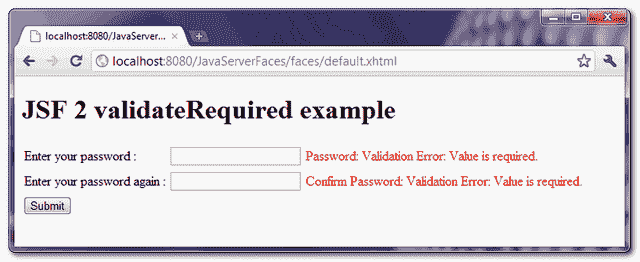

# JSF 新协议验证必需的示例

> 原文：<http://web.archive.org/web/20230101150211/http://www.mkyong.com/jsf2/jsf-2-validaterequired-example/>

" **f:validateRequired** "是 JSF 2.0 中一个新的验证器标签，用来确保输入字段不为空。举个例子，

```
 <h:inputSecret id="password" value="#{user.password}">
    <f:validateRequired />	
</h:inputSecret> 
```

或者，您也可以使用“required”属性，两者都执行相同的空值验证。

```
 <h:inputSecret id="password" value="#{user.password}" required="true" /> 
```

## “f:validateRequired”示例

一个 JSF 2.0 的例子，展示了如何使用“ **f:validateRequired** ”标签来确保“密码”字段不为空。

freestar.config.enabled_slots.push({ placementName: "mkyong_incontent_1", slotId: "mkyong_incontent_1" });

## 1.受管 Bean

用户管理的 bean。

```
 package com.mkyong;

import java.io.Serializable;
import javax.faces.bean.ManagedBean;
import javax.faces.bean.SessionScoped;

@ManagedBean(name="user")
@SessionScoped
public class UserBean implements Serializable{

	String password;
	String confPassword;

	//getter and setter methods
} 
```

## 2.JSF·佩奇

JSF XHTML 页面，展示了如何使用“ **f:validateRequired** ”标签来确保“密码”和“确认密码”字段不为空。

```
 <?xml version="1.0" encoding="UTF-8"?>
<!DOCTYPE html PUBLIC "-//W3C//DTD XHTML 1.0 Transitional//EN" 
"http://www.w3.org/TR/xhtml1/DTD/xhtml1-transitional.dtd">
<html    
      xmlns:h="http://java.sun.com/jsf/html"
      xmlns:f="http://java.sun.com/jsf/core"
      >
    <h:body>

    	<h1>JSF 2 validateRequired example</h1>

	<h:form>

		<h:panelGrid columns="3">

			Enter your password : 

			<h:inputSecret id="password" value="#{user.password}" 
				size="20" required="true"
				label="Password" />

			<h:message for="password" style="color:red" />

			Enter your password again : 

			<h:inputSecret id="confPassword" value="#{user.confPassword}" 
				size="20" label="Confirm Password">
				<f:validateRequired />	
			</h:inputSecret>

			<h:message for="confPassword" style="color:red" />

		</h:panelGrid>

		<h:commandButton value="Submit" action="result" />

	</h:form>

    </h:body>
</html> 
```

## 3.演示

如果“密码”或“确认密码”字段为空，则显示错误消息。

<noscript></noscript>


## 下载源代码

Download It – [JSF-2-ValidateRequired-Example.zip](http://web.archive.org/web/20210305084830/http://www.mkyong.com/wp-content/uploads/2010/10/JSF-2-ValidateRequired-Example.zip) (9KB)

## 参考

1.  [JSF 2 有效所需的 JavaDoc](http://web.archive.org/web/20210305084830/https://javaserverfaces.dev.java.net/nonav/docs/2.0/pdldocs/facelets/f/validateRequired.html)

Tags : [jsf2](http://web.archive.org/web/20210305084830/https://mkyong.com/tag/jsf2/) [validation](http://web.archive.org/web/20210305084830/https://mkyong.com/tag/validation/)freestar.config.enabled_slots.push({ placementName: "mkyong_leaderboard_btf", slotId: "mkyong_leaderboard_btf" });<input type="hidden" id="mkyong-current-postId" value="7521">