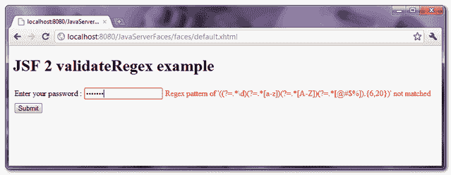

# JSF 新协议有效性示例

> 原文：<http://web.archive.org/web/20230101150211/http://www.mkyong.com/jsf2/jsf-2-validateregex-example/>

" **f:validateRegex** "是 JSF 2.0 中一个新的验证器标签，用于验证具有给定正则表达式模式的 JSF 组件。举个例子，

```
 <h:inputSecret id="password" value="#{user.password}">
  <f:validateRegex pattern="((?=.*\d)(?=.*[a-z])(?=.*[A-Z])(?=.*[@#$%]).{6,20})" />
</h:inputSecret> 
```

上述 regex 模式需要 6 到 20 个字符的字符串，至少包含一个数字、一个大写字母、一个小写字母和一个特殊符号(" @#$% ")。这对于密码验证来说足够强大和复杂，参见这个[带正则表达式的密码验证](http://web.archive.org/web/20210305084839/http://www.mkyong.com/regular-expressions/how-to-validate-password-with-regular-expression/)。

## “f:validateRegex”示例

一个 JSF 2.0 的例子，展示了如何使用" **f:validateRegex** "标签来创建一个强密码验证器。

freestar.config.enabled_slots.push({ placementName: "mkyong_incontent_1", slotId: "mkyong_incontent_1" });

## 1.受管 Bean

用户管理的 bean。

```
 package com.mkyong;

import java.io.Serializable;
import javax.faces.bean.ManagedBean;
import javax.faces.bean.SessionScoped;

@ManagedBean(name="user")
@SessionScoped
public class UserBean implements Serializable{

	String password;

	public String getPassword() {
		return password;
	}

	public void setPassword(String password) {
		this.password = password;
	}

} 
```

## 2.JSF·佩奇

JSF XHTML 页面，展示了如何使用“ **f:validateRegex** ”标签来确保“密码”字段匹配给定的正则表达式模式。

```
 <?xml version="1.0" encoding="UTF-8"?>
<!DOCTYPE html PUBLIC "-//W3C//DTD XHTML 1.0 Transitional//EN" 
"http://www.w3.org/TR/xhtml1/DTD/xhtml1-transitional.dtd">
<html    
      xmlns:h="http://java.sun.com/jsf/html"
      xmlns:f="http://java.sun.com/jsf/core"
      >
    <h:body>

    <h1>JSF 2 validateRegex example</h1>

     <h:form>

       <h:panelGrid columns="3">

	  Enter your password : 

	  <h:inputSecret id="password" value="#{user.password}" 
		size="20" required="true"
		label="Password">
		<f:validateRegex 
                   pattern="((?=.*\d)(?=.*[a-z])(?=.*[A-Z])(?=.*[@#$%]).{6,20})" />
	  </h:inputSecret>

	  <h:message for="password" style="color:red" />

       </h:panelGrid>

       <h:commandButton value="Submit" action="result" />

     </h:form>	
    </h:body>
</html> 
```

## 3.演示

如果“密码”与 regex 模式不匹配，则显示错误消息。

<noscript></noscript>


## 下载源代码

Download It – [JSF-2-ValidateRegex-Example.zip](http://web.archive.org/web/20210305084839/http://www.mkyong.com/wp-content/uploads/2010/10/JSF-2-ValidateRegex-Example.zip) (9KB)

## 参考

1.  [JSF 2 validateRegex JavaDoc](http://web.archive.org/web/20210305084839/https://javaserverfaces.dev.java.net/nonav/docs/2.0/pdldocs/facelets/f/validateRegex.html)
2.  [使用正则表达式进行密码验证](http://web.archive.org/web/20210305084839/http://www.mkyong.com/regular-expressions/how-to-validate-password-with-regular-expression/)

Tags : [jsf2](http://web.archive.org/web/20210305084839/https://mkyong.com/tag/jsf2/) [regex](http://web.archive.org/web/20210305084839/https://mkyong.com/tag/regex/) [validation](http://web.archive.org/web/20210305084839/https://mkyong.com/tag/validation/)freestar.config.enabled_slots.push({ placementName: "mkyong_leaderboard_btf", slotId: "mkyong_leaderboard_btf" });<input type="hidden" id="mkyong-current-postId" value="7528">