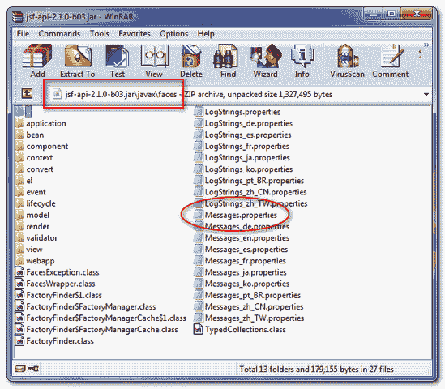
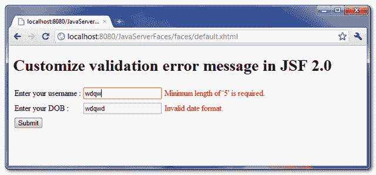

# 在 JSF 2.0 中自定义验证错误消息

> 原文：<http://web.archive.org/web/20230101150211/http://www.mkyong.com/jsf2/customize-validation-error-message-in-jsf-2-0/>

标准 JSF 转换和验证错误消息太详细、太专业，有时不太容易让人理解。在本文中，它向您展示了如何在 JSF 2.0 中定制标准转换或验证错误消息。

*概要指南*

1.  从 jsf-api-2.x.jar 的“Messages.properties”文件中找到您的消息密钥。
2.  创建您自己的属性文件，放置您在上面的“Messages.properties”文件中找到的相同消息键，并用您的自定义错误消息覆盖它。
3.  在“faces-config.xml”中注册您的属性文件，将其作为应用程序级别。
4.  完成了。

## 1.消息.属性

所有 JSF 标准转换和验证错误消息都存储在“Messages.properties”文件中，该文件可以从 **jsf-api-2.x.jar** 、*javax \ faces \ messages . properties*中找到，见下图:

<noscript></noscript>


请参见“ *Messages.properties* ”文件的一部分

```
 ...
# ===================================================================
# Converter Errors
# ===================================================================
javax.faces.converter.DateTimeConverter.DATE={2}: ''{0}'' could not be understood as a date.
javax.faces.converter.DateTimeConverter.DATE_detail={2}: ''{0}'' could not be understood as a date. Example: {1} 
...
# ====================================================================
# Validator Errors
# ====================================================================
javax.faces.validator.LengthValidator.MAXIMUM={1}: Validation Error: Length is greater than allowable maximum of ''{0}''
javax.faces.validator.LengthValidator.MINIMUM={1}: Validation Error: Length is less than allowable minimum of ''{0}''
... 
```

比如
**1。<f:validate length minimum = " 5 " maximum = " 10 "/>**如果最大长度验证失败，JSF 得到“javax . faces . validator . length validator . maximum”。
如果最小长度验证失败，JSF 得到“javax . faces . validator . length validator . minimum”。

**2。<f:convert datetime pattern = " d-M-yyyy "/>**
如果日期验证失败，JSF 得到“javax . faces . converter . datetime converter . date _ detail”。

**Note**
If you do not sure which key match to which validator tag, just display the error message once and compare it with “Messages.properties”, then you will know which key you want to override.freestar.config.enabled_slots.push({ placementName: "mkyong_incontent_1", slotId: "mkyong_incontent_1" });

## 2.自定义错误消息

创建一个名为“ **MyMessage.properties** ”的属性文件(可以是您喜欢的任何名称)，将消息键和自定义错误消息放入其中。稍后，将该属性文件放入项目资源文件夹中。

**MyMessage.properties**

```
 javax.faces.converter.DateTimeConverter.DATE={2}: ''{0}'' could not be understood as a date.
javax.faces.converter.DateTimeConverter.DATE_detail=Invalid date format.

javax.faces.validator.LengthValidator.MINIMUM=Minimum length of ''{0}'' is required. 
```

现在，您将自定义“**javax . faces . validator . length validator . minimum**”的验证错误消息和“**javax . faces . converter . datetime converter . date _ detail**”的转换错误消息。

**Note**
For the XXX_detail message key, you have to override its parent key (summary message) as well, which is XXX without the “_detail” behind; Otherwise, JSF will ignore your new custom error message and keep getting the standard error message from “Messages.properties”, may be this is a bug in JSF 2.0?

## 3.注册消息包

在“faces-config.xml”中注册您的自定义属性文件，将其作为应用程序级别。

**faces-config.xml**

```
 <?xml version="1.0" encoding="UTF-8"?>
<faces-config

    xmlns:xsi="http://www.w3.org/2001/XMLSchema-instance"
    xsi:schemaLocation="http://java.sun.com/xml/ns/javaee 
    http://java.sun.com/xml/ns/javaee/web-facesconfig_2_0.xsd"
    version="2.0">
     <application>
	  <message-bundle>
	  	com.mkyong.MyMessage
	  </message-bundle>
     </application>
</faces-config> 
```

## 4.演示

一个 JSF 页面，同时添加**<f:validate length/>**和**<f:convert datetime/>**验证。

```
 <?xml version="1.0" encoding="UTF-8"?>
<!DOCTYPE html PUBLIC "-//W3C//DTD XHTML 1.0 Transitional//EN" 
"http://www.w3.org/TR/xhtml1/DTD/xhtml1-transitional.dtd">
<html    
      xmlns:h="http://java.sun.com/jsf/html"
      xmlns:f="http://java.sun.com/jsf/core"
      >
    <h:body>

    	<h1>Customize validation error message in JSF 2.0</h1>

	<h:form>

		<h:panelGrid columns="3">

			Enter your username :

			<h:inputText id="username" value="#{user.username}" 
				size="20" required="true" label="Username">
				<f:validateLength minimum="5" maximum="10" />
			</h:inputText>

			<h:message for="username" style="color:red" />

			Enter your DOB :

			<h:inputText id="dob" value="#{user.dob}" 
				size="20" required="true" label="Date of Birth">
				<f:convertDateTime />
			</h:inputText>

			<h:message for="dob" style="color:red" />

		</h:panelGrid>

		<h:commandButton value="Submit" action="result" />

	</h:form>	
    </h:body>
</html> 
```

当验证失败时，现在显示您的自定义错误消息。

<noscript></noscript>


## 下载源代码

Download It – [JSF-2-Custom-Validation-Error-Message-Example.zip](http://web.archive.org/web/20210305084916/http://www.mkyong.com/wp-content/uploads/2010/10/JSF-2-Custom-Validation-Error-Message-Example.zip) (11KB)

## 参考

1.  [JSF 2 号&资源包](http://web.archive.org/web/20210305084916/http://www.mkyong.com/jsf2/jsf-2-0-and-resource-bundles-example/)

Tags : [error message](http://web.archive.org/web/20210305084916/https://mkyong.com/tag/error-message/) [jsf2](http://web.archive.org/web/20210305084916/https://mkyong.com/tag/jsf2/) [validation](http://web.archive.org/web/20210305084916/https://mkyong.com/tag/validation/)freestar.config.enabled_slots.push({ placementName: "mkyong_leaderboard_btf", slotId: "mkyong_leaderboard_btf" });<input type="hidden" id="mkyong-current-postId" value="7540">