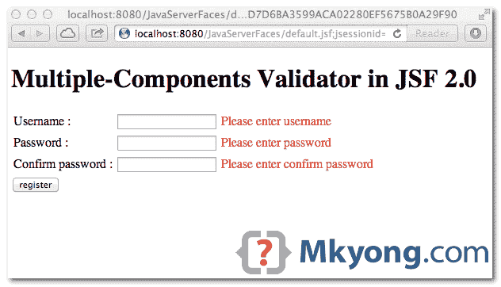
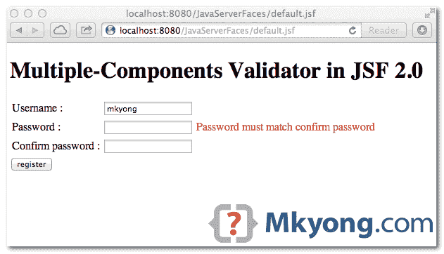

# JSF 2.0 中的多组件验证器

> 原文：<http://web.archive.org/web/20230101150211/http://www.mkyong.com/jsf2/multi-components-validator-in-jsf-2-0/>

在 JSF，没有官方方法来验证多个组件或字段。为了解决这个问题，您需要创建一个定制的验证器。在本教程中，我们将向您展示两种创建验证器来验证多个组件的非官方方法——密码和确认密码。

两种方式:
1。寄存器`PostValidateEvent`，将验证放入其中。
2。创建一个标准验证器，并通过`f:attribute`获得其他组件。

该示例在以下技术下进行了测试:

1.  JSF 2.1.11
2.  雄猫 6，7
3.  Java 1.6
4.  maven3

## 1.PostValidateEvent 中的验证

`javax.faces.event.PostValidateEvent`是一个系统事件，在所有组件都通过验证后触发。这个想法是注册一个`PostValidateEvent`，并附加一个验证方法。请参见以下内容:

```
 <f:event listener="#{bean.methodToValidateMultipleFields}" type="postValidate" /> 
```

default.xhtml

```
 <!DOCTYPE html>
<html 
  xmlns:h="http://java.sun.com/jsf/html"
  xmlns:f="http://java.sun.com/jsf/core">

<h:body>

<h1>Multiple-Components Validator in JSF 2.0</h1>

  <h:form id="register">

    <h:message for="RegisterGroupPanel" style="color:red;" />

    <h:panelGrid columns="3" id="RegisterGroupPanel">

	<!-- register a PostValidateEvent -->
	<f:event listener="#{user.validatePassword}" type="postValidate" />

	<h:outputLabel for="username" value="Username : " />
	<h:inputText id="username" value="#{user.username}" required="true"
		requiredMessage="Please enter username" />
	<h:message for="username" style="color: red;" />

	<h:outputLabel for="password" value="Password : " />
	<h:inputSecret id="password" value="#{user.password}" required="true"
		requiredMessage="Please enter password" />
	<h:message for="password" style="color: red;" />

	<h:outputLabel for="confirmPassword" value="Confirm password : " />
	<h:inputSecret id="confirmPassword" required="true"
		requiredMessage="Please enter confirm password" />
	<h:message for="confirmPassword" style="color: red;" />

    </h:panelGrid>

	<h:commandButton action="thanks" value="register" />

  </h:form>

</h:body>
</html> 
```

在`PostValidateEvent`中，“listener”方法必须有这个签名`public void method-name(ComponentSystemEvent event)`。代码的其余部分应该是不言自明的。

UserBean.java – It has a method to validate password and confirm password components.

```
 package com.mkyong;

import javax.faces.application.FacesMessage;
import javax.faces.bean.ManagedBean;
import javax.faces.bean.SessionScoped;
import javax.faces.component.UIComponent;
import javax.faces.component.UIInput;
import javax.faces.context.FacesContext;
import javax.faces.event.ComponentSystemEvent;

@ManagedBean(name = "user")
@SessionScoped
public class UserBean {

	public String username;
	public String password;

	public String getUsername() {
		return username;
	}

	public void setUsername(String username) {
		this.username = username;
	}

	public String getPassword() {
		return password;
	}

	public void setPassword(String password) {
		this.password = password;
	}

	public void validatePassword(ComponentSystemEvent event) {

	  FacesContext fc = FacesContext.getCurrentInstance();

	  UIComponent components = event.getComponent();

	  // get password
	  UIInput uiInputPassword = (UIInput) components.findComponent("password");
	  String password = uiInputPassword.getLocalValue() == null ? ""
		: uiInputPassword.getLocalValue().toString();
	  String passwordId = uiInputPassword.getClientId();

	  // get confirm password
	  UIInput uiInputConfirmPassword = (UIInput) components.findComponent("confirmPassword");
	  String confirmPassword = uiInputConfirmPassword.getLocalValue() == null ? ""
		: uiInputConfirmPassword.getLocalValue().toString();

	  // Let required="true" do its job.
	  if (password.isEmpty() || confirmPassword.isEmpty()) {
		return;
	  }

	  if (!password.equals(confirmPassword)) {

		FacesMessage msg = new FacesMessage("Password must match confirm password");
		msg.setSeverity(FacesMessage.SEVERITY_ERROR);
		fc.addMessage(passwordId, msg);
		fc.renderResponse();

	  }

	}
} 
```

freestar.config.enabled_slots.push({ placementName: "mkyong_incontent_1", slotId: "mkyong_incontent_1" });

## 2.自定义验证器和属性

这个方法是从这篇文章复制来的——[用于多个字段](http://web.archive.org/web/20210305084946/https://balusc.blogspot.com/2007/12/validator-for-multiple-fields.html)的验证器。

将“confirmPassword”组件定义为`#{confirmPassword}`，通过`f:attribute`附加到“Password”组件。

```
 <h:inputSecret id="password" value="#{user.password}" required="true"
	requiredMessage="Please enter password">

	<f:validator validatorId="passwordValidator" />
	<f:attribute name="confirmPassword" value="#{confirmPassword}" />

</h:inputSecret>

<h:inputSecret id="confirmPassword" required="true"
	binding="#{confirmPassword}"
	requiredMessage="Please enter confirm password" /> 
```

default.xhtml

```
 <!DOCTYPE html>
<html 
  xmlns:h="http://java.sun.com/jsf/html"
  xmlns:f="http://java.sun.com/jsf/core">

<h:body>

  <h1>Multiple-Components Validator in JSF 2.0</h1>

  <h:form id="register">

    <h:message for="RegisterGroupPanel" style="color:red;" />

    <h:panelGrid columns="3" id="RegisterGroupPanel">

	<h:outputLabel for="username" value="Username : " />
	<h:inputText id="username" value="#{user.username}" required="true"
		requiredMessage="Please enter username" />
	<h:message for="username" style="color: red;" />

	<h:outputLabel for="password" value="Password : " />
	<h:inputSecret id="password" value="#{user.password}" required="true"
		requiredMessage="Please enter password">
		<f:validator validatorId="passwordValidator" />
		<f:attribute name="confirmPassword" value="#{confirmPassword}" />
	</h:inputSecret>
	<h:message for="password" style="color: red;" />

	<h:outputLabel for="confirmPassword" value="Confirm password : " />
	<h:inputSecret id="confirmPassword" required="true"
		binding="#{confirmPassword}"
		requiredMessage="Please enter confirm password" />
	<h:message for="confirmPassword" style="color: red;" />

    </h:panelGrid>

	<h:commandButton action="thanks" value="register" />

  </h:form>

</h:body>
</html> 
```

自定义验证器类，并通过`component.getAttributes`获得确认密码组件。

PasswordValidator.java – JSF Custom validator

```
 package com.mkyong;

import javax.faces.application.FacesMessage;
import javax.faces.component.UIComponent;
import javax.faces.component.UIInput;
import javax.faces.context.FacesContext;
import javax.faces.validator.FacesValidator;
import javax.faces.validator.Validator;
import javax.faces.validator.ValidatorException;

@FacesValidator("passwordValidator")
public class PasswordValidator implements Validator {

	@Override
	public void validate(FacesContext context, UIComponent component,
		Object value) throws ValidatorException {

	  String password = value.toString();

	  UIInput uiInputConfirmPassword = (UIInput) component.getAttributes()
		.get("confirmPassword");
	  String confirmPassword = uiInputConfirmPassword.getSubmittedValue()
		.toString();

	  // Let required="true" do its job.
	  if (password == null || password.isEmpty() || confirmPassword == null
		|| confirmPassword.isEmpty()) {
			return;
	  }

	  if (!password.equals(confirmPassword)) {
		uiInputConfirmPassword.setValid(false);
		throw new ValidatorException(new FacesMessage(
			"Password must match confirm password."));
	  }

	}
} 
```

## 3.演示

以上两个解决方案做同样的事情，验证两个组件-密码和确认密码。

没有输入，`required="true"`被触发。

<noscript></noscript>


验证多个组件/字段。确保密码等于确认密码。

<noscript></noscript>


## 下载源代码

Download It – [JSF-Validator-Multiple-Components-Example.zip](http://web.archive.org/web/20210305084946/http://www.mkyong.com/wp-content/uploads/2010/11/JSF-Validator-Multiple-Components-Example.zip) (27 KB)

## 参考

1.  [JSF 2 后期验证事件 JavaDoc](http://web.archive.org/web/20210305084946/https://docs.oracle.com/javaee/6/api/javax/faces/event/PostValidateEvent.html)
2.  [JSF 2 赛事列表](http://web.archive.org/web/20210305084946/http://javaserverfaces.java.net/nonav/docs/2.1/vdldocs/facelets/f/event.html)

Tags : [jsf2](http://web.archive.org/web/20210305084946/https://mkyong.com/tag/jsf2/) [validation](http://web.archive.org/web/20210305084946/https://mkyong.com/tag/validation/)freestar.config.enabled_slots.push({ placementName: "mkyong_leaderboard_btf", slotId: "mkyong_leaderboard_btf" });<input type="hidden" id="mkyong-current-postId" value="7689">