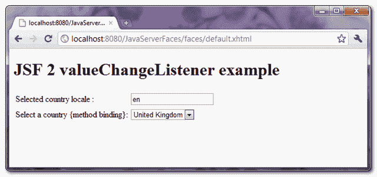
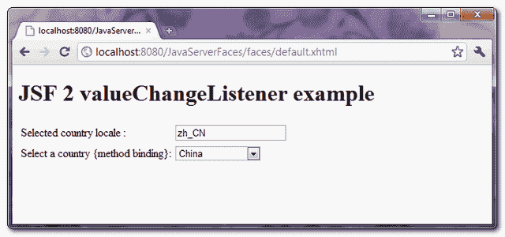

# JSF 2 值更改监听程序示例

> 原文：<http://web.archive.org/web/20230101150211/http://www.mkyong.com/jsf2/jsf-2-valuechangelistener-example/>

当用户对输入组件进行更改时，如 *h:inputText* 或 *h:selectOneMenu* ，将触发 JSF“**值更改事件**。

实现它的两种方法:

**1。方法绑定**–在输入组件中，直接在“ **valueChangeListener** ”属性中指定了 bean 的方法。
JSF……

```
 <h:selectOneMenu value="#{bean.value}" onchange="submit()"
	valueChangeListener="#{bean.valueChangeMethod}">
   	<f:selectItems value="#{bean.values}" />
</h:selectOneMenu> 
```

*Java…*
与值变化事件交互的方法应该接受一个 **ValueChangeEvent** 参数。

```
 @ManagedBean(name="bean")
@SessionScoped
public class BeanBean{

	public void valueChangeMethod(ValueChangeEvent e){
		//...
	}

} 
```

**2。valueChangeListener 接口**——在输入组件中，内部添加了一个“ **f:valueChangeListener** 标签，并指定了 ValueChangeListener 接口的一个实现类。
JSF……

```
 <h:selectOneMenu value="#{bean.value}" onchange="submit()">
    <f:valueChangeListener type="ValueListenerXXX" />
   	<f:selectItems value="#{bean.values}" />
</h:selectOneMenu> 
```

*Java…*
实现 **ValueChangeListener** 接口并覆盖 **processValueChange()** 方法。

```
 public class ValueListenerXXX implements ValueChangeListener{

	@Override
	public void processValueChange(ValueChangeEvent event)
			throws AbortProcessingException {

		//...

	}
} 
```

**Note**
To make it work, you have to attach a **onchange=”submit()”** JavaScript to the input component; Otherwise, no event will be fired.

## 完整的 valueChangeListener 示例

这是一个 JSF 2.0 应用程序，有一个下拉框( *h:selectOneMenu* )和一个文本框( *h:inputText* )，当用户在下拉框中进行更改时，它会触发“值更改事件”并用新选择的下拉框值更新文本框。

这个例子以“**方法绑定**和“ **ValueChangeListener** ”两种方式进行了演示。

freestar.config.enabled_slots.push({ placementName: "mkyong_incontent_1", slotId: "mkyong_incontent_1" });

## 1.方法绑定

一个 country bean，为演示提供国家和地区代码列表。您可以通过输入组件中的" **valueChangeListener** "属性绑定 bean 的方法。见下文:

*CountryBean.java* 的缩写形式

```
 package com.mkyong;

import java.io.Serializable;
import java.util.LinkedHashMap;
import java.util.Map;
import javax.faces.bean.ManagedBean;
import javax.faces.bean.SessionScoped;
import javax.faces.event.ValueChangeEvent;

@ManagedBean(name="country")
@SessionScoped
public class CountryBean implements Serializable{

	private static final long serialVersionUID = 1L;

	private static Map<String,String> countries;

	private String localeCode = "en"; //default value 

	static{
		countries = new LinkedHashMap<String,String>();
		countries.put("United Kingdom", "en"); //label, value
		countries.put("French", "fr");
		countries.put("German", "de");
		countries.put("China", "zh_CN");
	}

	public void countryLocaleCodeChanged(ValueChangeEvent e){
		//assign new value to localeCode
		localeCode = e.getNewValue().toString();

	}

	public Map<String,String> getCountryInMap() {
		return this.countries;
	}

	public String getLocaleCode() {
		return localeCode;
	}

	public void setLocaleCode(String localeCode) {
		this.localeCode = localeCode;
	}

} 
```

*JSF 页面*

```
 <?xml version="1.0" encoding="UTF-8"?>
<!DOCTYPE html PUBLIC "-//W3C//DTD XHTML 1.0 Transitional//EN" 
"http://www.w3.org/TR/xhtml1/DTD/xhtml1-transitional.dtd">
<html    
      xmlns:h="http://java.sun.com/jsf/html"
      xmlns:f="http://java.sun.com/jsf/core"
      xmlns:ui="http://java.sun.com/jsf/facelets"
      >
    <h:body>

    	<h1>JSF 2 valueChangeListener example</h1>

	  <h:form>

	  <h:panelGrid columns="2">

		Selected country : 
		<h:inputText id="country" value="#{country.localeCode}" size="20" />

		Select a country {method binding}: 
		<h:selectOneMenu value="#{country.localeCode}" onchange="submit()"
			valueChangeListener="#{country.countryLocaleCodeChanged}">
   			<f:selectItems value="#{country.countryInMap}" />
   		</h:selectOneMenu>

	  </h:panelGrid>

	</h:form>

    </h:body>
</html> 
```

## 2.ValueChangeListener 接口

重用 above country bean 来提供国家和地区代码的列表。实现 **ValueChangeListener** 接口，并通过“ **f:valueChangeListener** 标签绑定。见下文:

*CountryValueListener.java*

```
 package com.mkyong;

import javax.faces.context.FacesContext;
import javax.faces.event.AbortProcessingException;
import javax.faces.event.ValueChangeEvent;
import javax.faces.event.ValueChangeListener;

public class CountryValueListener implements ValueChangeListener{

	@Override
	public void processValueChange(ValueChangeEvent event)
			throws AbortProcessingException {

		//access country bean directly
		CountryBean country = (CountryBean) FacesContext.getCurrentInstance().
			getExternalContext().getSessionMap().get("country");

		country.setLocaleCode(event.getNewValue().toString());

	}

} 
```

*JSF 页面*

```
 <?xml version="1.0" encoding="UTF-8"?>
<!DOCTYPE html PUBLIC "-//W3C//DTD XHTML 1.0 Transitional//EN" 
"http://www.w3.org/TR/xhtml1/DTD/xhtml1-transitional.dtd">
<html    
      xmlns:h="http://java.sun.com/jsf/html"
      xmlns:f="http://java.sun.com/jsf/core"
      xmlns:ui="http://java.sun.com/jsf/facelets"
      >
    <h:body>

    	<h1>JSF 2 valueChangeListener example</h1>

	  <h:form>

	  <h:panelGrid columns="2">

		Selected country : 
		<h:inputText id="country" value="#{country.localeCode}" size="20" />

		Select a country {ValueChangeListener class}: 
		<h:selectOneMenu value="#{country.localeCode}" onchange="submit()">
			<f:valueChangeListener type="com.mkyong.CountryValueListener" />
   			<f:selectItems value="#{country.countryInMap}" />
   		</h:selectOneMenu>

	  </h:panelGrid>

	 </h:form>

    </h:body>
</html> 
```

## 演示

默认情况下，选择国家“英国”。



如果国家/地区下拉框值被更改，则触发 **valueChangeListener** ，并用新选择的 dropdrow 框值更新 textbox 值。



## 下载源代码

Download It – [JSF-2-ValueChangeListener-Example.zip](http://web.archive.org/web/20210319060351/http://www.mkyong.com/wp-content/uploads/2010/11/JSF-2-ValueChangeListener-Example.zip) (10KB)

## 参考

1.  [JSF 2 下拉框示例](http://web.archive.org/web/20210319060351/http://www.mkyong.com/jsf2/jsf-2-dropdown-box-example/)

Tags : [jsf2](http://web.archive.org/web/20210319060351/https://mkyong.com/tag/jsf2/)freestar.config.enabled_slots.push({ placementName: "mkyong_leaderboard_btf", slotId: "mkyong_leaderboard_btf" });<input type="hidden" id="mkyong-current-postId" value="7584">