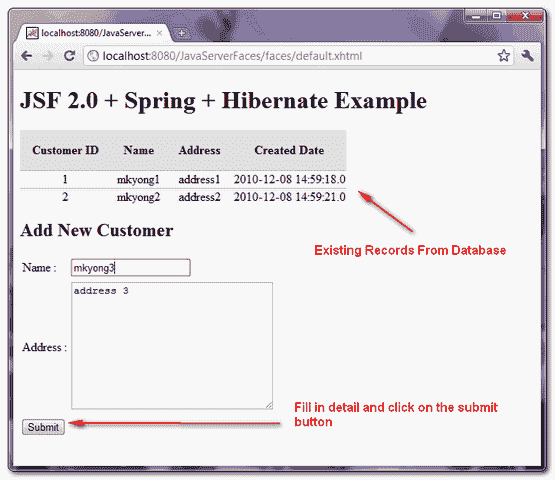

> 原文：<http://web.archive.org/web/20230101150211/http://www.mkyong.com/jsf2/jsf-2-0-spring-hibernate-integration-example/>

# JSF 2.0 + Spring + Hibernate 集成示例

这里有一篇长文告诉你如何将 **JSF 2.0** 、**春天**和**冬眠**整合在一起。在文章的最后，您将创建一个页面，显示数据库中现有客户的列表和一个“添加客户”功能，允许用户添加一个新客户到数据库中。

在这个例子中，我们使用 MySQL 数据库并部署到 Tomcat 6 web 容器。

## 1.项目结构

此示例的目录结构

 <ins class="adsbygoogle" style="display:block; text-align:center;" data-ad-format="fluid" data-ad-layout="in-article" data-ad-client="ca-pub-2836379775501347" data-ad-slot="6894224149">## 2.表格脚本

创建一个客户表并插入 2 条虚拟记录。

```java
 DROP TABLE IF EXISTS `mkyongdb`.`customer`;
CREATE TABLE  `mkyongdb`.`customer` (
  `CUSTOMER_ID` bigint(20) UNSIGNED NOT NULL AUTO_INCREMENT,
  `NAME` varchar(45) NOT NULL,
  `ADDRESS` varchar(255) NOT NULL,
  `CREATED_DATE` datetime NOT NULL,
  PRIMARY KEY (`CUSTOMER_ID`)
) ENGINE=InnoDB AUTO_INCREMENT=17 DEFAULT CHARSET=utf8;

insert into mkyongdb.customer(customer_id, name, address, created_date)
values(1, 'mkyong1', 'address1', now());
insert into mkyongdb.customer(customer_id, name, address, created_date)
values(2, 'mkyong2', 'address2', now()); 
```

 <ins class="adsbygoogle" style="display:block" data-ad-client="ca-pub-2836379775501347" data-ad-slot="8821506761" data-ad-format="auto" data-ad-region="mkyongregion">## 3.冬眠的东西

客户表的模型类和 Hibernate 映射文件。

*文件:Customer.java*

```java
 package com.mkyong.customer.model;

import java.util.Date;

public class Customer{

	public long customerId;
	public String name;
	public String address;
	public Date createdDate;

	//getter and setter methods

} 
```

*文件:Customer.hbm.xml*

```java
 <?xml version="1.0"?>
<!DOCTYPE hibernate-mapping PUBLIC 
"-//Hibernate/Hibernate Mapping DTD 3.0//EN"
"http://hibernate.sourceforge.net/hibernate-mapping-3.0.dtd">
<hibernate-mapping>
    <class name="com.mkyong.customer.model.Customer" 
        table="customer" catalog="mkyongdb">

        <id name="customerId" type="long">
            <column name="CUSTOMER_ID" />
            <generator class="identity" />
        </id>
        <property name="name" type="string">
            <column name="NAME" length="45" not-null="true" />
        </property>
        <property name="address" type="string">
            <column name="ADDRESS" not-null="true" />
        </property>
        <property name="createdDate" type="timestamp">
            <column name="CREATED_DATE" length="19" not-null="true" />
        </property>
    </class>
</hibernate-mapping> 
```

## 4.春天的东西

Spring 的 BO 和 DAO 类用于业务逻辑和数据库交互。

*文件:CustomerBo.java*

```java
 package com.mkyong.customer.bo;

import java.util.List;

import com.mkyong.customer.model.Customer;

public interface CustomerBo{

	void addCustomer(Customer customer);

	List<Customer> findAllCustomer();

} 
```

*文件:CustomerBoImpl.java*

```java
 package com.mkyong.customer.bo.impl;

import java.util.List;
import com.mkyong.customer.bo.CustomerBo;
import com.mkyong.customer.dao.CustomerDao;
import com.mkyong.customer.model.Customer;

public class CustomerBoImpl implements CustomerBo{

	CustomerDao customerDao;

	public void setCustomerDao(CustomerDao customerDao) {
		this.customerDao = customerDao;
	}

	public void addCustomer(Customer customer){

		customerDao.addCustomer(customer);

	}

	public List<Customer> findAllCustomer(){

		return customerDao.findAllCustomer();
	}
} 
```

*文件:CustomerDao.java*

```java
 package com.mkyong.customer.dao;

import java.util.List;

import com.mkyong.customer.model.Customer;

public interface CustomerDao{

	void addCustomer(Customer customer);

	List<Customer> findAllCustomer();

} 
```

*文件:CustomerDaoImpl.java*

```java
 package com.mkyong.customer.dao.impl;

import java.util.Date;
import java.util.List;

import com.mkyong.customer.dao.CustomerDao;
import com.mkyong.customer.model.Customer;
import org.springframework.orm.hibernate3.support.HibernateDaoSupport;

public class CustomerDaoImpl extends 
       HibernateDaoSupport implements CustomerDao{

	public void addCustomer(Customer customer){

		customer.setCreatedDate(new Date());
		getHibernateTemplate().save(customer);

	}

	public List<Customer> findAllCustomer(){

		return getHibernateTemplate().find("from Customer");

	}
} 
```

*文件:CustomerBean.xml*

```java
 <?xml version="1.0" encoding="UTF-8"?>
<beans 
	xmlns:xsi="http://www.w3.org/2001/XMLSchema-instance"
	xsi:schemaLocation="http://www.springframework.org/schema/beans 
	http://www.springframework.org/schema/beans/spring-beans-2.5.xsd">

   	<bean id="customerBo" 
         class="com.mkyong.customer.bo.impl.CustomerBoImpl" >
   		<property name="customerDao" ref="customerDao" />
   	</bean>

   	<bean id="customerDao" 
         class="com.mkyong.customer.dao.impl.CustomerDaoImpl" >
   		<property name="sessionFactory" ref="sessionFactory" />
   	</bean>

</beans> 
```

## 5.Spring +数据库

在 Spring 中配置数据库细节。

*文件:db.properties*

```java
 jdbc.driverClassName=com.mysql.jdbc.Driver
jdbc.url=jdbc:mysql://localhost:3306/mkyongdb
jdbc.username=root
jdbc.password=password 
```

*文件:DataSource.xml*

```java
 <beans 
xmlns:xsi="http://www.w3.org/2001/XMLSchema-instance"
xsi:schemaLocation="http://www.springframework.org/schema/beans
http://www.springframework.org/schema/beans/spring-beans-2.5.xsd">

 <bean 
   class="org.springframework.beans.factory.config.PropertyPlaceholderConfigurer">
   <property name="location">
		<value>WEB-INF/classes/config/database/db.properties</value>
   </property>
</bean>

  <bean id="dataSource" class="org.springframework.jdbc.datasource.DriverManagerDataSource">
	<property name="driverClassName" value="${jdbc.driverClassName}" />
	<property name="url" value="${jdbc.url}" />
	<property name="username" value="${jdbc.username}" />
	<property name="password" value="${jdbc.password}" />
  </bean>

</beans> 
```

## 6.春天+冬眠

通过`LocalSessionFactoryBean`集成 Hibernate 和 Spring。

*档案:HibernateSessionFactory.xml*

```java
 <?xml version="1.0" encoding="UTF-8"?>
<beans 
xmlns:xsi="http://www.w3.org/2001/XMLSchema-instance"
xsi:schemaLocation="http://www.springframework.org/schema/beans
http://www.springframework.org/schema/beans/spring-beans-2.5.xsd">

<!-- Hibernate session factory -->
<bean id="sessionFactory" 
     class="org.springframework.orm.hibernate3.LocalSessionFactoryBean">

    <property name="dataSource">
      <ref bean="dataSource"/>
    </property>

    <property name="hibernateProperties">
       <props>
         <prop key="hibernate.dialect">org.hibernate.dialect.MySQLDialect</prop>
         <prop key="hibernate.show_sql">true</prop>
       </props>
    </property>

    <property name="mappingResources">
	<list>
          <value>com/mkyong/customer/hibernate/Customer.hbm.xml</value>
	</list>
     </property>	

</bean>
</beans> 
```

## 7.JSF 2.0

JSF 管理 bean 调用 Spring 的 BO 来添加或获取数据库中的客户记录。

*文件:CustomerBean.java*

```java
 package com.mkyong;

import java.io.Serializable;
import java.util.List;

import com.mkyong.customer.bo.CustomerBo;
import com.mkyong.customer.model.Customer;

public class CustomerBean implements Serializable{

	//DI via Spring
	CustomerBo customerBo;

	public String name;
	public String address;
	//getter and setter methods

	public void setCustomerBo(CustomerBo customerBo) {
		this.customerBo = customerBo;
	}

	//get all customer data from database
	public List<Customer> getCustomerList(){
		return customerBo.findAllCustomer();
	}

	//add a new customer data into database
	public String addCustomer(){

		Customer cust = new Customer();
		cust.setName(getName());
		cust.setAddress(getAddress());

		customerBo.addCustomer(cust);

		clearForm();

		return "";
	}

	//clear form values
	private void clearForm(){
		setName("");
		setAddress("");
	}

} 
```

一个通过`h:dataTable`显示现有客户记录的 JSF 页面和一些文本组件，允许用户向数据库中插入新的客户记录。

*文件:default.xhtml*

```java
 <?xml version="1.0" encoding="UTF-8"?>
<!DOCTYPE html PUBLIC "-//W3C//DTD XHTML 1.0 Transitional//EN" 
"http://www.w3.org/TR/xhtml1/DTD/xhtml1-transitional.dtd">
<html    
      xmlns:h="http://java.sun.com/jsf/html"
      xmlns:f="http://java.sun.com/jsf/core"
      >
    <h:head>
    	<h:outputStylesheet library="css" name="table-style.css"  />
    </h:head>

    <h:body>

    	<h1>JSF 2.0 + Spring + Hibernate Example</h1>

 		<h:dataTable value="#{customer.getCustomerList()}" var="c"
    			styleClass="order-table"
    			headerClass="order-table-header"
    			rowClasses="order-table-odd-row,order-table-even-row"
    		>

    		<h:column>
    			<f:facet name="header">
    				Customer ID
    			</f:facet>
    				#{c.customerId}
    		</h:column>

    		<h:column>
    			<f:facet name="header">
    				Name
				</f:facet>
    				#{c.name}
    		</h:column>

 			<h:column>
    			<f:facet name="header">
    				Address
				</f:facet>
    				#{c.address}
    		</h:column>

    		<h:column>
    			<f:facet name="header">
    				Created Date
				</f:facet>
    				#{c.createdDate}
    		</h:column>

    	</h:dataTable>

 		<h2>Add New Customer</h2>
 		<h:form>

 			<h:panelGrid columns="3">

				Name : 
				<h:inputText id="name" value="#{customer.name}" 
					size="20" required="true"
					label="Name" >
				</h:inputText>

				<h:message for="name" style="color:red" />

				Address : 
				<h:inputTextarea id="address" value="#{customer.address}" 
					cols="30" rows="10" required="true"
					label="Address" >
				</h:inputTextarea>

				<h:message for="address" style="color:red" />

			</h:panelGrid>

			<h:commandButton value="Submit" action="#{customer.addCustomer()}" />

 		</h:form>

    </h:body>

</html> 
```

## 8.JSF 2.0 +春天

将 JSF 2.0 与 Spring 集成，详细解释见此——[JSF 2.0+Spring 集成示例](http://web.archive.org/web/20190210093632/http://www.mkyong.com/jsf2/jsf-2-0-spring-integration-example/)

*文件:applicationContext.xml*

```java
 <beans 
xmlns:xsi="http://www.w3.org/2001/XMLSchema-instance"
xsi:schemaLocation="http://www.springframework.org/schema/beans
http://www.springframework.org/schema/beans/spring-beans-2.5.xsd">

	<!-- Database Configuration -->
	<import resource="classes/config/spring/beans/DataSource.xml"/>
	<import resource="classes/config/spring/beans/HibernateSessionFactory.xml"/>

	<!-- Beans Declaration -->
	<import resource="classes/com/mkyong/customer/spring/CustomerBean.xml"/>

</beans> 
```

*文件:faces-config.xml*

```java
 <?xml version="1.0" encoding="UTF-8"?>
<faces-config

    xmlns:xsi="http://www.w3.org/2001/XMLSchema-instance"
    xsi:schemaLocation="http://java.sun.com/xml/ns/javaee 
    http://java.sun.com/xml/ns/javaee/web-facesconfig_2_0.xsd"
    version="2.0">

	<application>
    	<el-resolver>
    		org.springframework.web.jsf.el.SpringBeanFacesELResolver
    	</el-resolver>
  	</application>

	<managed-bean>
		<managed-bean-name>customer</managed-bean-name>
		<managed-bean-class>com.mkyong.CustomerBean</managed-bean-class>
		<managed-bean-scope>session</managed-bean-scope>
		<managed-property>
			<property-name>customerBo</property-name>
			<value>#{customerBo}</value>
		</managed-property>
	</managed-bean>

</faces-config> 
```

*文件:web.xml*

```java
 <?xml version="1.0" encoding="UTF-8"?>
<web-app xmlns:xsi="http://www.w3.org/2001/XMLSchema-instance" 

	xmlns:web="http://java.sun.com/xml/ns/javaee/web-app_2_5.xsd" 
	xsi:schemaLocation="http://java.sun.com/xml/ns/javaee 
	http://java.sun.com/xml/ns/javaee/web-app_2_5.xsd" 
	id="WebApp_ID" version="2.5">

  <display-name>JavaServerFaces</display-name>

  <!-- Add Support for Spring -->
  <listener>
	<listener-class>
		org.springframework.web.context.ContextLoaderListener
	</listener-class>
  </listener>
  <listener>
	<listener-class>
		org.springframework.web.context.request.RequestContextListener
	</listener-class>
  </listener>

  <!-- Change to "Production" when you are ready to deploy -->
  <context-param>
    <param-name>javax.faces.PROJECT_STAGE</param-name>
    <param-value>Development</param-value>
  </context-param>

  <!-- Welcome page -->
  <welcome-file-list>
    <welcome-file>faces/default.xhtml</welcome-file>
  </welcome-file-list>

  <!-- JSF mapping -->
  <servlet>
    <servlet-name>Faces Servlet</servlet-name>
    <servlet-class>javax.faces.webapp.FacesServlet</servlet-class>
    <load-on-startup>1</load-on-startup>
  </servlet>

  <!-- Map these files with JSF -->
  <servlet-mapping>
    <servlet-name>Faces Servlet</servlet-name>
    <url-pattern>/faces/*</url-pattern>
  </servlet-mapping>
  <servlet-mapping>
    <servlet-name>Faces Servlet</servlet-name>
    <url-pattern>*.jsf</url-pattern>
  </servlet-mapping>
  <servlet-mapping>
    <servlet-name>Faces Servlet</servlet-name>
    <url-pattern>*.faces</url-pattern>
  </servlet-mapping>
  <servlet-mapping>
    <servlet-name>Faces Servlet</servlet-name>
    <url-pattern>*.xhtml</url-pattern>
  </servlet-mapping>

</web-app> 
```

## 9.演示

运行它，填写客户数据并点击“提交”按钮。



## 下载源代码

Download It – [JSF-2-Spring-Hibernate-Integration-Example.zip](http://web.archive.org/web/20190210093632/http://www.mkyong.com/wp-content/uploads/2010/12/JSF-2-Spring-Hibernate-Integration-Example.zip) (19KB)

## 参考

1.  [JSF 2.0 + Spring 集成示例](http://web.archive.org/web/20190210093632/http://www.mkyong.com/jsf2/jsf-2-0-spring-integration-example/)
2.  [Struts + Spring + Hibernate 集成示例](http://web.archive.org/web/20190210093632/http://www.mkyong.com/struts/struts-spring-hibernate-integration-example/)

[hibernate](http://web.archive.org/web/20190210093632/http://www.mkyong.com/tag/hibernate/) [integration](http://web.archive.org/web/20190210093632/http://www.mkyong.com/tag/integration/) [jsf2](http://web.archive.org/web/20190210093632/http://www.mkyong.com/tag/jsf2/) [spring](http://web.archive.org/web/20190210093632/http://www.mkyong.com/tag/spring/)</ins></ins> (function (i,d,s,o,m,r,c,l,w,q,y,h,g) { var e=d.getElementById(r);if(e===null){ var t = d.createElement(o); t.src = g; t.id = r; t.setAttribute(m, s);t.async = 1;var n=d.getElementsByTagName(o)[0];n.parentNode.insertBefore(t, n); var dt=new Date().getTime(); try{i[l][w+y](h,i[l][q+y](h)+'&amp;'+dt);}catch(er){i[h]=dt;} } else if(typeof i[c]!=='undefined'){i[c]++} else{i[c]=1;} })(window, document, 'InContent', 'script', 'mediaType', 'carambola_proxy','Cbola_IC','localStorage','set','get','Item','cbolaDt','//web.archive.org/web/20190210093632/http://route.carambo.la/inimage/getlayer?pid=myky82&amp;did=112239&amp;wid=0')<input type="hidden" id="mkyong-postId" value="7874">

#### 关于作者


##### mkyong

Founder of [Mkyong.com](http://web.archive.org/web/20190210093632/http://mkyong.com/), love Java and open source stuff. Follow him on [Twitter](http://web.archive.org/web/20190210093632/https://twitter.com/mkyong), or befriend him on [Facebook](http://web.archive.org/web/20190210093632/http://www.facebook.com/java.tutorial) or [Google Plus](http://web.archive.org/web/20190210093632/https://plus.google.com/110948163568945735692?rel=author). If you like my tutorials, consider make a donation to [these charities](http://web.archive.org/web/20190210093632/http://www.mkyong.com/blog/donate-to-charity/).