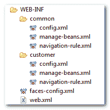

# 如何将 faces-config.xml 拆分成多个文件？

> 原文：<http://web.archive.org/web/20230101150211/http://www.mkyong.com/jsf2/how-to-split-faces-config-xml-into-multiple-files/>

## 问题

在 JSF， **faces-config.xml** 文件可以用来包含管理 beans、导航规则或任何 JSF faces 配置。但是，将所有的配置放入一个单独的 **faces-config.xml** 文件中会导致这个文件很快变大，并导致严重的可维护性问题。

## 解决办法

实际上，您可以将 **faces-config.xml** 分割成多个更小的文件，每个文件根据相关的设置进行分组。例如，按模块分组、受管 beans、导航规则、不同 XML 文件中的 faces 配置。见下图:

[](http://web.archive.org/web/20220709035122/http://www.mkyong.com/wp-content/uploads/2010/09/jsf2-multiple-faces-config-files.png)

然后声明了所有 XML 文件中的**javax . faces . config _ FILES**initialize 参数，它在 **WEB-INF/web.xm** l 文件里面。

```java
 <web-app ...>
  ...
  <context-param>
    <param-name>javax.faces.CONFIG_FILES</param-name>
    <param-value>
    	WEB-INF/common/manage-beans.xml,
    	WEB-INF/common/navigation-rule.xml,
    	WEB-INF/common/config.xml
    </param-value>
  </context-param>
  ...
</web-app> 
```

**Note**
For Struts developer, this is the exact classic problem happened in the [Struts configuration file](http://web.archive.org/web/20220709035122/http://www.mkyong.com/struts/struts-multiple-configuration-files-example/) as well.<input type="hidden" id="mkyong-current-postId" value="7036">