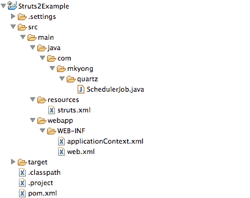

> 原文：<http://web.archive.org/web/20230101150211/https://mkyong.com/struts2/struts-2-spring-3-quartz-1-8-scheduler-example/>

# Struts 2 + Spring 3 + Quartz 1.8 调度器示例

在本教程中，我们将向您展示如何集成**Struts 2+Spring 3+Quartz 1 . 8 . 6**。

**Why NOT Quartz 2?**
Currently, Spring 3 is still NOT support Quartz 2 APIs, see this [SPR-8581 bug report](http://web.archive.org/web/20190304032247/https://jira.springsource.org/browse/SPR-8581). Will update this article again once bug fixed is released.

使用的工具

1.  弹簧 3.1.5 释放
2.  石英
3.  支柱 2.3.4
4.  支柱 2-弹簧-插件 2.3.4
5.  maven3
6.  Eclipse 4.2

## 1.项目文件夹

这是最终的项目文件夹结构。

 <ins class="adsbygoogle" style="display:block; text-align:center;" data-ad-format="fluid" data-ad-layout="in-article" data-ad-client="ca-pub-2836379775501347" data-ad-slot="6894224149">## 2.依赖库

集成与这个 [Spring 2.5.6 + Quartz 1.6](http://web.archive.org/web/20190304032247/http://www.mkyong.com/struts2/struts-2-spring-quartz-scheduler-integration-example/) 类似，只是 Spring3 的依赖关系有点混乱，阅读下面的 Maven pom.xml 了解开发本教程所需的所有依赖关系。

查看 XML 注释可以理解为什么需要这个 jar。

*文件:pom.xml*

```java
 ...
<dependencies>

  <!-- Struts 2 -->
  <dependency>
	<groupId>org.apache.struts</groupId>
	<artifactId>struts2-core</artifactId>
	<version>2.3.4</version>
  </dependency>

  <!-- Quartz framework -->
  <dependency>
	<groupId>org.quartz-scheduler</groupId>
	<artifactId>quartz</artifactId>
	<version>1.8.6</version>
  </dependency>

  <!-- Spring 3 dependencies -->
  <dependency>
	<groupId>org.springframework</groupId>
	<artifactId>spring-core</artifactId>
	<version>3.1.2.RELEASE</version>
  </dependency>

  <dependency>
	<groupId>org.springframework</groupId>
	<artifactId>spring-context</artifactId>
	<version>3.1.2.RELEASE</version>
  </dependency>

  <!-- QuartzJobBean in spring-context-support.jar -->
  <dependency>
	<groupId>org.springframework</groupId>
	<artifactId>spring-context-support</artifactId>
	<version>3.1.2.RELEASE</version>
  </dependency>

  <!-- Struts 2 + Spring 3 need this jar, ContextLoaderListener -->
  <dependency>
	<groupId>org.springframework</groupId>
	<artifactId>spring-web</artifactId>
	<version>3.1.2.RELEASE</version>
  </dependency>

  <!-- Spring + Quartz need transaction -->
  <dependency>
	<groupId>org.springframework</groupId>
	<artifactId>spring-tx</artifactId>
	<version>3.1.2.RELEASE</version>
  </dependency>

  <!-- Struts 2 + Spring integration plugins -->
  <dependency>
	<groupId>org.apache.struts</groupId>
	<artifactId>struts2-spring-plugin</artifactId>
	<version>2.3.4</version>
  </dependency>

</dependencies>
  ... 
```

 <ins class="adsbygoogle" style="display:block" data-ad-client="ca-pub-2836379775501347" data-ad-slot="8821506761" data-ad-format="auto" data-ad-region="mkyongregion">## 3.弹簧 3 +石英

要集成 Spring3 和 Quartz，需要创建一个扩展了`org.springframework.scheduling.quartz.QuartzJobBean`的类，并实现`executeInternal()`方法，就像在 Quartz 中创建调度作业一样。

*文件:SchedulerJob.java*

```java
 package com.mkyong.quartz;

import org.quartz.JobExecutionContext;
import org.quartz.JobExecutionException;
import org.springframework.scheduling.quartz.QuartzJobBean;

public class SchedulerJob extends QuartzJobBean
{

	protected void executeInternal(JobExecutionContext context)
	throws JobExecutionException {

		System.out.println("Struts 2.3.4 + Quartz 1.8.6 + Spring 3.1.2");

	}
} 
```

*File:application context . XML*–将整个 Quartz 的调度程序和 Spring 细节放在`applicationContext.xml`中。有关详细信息，请参见 XML 注释。

```java
 <beans 
  xmlns:xsi="http://www.w3.org/2001/XMLSchema-instance"
  xsi:schemaLocation="http://www.springframework.org/schema/beans
  http://www.springframework.org/schema/beans/spring-beans-3.0.xsd">

  <!-- Spring Quartz Scheduler job -->
  <bean name="schedulerJob" class="org.springframework.scheduling.quartz.JobDetailBean">
	<property name="jobClass" value="com.mkyong.quartz.SchedulerJob" />
  </bean>

  <!-- Cron Trigger, run every 10 seconds -->
  <bean id="cronTrigger" class="org.springframework.scheduling.quartz.CronTriggerBean">
	<property name="jobDetail" ref="schedulerJob" />
	<property name="cronExpression" value="0/10 * * * * ?" />
  </bean>

  <!-- DI -->
  <bean class="org.springframework.scheduling.quartz.SchedulerFactoryBean">
	<property name="jobDetails">
		<list>
			<ref bean="schedulerJob" />
		</list>
	</property>

	<property name="triggers">
		<list>
			<ref bean="cronTrigger" />
		</list>
	</property>
  </bean>

</beans> 
```

## 4.支柱 2 +弹簧 3

要集成 **Struts 2 + Spring** ，只需将`org.springframework.web.context.ContextLoaderListener`监听器类放在`web.xml`文件中。

**Note**
For detail, please read this [Struts 2 + Spring integration example](http://web.archive.org/web/20190304032247/http://www.mkyong.com/struts2/struts-2-spring-integration-example/).

*文件:web.xml*

```java
 <!DOCTYPE web-app PUBLIC
 "-//Sun Microsystems, Inc.//DTD Web Application 2.3//EN"
 "http://java.sun.com/dtd/web-app_2_3.dtd" >

<web-app>
	<display-name>Struts 2 Web Application</display-name>

	<filter>
	  <filter-name>struts2</filter-name>
	  <filter-class>
		org.apache.struts2.dispatcher.ng.filter.StrutsPrepareAndExecuteFilter
	  </filter-class>
	</filter>

	<filter-mapping>
	  <filter-name>struts2</filter-name>
	  <url-pattern>/*</url-pattern>
	</filter-mapping>

	<listener>
	  <listener-class>
		org.springframework.web.context.ContextLoaderListener
	  </listener-class>
	</listener>

</web-app> 
```

## 5.演示

完成，当 Strut2 启动时，它调用 Spring 并运行定义的 Quartz 的任务。

```java
 Jul 24, 2012 4:49:07 PM org.apache.coyote.AbstractProtocol start
INFO: Starting ProtocolHandler ["http-bio-8080"]
Jul 24, 2012 4:49:07 PM org.apache.coyote.AbstractProtocol start
INFO: Starting ProtocolHandler ["ajp-bio-8009"]
Jul 24, 2012 4:49:07 PM org.apache.catalina.startup.Catalina start
INFO: Server startup in 3430 ms
Struts 2.3.4 + Quartz 1.8.6 + Spring 3.1.2  //run this every 10 seconds.
Struts 2.3.4 + Quartz 1.8.6 + Spring 3.1.2
Struts 2.3.4 + Quartz 1.8.6 + Spring 3.1.2 
```

## 下载源代码

Download it – [Struts2-Spring3-Quartz-Example.zip](http://web.archive.org/web/20190304032247/http://www.mkyong.com/wp-content/uploads/2012/07/Struts2-Spring3-Quartz-Example.zip) (20 KB).

## 参考

1.  [Struts 2 + Spring 集成示例](http://web.archive.org/web/20190304032247/http://www.mkyong.com/struts2/struts-2-spring-integration-example/)
2.  [Struts 2 Spring 插件文档](http://web.archive.org/web/20190304032247/http://struts.apache.org/2.x/docs/spring-plugin.html)
3.  [QuartzJobBean JavaDoc](http://web.archive.org/web/20190304032247/http://static.springsource.org/spring/docs/3.0.x/javadoc-api/org/springframework/scheduling/quartz/QuartzJobBean.html)
4.  [Spring 应支持石英 2.0 CronTrigger 接口](http://web.archive.org/web/20190304032247/https://jira.springsource.org/browse/SPR-8581)
5.  [支柱 2 +弹簧 2.5.6 +石英集成示例](http://web.archive.org/web/20190304032247/http://www.mkyong.com/struts2/struts-2-spring-quartz-scheduler-integration-example/)

[quartz](http://web.archive.org/web/20190304032247/http://www.mkyong.com/tag/quartz/) [scheduler](http://web.archive.org/web/20190304032247/http://www.mkyong.com/tag/scheduler/) [spring3](http://web.archive.org/web/20190304032247/http://www.mkyong.com/tag/spring3/) [struts2](http://web.archive.org/web/20190304032247/http://www.mkyong.com/tag/struts2/)</ins></ins> (function (i,d,s,o,m,r,c,l,w,q,y,h,g) { var e=d.getElementById(r);if(e===null){ var t = d.createElement(o); t.src = g; t.id = r; t.setAttribute(m, s);t.async = 1;var n=d.getElementsByTagName(o)[0];n.parentNode.insertBefore(t, n); var dt=new Date().getTime(); try{i[l][w+y](h,i[l][q+y](h)+'&amp;'+dt);}catch(er){i[h]=dt;} } else if(typeof i[c]!=='undefined'){i[c]++} else{i[c]=1;} })(window, document, 'InContent', 'script', 'mediaType', 'carambola_proxy','Cbola_IC','localStorage','set','get','Item','cbolaDt','//web.archive.org/web/20190304032247/http://route.carambo.la/inimage/getlayer?pid=myky82&amp;did=112239&amp;wid=0')<input type="hidden" id="mkyong-postId" value="11244">

#### 关于作者


##### mkyong

Founder of [Mkyong.com](http://web.archive.org/web/20190304032247/http://mkyong.com/), love Java and open source stuff. Follow him on [Twitter](http://web.archive.org/web/20190304032247/https://twitter.com/mkyong), or befriend him on [Facebook](http://web.archive.org/web/20190304032247/http://www.facebook.com/java.tutorial) or [Google Plus](http://web.archive.org/web/20190304032247/https://plus.google.com/110948163568945735692?rel=author). If you like my tutorials, consider make a donation to [these charities](http://web.archive.org/web/20190304032247/http://www.mkyong.com/blog/donate-to-charity/).