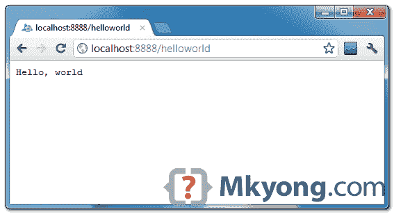

# 使用 Eclipse 的 Google app engine Java hello world 示例

> 原文：<http://web.archive.org/web/20230101150211/http://www.mkyong.com/google-app-engine/google-app-engine-hello-world-example-using-eclipse/>

在本教程中，我们将向您展示如何使用 **Eclipse** 创建一个**Google App Engine**(GAE)**Java**项目(hello world 示例)，在本地运行它，并将其部署到 Google App Engine 帐户。

使用的工具:

1.  JDK 1.6
2.  Eclipse 3.7+Eclipse 的 Google 插件
3.  谷歌应用引擎 Java SDK 1.6.3.1

**Note**
GAE supports Java 1.5 and 1.6.

*P.S 假设安装了 JDK1.6 和 Eclipse 3.7。*

## 1.为 Eclipse 安装谷歌插件

阅读本指南-[如何为 Eclipse 安装谷歌插件](http://web.archive.org/web/20221225035511/http://www.mkyong.com/google-app-engine/how-to-install-google-plugin-for-eclipse/)。如果你同时安装了 Google App Engine Java SDK 和“ **Google Plugin for Eclipse** ”，那么转到步骤 2，否则，获取 [Google App Engine Java SDK](http://web.archive.org/web/20221225035511/https://developers.google.com/appengine/downloads) 并解压。

## 2.创建新的 Web 应用程序项目

在 Eclipse 工具栏中，点击 Google 图标，选择“**新建 Web 应用项目…** ”

*图-新的 Web 应用项目*


*图–取消选择“ **Google Web ToolKit** ”，通过“ **configure SDK** ”链接链接您的 GAE Java SDK。*


单击 finished，Google Plugin for Eclipse 将自动生成一个示例项目。

## 3.你好世界

查看生成的项目目录。


没什么特别的，标准的 Java web 项目结构。

```java
 HelloWorld/
  src/
    ...Java source code...
    META-INF/
      ...other configuration...
  war/
    ...JSPs, images, data files...
    WEB-INF/
      ...app configuration...
      lib/
        ...JARs for libraries...
      classes/
        ...compiled classes... 
```

额外的是这个文件“`appengine-web.xml`”，Google App Engine 需要这个来运行和部署应用程序。

*文件:appengine-web.xml*

```java
 <?xml version="1.0" encoding="utf-8"?>
<appengine-web-app >
  <application></application>
  <version>1</version>

  <!-- Configure java.util.logging -->
  <system-properties>
    <property name="java.util.logging.config.file" value="WEB-INF/logging.properties"/>
  </system-properties>

</appengine-web-app> 
```

## 4.在本地运行

右键单击项目并作为“ **Web 应用程序**”运行。

*Eclipse 控制台:*

```java
 //...
INFO: The server is running at http://localhost:8888/
30 Mac 2012 11:13:01 PM com.google.appengine.tools.development.DevAppServerImpl start
INFO: The admin console is running at http://localhost:8888/_ah/admin 
```

访问 URL `http://localhost:8888/`，参见输出


还有 hello world servlet–`http://localhost:8888/helloworld`



## 5.部署到 Google 应用引擎

在[https://appengine.google.com/](http://web.archive.org/web/20221225035511/https://appengine.google.com/)上注册一个帐户，并为您的网络应用程序创建一个应用程序 ID。

在本演示中，我创建了一个名为“mkyong123”的应用程序 ID，并将其放在`appengine-web.xml`中。

*文件:appengine-web.xml*

```java
 <?xml version="1.0" encoding="utf-8"?>
<appengine-web-app >
  <application>mkyong123</application>
  <version>1</version>

  <!-- Configure java.util.logging -->
  <system-properties>
    <property name="java.util.logging.config.file" value="WEB-INF/logging.properties"/>
  </system-properties>

</appengine-web-app> 
```

要部署，请参见以下步骤:

*图 1.1–点击工具栏上的 GAE 部署按钮。*


*图 1.2–使用您的 Google 帐户登录并点击部署按钮。*


*图 1.3–如果一切正常，hello world web 应用程序将被部署到这个 URL——[http://mkyong123.appspot.com/](http://web.archive.org/web/20221225035511/https://mkyong123.appspot.com/)*


完成了。

## 参考

1.  [谷歌应用引擎——入门:Java](http://web.archive.org/web/20221225035511/https://developers.google.com/appengine/docs/java/gettingstarted/)
2.  [谷歌应用引擎 Python hello world 使用 Eclipse 的例子](http://web.archive.org/web/20221225035511/http://www.mkyong.com/google-app-engine/google-app-engine-python-hello-world-example-using-eclipse/)

<input type="hidden" id="mkyong-current-postId" value="10773">