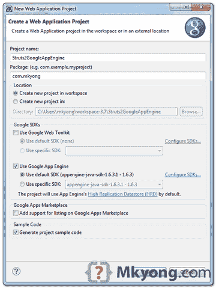
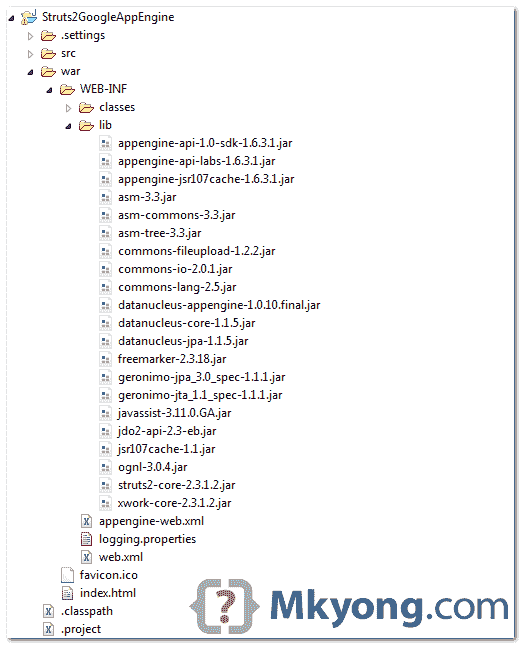
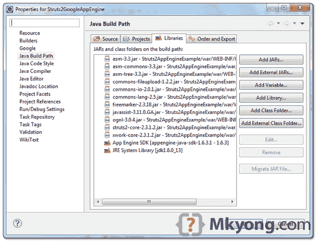
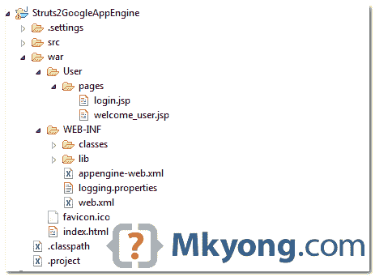
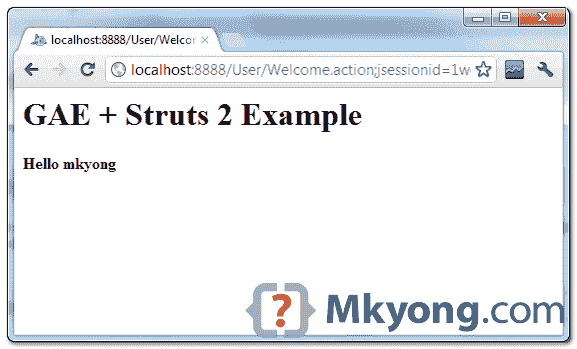
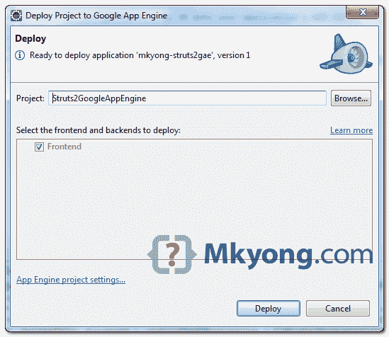
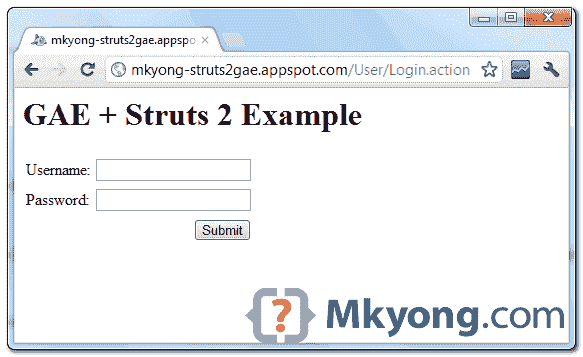

> 原文：<http://web.archive.org/web/20230101150211/http://www.mkyong.com/google-app-engine/google-app-engine-struts-2-example/>

# Google 应用引擎+ Struts 2 示例

在本教程中，我们将向您展示如何在 **Google App Engine** (GAE)环境下开发 **Struts 2** web 应用程序。

使用的工具和技术:

1.  JDK 1.6
2.  Eclipse 3.7+Eclipse 的 Google 插件
3.  谷歌应用引擎 Java SDK 1.6.3.1
4.  struts 2.3.1.2

**Note**
Before proceed on this tutorial, make sure you read this – [GAE + Java example](http://web.archive.org/web/20190223080850/http://www.mkyong.com/google-app-engine/google-app-engine-hello-world-example-using-eclipse/) and [Struts 2 hello world example](http://web.archive.org/web/20190223080850/http://www.mkyong.com/struts2/struts-2-hello-world-example/).

## 1.新建 Web 应用程序项目

在 Eclipse 中，创建一个新的 Web 应用程序项目，命名为“Struts2GoogleAppEngine”。



Eclipse 的谷歌插件将生成一个 GAE 项目结构的样本。稍后，我们将向您展示如何将 Struts2 与这个生成的 GAE 项目集成。

 <ins class="adsbygoogle" style="display:block; text-align:center;" data-ad-format="fluid" data-ad-layout="in-article" data-ad-client="ca-pub-2836379775501347" data-ad-slot="6894224149">## 2.集成 Struts 2 库

获取以下 Struts 2 依赖库，[在此下载 Struts 2](http://web.archive.org/web/20190223080850/http://struts.apache.org/download.cgi)。

*   asm-3.3.jar
*   asm-commons-3.3
*   组件树 3.3.jar
*   文件上传-1.2.2.jar
*   commons-io-2.0.1.jar
*   2.5.jar
*   自由标记-2.3.18.jar
*   javassist-3.11.0.GA.jar
*   ognl-3.0.4.jar
*   支柱 2-核心-2.3.1.2.jar
*   xwork-core-2.3.1.2.jar

全部放入“ **war/WEB-INF/lib** ”文件夹。



右键点击项目文件夹，选择"**属性** " - > " **Java 构建路径** " - > " **库**"选项卡，点击"**添加 Jars** 按钮，从" **war/WEB-INF/lib** "文件夹中选择以上 11 个 Jars 进入构建路径。

 <ins class="adsbygoogle" style="display:block" data-ad-client="ca-pub-2836379775501347" data-ad-slot="8821506761" data-ad-format="auto" data-ad-region="mkyongregion">## 3.集成 Struts 2 代码

3.1 删除生成的`Struts2GoogleAppEngineServlet.java`，不需要这个。

3.2 创建一个新的 Struts 2 操作类。

*文件:src/com/mkyong/user/action/welcome user action . Java*

```java
 package com.mkyong.user.action;

public class WelcomeUserAction {

	private String username;

	public String getUsername() {
		return username;
	}

	public void setUsername(String username) {
		this.username = username;
	}

	public String execute() {

		return "SUCCESS";

	}
} 
```

3.3 创建一个监听器类，并将 ognl 安全设置为空。

**Note**
Struts 2 need this listener to run in GAE environment. Read this – [Issues when deploying Struts 2 on GAE](http://web.archive.org/web/20190223080850/http://struts.apache.org/2.2.1/docs/google-app-engine-gae.html) and [Error: result ‘null’ not found](http://web.archive.org/web/20190223080850/http://www.mkyong.com/google-app-engine/strurts-2-on-gae-error-result-null-not-found/)

*文件:src/com/mkyong/listener/struts 2 listenerongae . Java*

```java
 package com.mkyong.listener;

import javax.servlet.ServletContextEvent;
import javax.servlet.ServletContextListener;
import javax.servlet.http.HttpSessionAttributeListener;
import javax.servlet.http.HttpSessionBindingEvent;
import javax.servlet.http.HttpSessionEvent;
import javax.servlet.http.HttpSessionListener;

import ognl.OgnlRuntime;

public class Struts2ListenerOnGAE implements ServletContextListener,
		HttpSessionListener, HttpSessionAttributeListener {

	public void contextInitialized(ServletContextEvent sce) {
		OgnlRuntime.setSecurityManager(null);
	}

	@Override
	public void contextDestroyed(ServletContextEvent arg0) {
		// TODO Auto-generated method stub

	}

	@Override
	public void sessionCreated(HttpSessionEvent arg0) {
		// TODO Auto-generated method stub

	}

	@Override
	public void sessionDestroyed(HttpSessionEvent arg0) {
		// TODO Auto-generated method stub

	}

	@Override
	public void attributeAdded(HttpSessionBindingEvent arg0) {
		// TODO Auto-generated method stub

	}

	@Override
	public void attributeRemoved(HttpSessionBindingEvent arg0) {
		// TODO Auto-generated method stub

	}

	@Override
	public void attributeReplaced(HttpSessionBindingEvent arg0) {
		// TODO Auto-generated method stub

	}

} 
```

3.4 要在本地 GAE 环境中运行 Struts2 项目，必须创建一个`TextBlock`类，并重载原来的`TextBlok`类，否则会出现“`javax.swing.tree.TreeNode is a restricted class`错误信息。希望 Struts2 团队可以在未来的版本中解决这个问题。

**TextBlock Source Code**
Go this URL to [download TextBlock source code](http://web.archive.org/web/20190223080850/http://www.mkyong.com/google-app-engine/javax-swing-tree-treenode-is-a-restricted-class/).

3.5 审查项目目录结构。


## 4.集成 Struts 2 页

4.1 创建一个`login.jsp`页面，接受用户输入。

*文件:war/User/pages/login.jsp*

```java
 <%@ page contentType="text/html; charset=UTF-8" %>
<%@ taglib prefix="s" uri="/struts-tags" %>
<html>
<head></head>
<body>
<h1>GAE + Struts 2 Example</h1>

<s:form action="Welcome">
	<s:textfield name="username" label="Username"/>
	<s:password name="password" label="Password"/>
	<s:submit/>
</s:form>

</body>
</html> 
```

4.2 创建一个`welcome_user.jsp`页面。

*文件:war/User/pages/welcome _ User . JSP*

```java
 <%@ page contentType="text/html; charset=UTF-8" %>
<%@ taglib prefix="s" uri="/struts-tags" %>
<html>
<head></head>
<body>
<h1>GAE + Struts 2 Example</h1>

<h2>Hello <s:property value="username"/></h2>

</body>
</html> 
```

4.3 再次审查项目目录结构。



## 5.Struts XML 配置

创建一个`struts.xml`文件，放入“ **src/struts.xml** ”。

*文件:struts.xml*

```java
 <?xml version="1.0" encoding="UTF-8" ?>
<!DOCTYPE struts PUBLIC
"-//Apache Software Foundation//DTD Struts Configuration 2.0//EN"
"http://struts.apache.org/dtds/struts-2.0.dtd">

<struts>

  <package name="user" namespace="/User" extends="struts-default">
	<action name="Login">
		<result>pages/login.jsp</result>
	</action>
	<action name="Welcome" class="com.mkyong.user.action.WelcomeUserAction">
		<result name="SUCCESS">pages/welcome_user.jsp</result>
	</action>
   </package>

</struts> 
```

## 6.web.xml

更新`web.xml`，集成 Struts2，配置 ognl 安全监听器。

*文件:web.xml*

```java
 <?xml version="1.0" encoding="utf-8"?>
<web-app xmlns:xsi="http://www.w3.org/2001/XMLSchema-instance"

	xmlns:web="http://java.sun.com/xml/ns/javaee/web-app_2_5.xsd"
	xsi:schemaLocation="http://java.sun.com/xml/ns/javaee
        http://java.sun.com/xml/ns/javaee/web-app_2_5.xsd"
	version="2.5">
	<filter>
	    <filter-name>struts2</filter-name>
	    <filter-class>
		org.apache.struts2.dispatcher.ng.filter.StrutsPrepareAndExecuteFilter
	    </filter-class>
	</filter>

	<filter-mapping>
		<filter-name>struts2</filter-name>
		<url-pattern>/*</url-pattern>
	</filter-mapping>

	<listener>
		<listener-class>
                   com.mkyong.listener.Struts2ListenerOnGAE
                </listener-class>
	</listener>
	<welcome-file-list>
		<welcome-file>index.html</welcome-file>
	</welcome-file-list>
</web-app> 
```

## 7.目录结构

查看最终的目录结构。


## 8.在本地运行

完成，是时候进行测试了。右键点击项目，运行为“ **Web 应用**”。

*网址:http://localhost:8888/User/log in . action*



## 9.部署在 GAE

更新`appengine-web.xml`，放上你的 App Engine 应用 ID。

```java
 <?xml version="1.0" encoding="utf-8"?>
<appengine-web-app >
  <application>mkyong-struts2gae</application>
  <version>1</version>

  <!-- Configure java.util.logging -->
  <system-properties>
    <property name="java.util.logging.config.file" value="WEB-INF/logging.properties"/>
  </system-properties>

</appengine-web-app> 
```

选择项目，点击谷歌图标，“**部署到应用引擎**”。谷歌 Eclipse 插件将自动部署所有必要的文件到 GAE 生产。



在部署期间，Eclipse 控制台视图中将显示以下类似的消息。

```java
 ------------ Deploying frontend ------------

Preparing to deploy:
	Created staging directory at: 'C:\Users\mkyong\AppData\Local\Temp\appcfg7432687551.tmp'
	Scanning for jsp files.
	Compiling jsp files.
	Scanning files on local disk.
	Initiating update.
	Cloning 2 static files.
	Cloning 46 application files.

Deploying:
	Uploading 12 files.
	Uploaded 3 files.
	Uploaded 6 files.
	Uploaded 9 files.
	Uploaded 12 files.
	Initializing precompilation...
	Sending batch containing 11 file(s) totaling 44KB.
	Sending batch containing 1 blob(s) totaling 1KB.
	Deploying new version.

Verifying availability:
	Will check again in 1 seconds.
	Will check again in 2 seconds.
	Will check again in 4 seconds.
	Closing update: new version is ready to start serving.

Updating datastore:
	Uploading index definitions.

Deployment completed successfully 
```

*网址:**http://mkyong-struts2gae.appspot.com/User/Login.action***

**Note**
Finally, finished this long article. The overall integration is not much difficult, just need to fix Struts2 ognl security and TextBlock issues, hope Struts2’s team can fix this in future.

## 下载源代码

由于文件很大，所有 Struts2 jars 都被排除在外，需要手动下载。

Download – [Struts2GoogleAppEngine.zip](http://web.archive.org/web/20190223080850/http://www.mkyong.com/wp-content/uploads/2012/04/Struts2GoogleAppEngine.zip) (23 KB)

## 参考

1.  [Struts2 hello world 示例](http://web.archive.org/web/20190223080850/http://www.mkyong.com/struts2/struts-2-hello-world-example/)
2.  [Google App Engine+Java hello world 示例，使用 Eclipse](http://web.archive.org/web/20190223080850/http://www.mkyong.com/google-app-engine/google-app-engine-hello-world-example-using-eclipse/)
3.  [Apache Struts](http://web.archive.org/web/20190223080850/http://struts.apache.org/index.html)
4.  [GAE 上的支柱 2](http://web.archive.org/web/20190223080850/http://struts.apache.org/2.2.1/docs/google-app-engine-gae.html)

[gae](http://web.archive.org/web/20190223080850/http://www.mkyong.com/tag/gae/) [struts2](http://web.archive.org/web/20190223080850/http://www.mkyong.com/tag/struts2/)</ins></ins> (function (i,d,s,o,m,r,c,l,w,q,y,h,g) { var e=d.getElementById(r);if(e===null){ var t = d.createElement(o); t.src = g; t.id = r; t.setAttribute(m, s);t.async = 1;var n=d.getElementsByTagName(o)[0];n.parentNode.insertBefore(t, n); var dt=new Date().getTime(); try{i[l][w+y](h,i[l][q+y](h)+'&amp;'+dt);}catch(er){i[h]=dt;} } else if(typeof i[c]!=='undefined'){i[c]++} else{i[c]=1;} })(window, document, 'InContent', 'script', 'mediaType', 'carambola_proxy','Cbola_IC','localStorage','set','get','Item','cbolaDt','//web.archive.org/web/20190223080850/http://route.carambo.la/inimage/getlayer?pid=myky82&amp;did=112239&amp;wid=0')<input type="hidden" id="mkyong-postId" value="10873">


