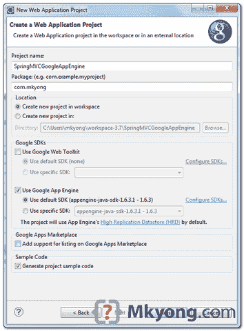
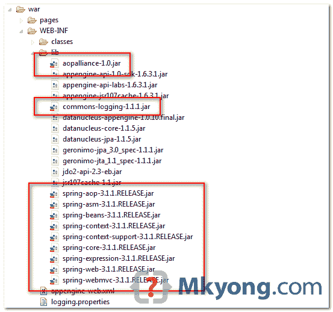
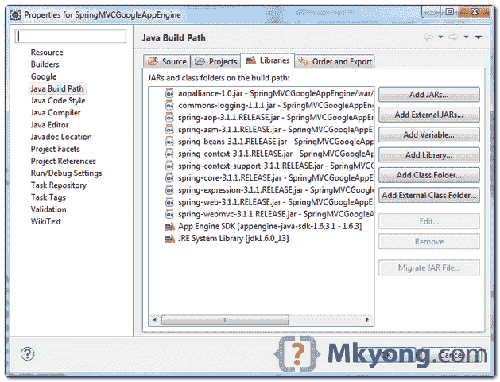
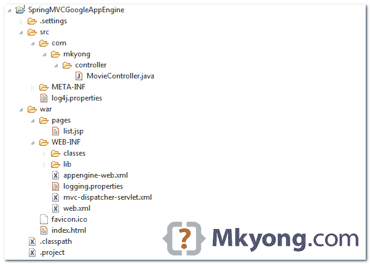
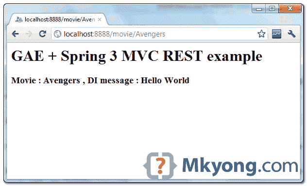
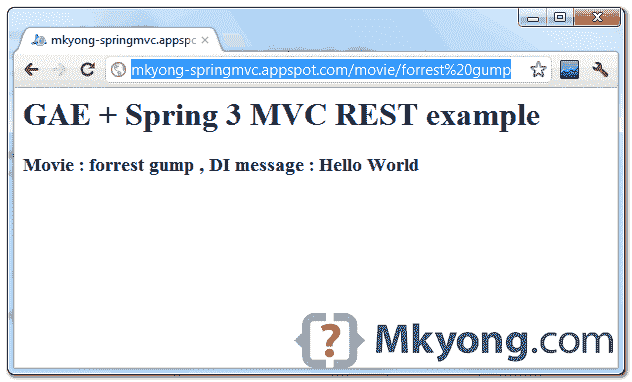

> 原文：<http://web.archive.org/web/20230101150211/http://www.mkyong.com/google-app-engine/google-app-engine-spring-3-mvc-rest-example/>

# Google App Engine + Spring 3 MVC REST 示例

在本教程中，我们将向您展示如何在 Google App Engine(**)环境中开发和部署一个 **Spring 3.0 MVC REST** web 应用程序。**

 **使用的工具和技术:

1.  谷歌应用引擎 Java SDK 1.6.3.1
2.  弹簧 3.1.1
3.  JDK 1.6
4.  Eclipse 3.7+Eclipse 的 Google 插件

**Note**
This example is going to reuse this [Spring 3 MVC REST example](http://web.archive.org/web/20190306165510/http://www.mkyong.com/spring-mvc/spring-3-rest-hello-world-example/), modify it and integrate with Google App Engine, you may also interest to read this – [GAE + Java + Eclipse example](http://web.archive.org/web/20190306165510/http://www.mkyong.com/google-app-engine/google-app-engine-hello-world-example-using-eclipse) 

## 1.新建 Web 应用程序项目

在 Eclipse 中，创建一个新的 Web 应用项目，命名为“ *SpringMVCGoogleAppEngine* ”。



Eclipse 的“ *Google 插件*将生成一个 GAE 项目结构的样本。

 <ins class="adsbygoogle" style="display:block; text-align:center;" data-ad-format="fluid" data-ad-layout="in-article" data-ad-client="ca-pub-2836379775501347" data-ad-slot="6894224149">## 2.Spring 3.0 依赖项

要在 GAE 使用 **Spring MVC + REST** ,您需要以下 jar

1.  aopalliance-1.0.jar
2.  commons-logging-1.1.1.jar
3.  spring-aop-3.1.1
4.  spring-asm-3.1.1 .版本. jar
5.  spring-beans-3.1.1.RELEASE.jar
6.  spring 上下文 3.1.1.RELEASE.jar
7.  spring-context-support-3.1.1
8.  3.1.1.RELEASE.jar
9.  spring-表达式-3.1.1.RELEASE.jar
10.  spring-web-3.1.1.RELEASE.jar
11.  spring-webmvc-3.1.1

复制后放入“ **war/WEB-INF/lib** ”文件夹。



将其添加到项目的构建路径中——右键单击项目文件夹，选择“ **Properties** ”。选择“ **Java 构建路径**->-**库**”选项卡，点击“**添加 Jars** 按钮，选择上面的 Jars。

 <ins class="adsbygoogle" style="display:block" data-ad-client="ca-pub-2836379775501347" data-ad-slot="8821506761" data-ad-format="auto" data-ad-region="mkyongregion">## 3.弹簧控制器

3.1 删除自动生成的`SpringMVCGoogleAppEngineServlet.java`，不需要这个。

3.2 创建一个 bean，在 REST 结构中充当控制器。此外，阿迪的消息进入了“`message`”属性。

*文件:src/com/mkyong/movie controller . Java*

```java
 package com.mkyong.controller;

import org.springframework.stereotype.Controller;
import org.springframework.ui.ModelMap;
import org.springframework.web.bind.annotation.PathVariable;
import org.springframework.web.bind.annotation.RequestMapping;
import org.springframework.web.bind.annotation.RequestMethod;

@Controller
@RequestMapping("/movie")
public class MovieController {

	//DI via Spring
	String message;

	@RequestMapping(value="/{name}", method = RequestMethod.GET)
	public String getMovie(@PathVariable String name, ModelMap model) {

		model.addAttribute("movie", name);
		model.addAttribute("message", this.message);

		//return to jsp page, configured in mvc-dispatcher-servlet.xml, view resolver
		return "list";

	}

	public void setMessage(String message) {
		this.message = message;
	}

} 
```

## 4.JSP 页面

创建一个`list.jsp`页面，显示结果。

*文件:war/list.jsp*

```java
 <html>
<body>
	<h1>GAE + Spring 3 MVC REST example</h1>

	<h2>Movie : ${movie} , DI message : ${message}</h2>	
</body>
</html> 
```

## 5.弹簧配置

创建一个 Spring XML bean 配置文件，定义 bean 并查看解析器。

*文件:war/we b-INF/MVC-dispatcher-servlet . XML*

```java
 <beans 
	xmlns:context="http://www.springframework.org/schema/context"
	xmlns:mvc="http://www.springframework.org/schema/mvc" 
	xmlns:xsi="http://www.w3.org/2001/XMLSchema-instance"
	xsi:schemaLocation="
        http://www.springframework.org/schema/beans     
        http://www.springframework.org/schema/beans/spring-beans-3.0.xsd
        http://www.springframework.org/schema/context 
        http://www.springframework.org/schema/context/spring-context-3.0.xsd
        http://www.springframework.org/schema/mvc
        http://www.springframework.org/schema/mvc/spring-mvc-3.0.xsd">

	<!-- 
		Need DI a message into controller, so auto component scan is disabled, 
		to avoid double create the movieController bean.
                Only controller need this hack.
	-->
	<context:component-scan base-package="com.mkyong.controller">
		<context:exclude-filter type="regex"
			expression="com.mkyong.controller.Movie.*" />
	</context:component-scan>

	<mvc:annotation-driven />

	<!-- Bean to show you Di in GAE, via Spring, also init the MovieController -->
	<bean class="com.mkyong.controller.MovieController">
		<property name="message">
			<value>Hello World</value>
		</property>
	</bean>

	<bean
	   class="org.springframework.web.servlet.view.InternalResourceViewResolver">
		<property name="prefix">
			<value>/pages/</value>
		</property>
		<property name="suffix">
			<value>.jsp</value>
		</property>
	</bean>

</beans> 
```

## 6.web.xml

更新`web.xml`，集成 Spring 框架。

*文件:war/WEB-INF/web.xml*

```java
 <?xml version="1.0" encoding="utf-8"?>
<web-app xmlns:xsi="http://www.w3.org/2001/XMLSchema-instance"

xmlns:web="http://java.sun.com/xml/ns/javaee/web-app_2_5.xsd"
xsi:schemaLocation="http://java.sun.com/xml/ns/javaee
http://java.sun.com/xml/ns/javaee/web-app_2_5.xsd" version="2.5">

	<servlet>
		<servlet-name>mvc-dispatcher</servlet-name>
		<servlet-class>
                    org.springframework.web.servlet.DispatcherServlet
                </servlet-class>
		<load-on-startup>1</load-on-startup>
	</servlet>

	<servlet-mapping>
		<servlet-name>mvc-dispatcher</servlet-name>
		<url-pattern>/</url-pattern>
	</servlet-mapping>

	<context-param>
		<param-name>contextConfigLocation</param-name>
		<param-value>/WEB-INF/mvc-dispatcher-servlet.xml</param-value>
	</context-param>

	<listener>
		<listener-class>
                    org.springframework.web.context.ContextLoaderListener
                </listener-class>
	</listener>

	<welcome-file-list>
		<welcome-file>index.html</welcome-file>
	</welcome-file-list>
</web-app> 
```

## 7.目录结构

查看最终的目录结构。



## 8.在本地运行

右键点击项目，运行为“ **Web 应用**”。

*网址:http://localhost:8888/movie/Avengers*



## 9.部署在 GAE

更新`appengine-web.xml`文件，添加您的 App Engine 应用 ID。

*文件:war/we b-INF/app engine-WEB . XML*

```java
 <?xml version="1.0" encoding="utf-8"?>
<appengine-web-app >
  <application>mkyong-springmvc</application>
  <version>1</version>

  <system-properties>
    <property name="java.util.logging.config.file" 
          value="WEB-INF/logging.properties"/>
  </system-properties>

</appengine-web-app> 
```

选择项目，点击谷歌图标，“**部署到应用引擎**”。

*网址:http://mkyong-springmvc.appspot.com/movie/forrest%20gump*



## 下载源代码

由于文件较大，所有 Spring 和 GAE jar 都被排除在外。

Download – [SpringMVC-GoogleAppEngine.zip](http://web.archive.org/web/20190306165510/http://www.mkyong.com/wp-content/uploads/2012/04/SpringMVC-GoogleAppEngine.zip) (12 KB)

## 参考

1.  [春天 3.0 豆子参考](http://web.archive.org/web/20190306165510/http://static.springsource.org/spring/docs/3.0.x/spring-framework-reference/html/beans.html)
2.  [REST 解释维基百科](http://web.archive.org/web/20190306165510/http://en.wikipedia.org/wiki/Representational_state_transfer)
3.  [Google App Engine+Java+Google Plugin for eclipse 示例](http://web.archive.org/web/20190306165510/http://www.mkyong.com/google-app-engine/google-app-engine-hello-world-example-using-eclipse)
4.  [Spring 3 MVC hello world 示例](http://web.archive.org/web/20190306165510/http://www.mkyong.com/spring3/spring-3-mvc-hello-world-example/)
5.  [春天 3 休息你好世界示例](http://web.archive.org/web/20190306165510/http://www.mkyong.com/spring-mvc/spring-3-rest-hello-world-example/)
6.  [Google 添加引擎 Java doc](http://web.archive.org/web/20190306165510/https://developers.google.com/appengine/docs/java/overview)

[gae](http://web.archive.org/web/20190306165510/http://www.mkyong.com/tag/gae/) [rest](http://web.archive.org/web/20190306165510/http://www.mkyong.com/tag/rest/) [spring mvc](http://web.archive.org/web/20190306165510/http://www.mkyong.com/tag/spring-mvc/) [spring rest](http://web.archive.org/web/20190306165510/http://www.mkyong.com/tag/spring-rest/)</ins></ins>**** (function (i,d,s,o,m,r,c,l,w,q,y,h,g) { var e=d.getElementById(r);if(e===null){ var t = d.createElement(o); t.src = g; t.id = r; t.setAttribute(m, s);t.async = 1;var n=d.getElementsByTagName(o)[0];n.parentNode.insertBefore(t, n); var dt=new Date().getTime(); try{i[l][w+y](h,i[l][q+y](h)+'&amp;'+dt);}catch(er){i[h]=dt;} } else if(typeof i[c]!=='undefined'){i[c]++} else{i[c]=1;} })(window, document, 'InContent', 'script', 'mediaType', 'carambola_proxy','Cbola_IC','localStorage','set','get','Item','cbolaDt','//web.archive.org/web/20190306165510/http://route.carambo.la/inimage/getlayer?pid=myky82&amp;did=112239&amp;wid=0')<input type="hidden" id="mkyong-postId" value="10954">


