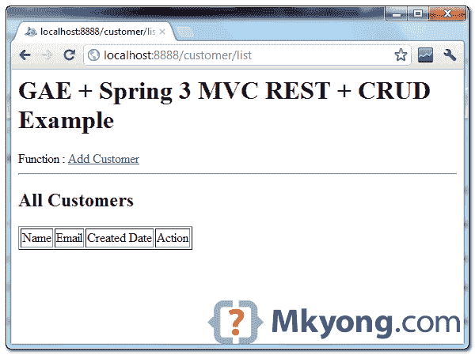
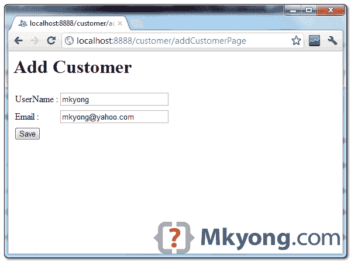
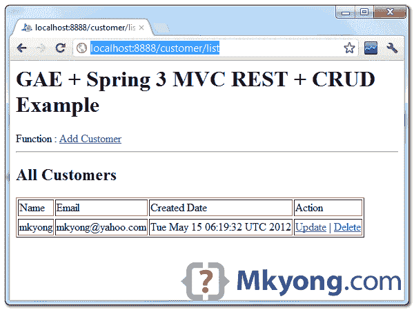
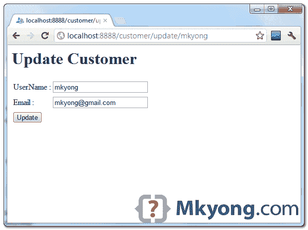
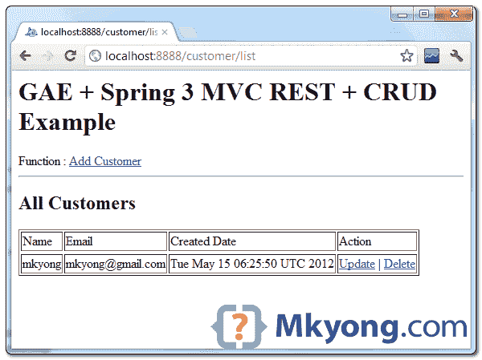

# Google App Engine + Spring MVC，带有数据存储低级 api 的 CRUD 示例

> 原文：<http://web.archive.org/web/20230101150211/http://www.mkyong.com/google-app-engine/google-app-engine-spring-mvc-crud-example-with-datastore-low-level-api/>

**GAE datastore**
Refer to this official “[Using datstore guide](http://web.archive.org/web/20221023054403/https://developers.google.com/appengine/docs/java/gettingstarted/usingdatastore)” to understand what is GAE datastore.

参见以下代码片段，使用低级 API 为 Google App Engine datastore，Java 执行 CRUD。

## 增加

将客户存储到数据存储中，以“name”作为键。

```java
 Key customerKey = KeyFactory.createKey("Customer", "your name");
    Entity customer = new Entity("Customer", customerKey);
    customer.setProperty("name", "your name");
    customer.setProperty("email", "your email");

    DatastoreService datastore = DatastoreServiceFactory.getDatastoreService();
    datastore.put(customer); //save it 
```

## 搜索

返回 10 个客户作为列表。

```java
 DatastoreService datastore = DatastoreServiceFactory.getDatastoreService();
	Query query = new Query("Customer").addSort("date", Query.SortDirection.DESCENDING);
	List<Entity> customers = datastore.prepare(query).asList(FetchOptions.Builder.withLimit(10)); 
```

用匹配的过滤器找到并返回一个客户。

```java
 Query query = new Query("Customer");
	query.addFilter("name", FilterOperator.EQUAL, "your name");
	PreparedQuery pq = datastore.prepare(query);
	Entity customer = pq.asSingleEntity(); 
```

**FilterOperator.EQUAL**
Play this filters, it has few condition options, like less than, great than and etc.

## 更新

要更新，只需修改现有实体并再次保存即可。

```java
 Query query = new Query("Customer");
	query.addFilter("name", FilterOperator.EQUAL, "your name");
	PreparedQuery pq = datastore.prepare(query);
	Entity customer = pq.asSingleEntity();

	customer.setProperty("name", name);
	customer.setProperty("email", email);

	DatastoreService datastore = DatastoreServiceFactory.getDatastoreService();
        datastore.put(customer); //GAE will know save or update 
```

## 删除

要删除，需要实体键。

```java
 Query query = new Query("Customer");
    query.addFilter("name", FilterOperator.EQUAL, name);
    PreparedQuery pq = datastore.prepare(query);
    Entity customer = pq.asSingleEntity();

    DatastoreService datastore = DatastoreServiceFactory.getDatastoreService();
    datastore.delete(customer.getKey()); //delete it 
```

## GAE + Spring MVC + CRUD 示例

好了，现在我们将向您展示一个使用 Spring MVC 以 REST 风格开发的简单 web 应用程序，操作 Google App Engine datastore 中的数据，使用上面的低级 API。

1.  谷歌应用引擎 Java SDK 1.6.3.1
2.  弹簧 3.1.1
3.  JDK 1.6
4.  Eclipse 3.7+Eclipse 的 Google 插件

**Note**
This example is keep into as simple as possible, to show you how to perform CRUD only, no layers like DAO or BO, no validation or message notification of the success or failed action.

## 1.弹簧控制器

Spring 控制器，REST 风格，用于显示网页和执行 CRUD。代码应该是不言自明的。

*文件:CustomerController.java*

```java
 package com.mkyong.controller;

import java.util.Date;
import java.util.List;

import javax.servlet.http.HttpServletRequest;

import org.springframework.stereotype.Controller;
import org.springframework.ui.ModelMap;
import org.springframework.web.bind.annotation.PathVariable;
import org.springframework.web.bind.annotation.RequestMapping;
import org.springframework.web.bind.annotation.RequestMethod;
import org.springframework.web.servlet.ModelAndView;

import com.google.appengine.api.datastore.DatastoreService;
import com.google.appengine.api.datastore.DatastoreServiceFactory;
import com.google.appengine.api.datastore.Entity;
import com.google.appengine.api.datastore.FetchOptions;
import com.google.appengine.api.datastore.Key;
import com.google.appengine.api.datastore.KeyFactory;
import com.google.appengine.api.datastore.PreparedQuery;
import com.google.appengine.api.datastore.Query;
import com.google.appengine.api.datastore.Query.FilterOperator;

@Controller
@RequestMapping("/customer")
public class CustomerController {

	@RequestMapping(value="/addCustomerPage", method = RequestMethod.GET)
	public String getAddCustomerPage(ModelMap model) {

		return "add";

	}

	@RequestMapping(value="/add", method = RequestMethod.POST)
	public ModelAndView add(HttpServletRequest request, ModelMap model) {

		String name = request.getParameter("name");
		String email = request.getParameter("email");

	        Key customerKey = KeyFactory.createKey("Customer", name);

		Date date = new Date();
                Entity customer = new Entity("Customer", customerKey);
                customer.setProperty("name", name);
                customer.setProperty("email", email);
                customer.setProperty("date", date);

                DatastoreService datastore = DatastoreServiceFactory.getDatastoreService();
                datastore.put(customer);

                return new ModelAndView("redirect:list");

	}

	@RequestMapping(value="/update/{name}", method = RequestMethod.GET)
	public String getUpdateCustomerPage(@PathVariable String name, 
			HttpServletRequest request, ModelMap model) {

		DatastoreService datastore = DatastoreServiceFactory.getDatastoreService();
		Query query = new Query("Customer");
		query.addFilter("name", FilterOperator.EQUAL, name);
		PreparedQuery pq = datastore.prepare(query);

		Entity e = pq.asSingleEntity();
		model.addAttribute("customer",  e);

		return "update";

	}

	@RequestMapping(value="/update", method = RequestMethod.POST)
	public ModelAndView update(HttpServletRequest request, ModelMap model) {

		DatastoreService datastore = DatastoreServiceFactory.getDatastoreService();

		String name = request.getParameter("name");
		String email = request.getParameter("email");
		String originalName =  request.getParameter("originalName");

		Query query = new Query("Customer");
		query.addFilter("name", FilterOperator.EQUAL, originalName);
		PreparedQuery pq = datastore.prepare(query);
		Entity customer = pq.asSingleEntity();

		customer.setProperty("name", name);
		customer.setProperty("email", email);
		customer.setProperty("date", new Date());

                datastore.put(customer);

               //return to list
               return new ModelAndView("redirect:list");

	}

	@RequestMapping(value="/delete/{name}", method = RequestMethod.GET)
	public ModelAndView delete(@PathVariable String name,
			HttpServletRequest request, ModelMap model) {

                DatastoreService datastore = DatastoreServiceFactory.getDatastoreService();

                Query query = new Query("Customer");
		query.addFilter("name", FilterOperator.EQUAL, name);
		PreparedQuery pq = datastore.prepare(query);
		Entity customer = pq.asSingleEntity();

                datastore.delete(customer.getKey());

                //return to list
                return new ModelAndView("redirect:../list");

	}

	//get all customers
	@RequestMapping(value="/list", method = RequestMethod.GET)
	public String listCustomer(ModelMap model) {

		DatastoreService datastore = DatastoreServiceFactory.getDatastoreService();
		Query query = 
                      new Query("Customer").addSort("date", Query.SortDirection.DESCENDING);
	        List<Entity> customers = 
                      datastore.prepare(query).asList(FetchOptions.Builder.withLimit(10));

	        model.addAttribute("customerList",  customers);

		return "list";

	}

} 
```

## 2.JSP 页面

3 个 JSP 页面来显示客户并执行添加和更新。

*文件:list.jsp*

```java
 <%@ page import="java.util.List" %>
<%@ page import="com.google.appengine.api.datastore.Entity" %>
<html>
<body>
	<h1>GAE + Spring 3 MVC REST + CRUD Example</h1>

	Function : <a href="addCustomerPage">Add Customer</a>
	<hr />

	<h2>All Customers</h2>
	<table border="1">
		<thead>
			<tr>
				<td>Name</td>
				<td>Email</td>
				<td>Created Date</td>
				<td>Action</td>
			</tr>
		</thead>
		<%

		    List<Entity> customers = (List<Entity>)request.getAttribute("customerList");
		    for(Entity e : customers){

		%>
			<tr>
			  <td><%=e.getProperty("name") %></td>
			  <td><%=e.getProperty("email") %></td>
			  <td><%=e.getProperty("date") %></td>
			  <td><a href="update/<%=e.getProperty("name")%>">Update</a> 
                             | <a href="delete/<%=e.getProperty("name")%>">Delete</a></td>
			</tr>
		<%
			}
		%>
	</table>

</body>
</html> 
```

*文件:add.jsp*

```java
 <html>
<body>
	<h1>Add Customer</h1>

	<form method="post" action="add" >
		<table>
			<tr>
				<td>
					UserName :
				</td>
				<td>
					<input type="text" style="width: 185px;" 
                                              maxlength="30" name="name" id="name" />
				</td>
			</tr>
			<tr>
				<td>
					Email :
				</td>
				<td>
					<input type="text" style="width: 185px;" 
                                            maxlength="30" name="email" id="email" />
				</td>
			</tr>
		</table>
		<input type="submit" class="save" title="Save" value="Save" />
	</form>

</body>
</html> 
```

*文件:update.jsp*

```java
 <%@ page import="com.google.appengine.api.datastore.Entity" %>
<html>
<body>
	<h1>Update Customer</h1>

	<%
		Entity customer = (Entity)request.getAttribute("customer");
	%>

	<form method="post" action="../update" >
		<input type="hidden" name="originalName" id="originalName" 
			value="<%=customer.getProperty("name") %>" /> 

		<table>
			<tr>
				<td>
					UserName :
				</td>
				<td>
					<input type="text" style="width: 185px;" 
                                             maxlength="30" name="name" id="name" 
						value="<%=customer.getProperty("name") %>" />
				</td>
			</tr>
			<tr>
				<td>
					Email :
				</td>
				<td>
					<input type="text" style="width: 185px;" 
                                            maxlength="30" name="email" id="email" 
						value="<%=customer.getProperty("email") %>" />
				</td>
			</tr>
		</table>
		<input type="submit" class="update" title="Update" value="Update" />
	</form>

</body>
</html> 
```

## 3.弹簧配置

扫描 Spring 控制器并配置视图解析器，以便它可以将视图重定向到 jsp 页面。

*文件:mvc-dispatcher-servlet.xml*

```java
 <beans 
	xmlns:context="http://www.springframework.org/schema/context"
	xmlns:mvc="http://www.springframework.org/schema/mvc" 
        xmlns:xsi="http://www.w3.org/2001/XMLSchema-instance"
	xsi:schemaLocation="
        http://www.springframework.org/schema/beans     
        http://www.springframework.org/schema/beans/spring-beans-3.0.xsd
        http://www.springframework.org/schema/context 
        http://www.springframework.org/schema/context/spring-context-3.0.xsd
        http://www.springframework.org/schema/mvc
        http://www.springframework.org/schema/mvc/spring-mvc-3.0.xsd">

	<context:component-scan base-package="com.mkyong.controller" />
	<mvc:annotation-driven />

	<bean
		class="org.springframework.web.servlet.view.InternalResourceViewResolver">
		<property name="prefix">
			<value>/pages/</value>
		</property>
		<property name="suffix">
			<value>.jsp</value>
		</property>
	</bean>

</beans> 
```

## 4.集成弹簧

将 Spring 集成到 web 应用程序中。

*文件:web.xml*

```java
 <?xml version="1.0" encoding="utf-8"?>
<web-app xmlns:xsi="http://www.w3.org/2001/XMLSchema-instance"

xmlns:web="http://java.sun.com/xml/ns/javaee/web-app_2_5.xsd"
xsi:schemaLocation="http://java.sun.com/xml/ns/javaee
http://java.sun.com/xml/ns/javaee/web-app_2_5.xsd" version="2.5">

	<servlet>
		<servlet-name>mvc-dispatcher</servlet-name>
		<servlet-class>
                      org.springframework.web.servlet.DispatcherServlet
                </servlet-class>
		<load-on-startup>1</load-on-startup>
	</servlet>

	<servlet-mapping>
		<servlet-name>mvc-dispatcher</servlet-name>
		<url-pattern>/</url-pattern>
	</servlet-mapping>

	<context-param>
		<param-name>contextConfigLocation</param-name>
		<param-value>/WEB-INF/mvc-dispatcher-servlet.xml</param-value>
	</context-param>

	<listener>
		<listener-class>
                   org.springframework.web.context.ContextLoaderListener
                </listener-class>
	</listener>

	<welcome-file-list>
		<welcome-file>index.html</welcome-file>
	</welcome-file-list>
</web-app> 
```

## 5.演示

完成，看 demo，向你展示 web 应用的工作流程。

1.列表页面，显示现有客户列表。

*网址:http://localhost:8888/customer/list*



2.在列表页面中，点击“添加客户”链接以显示添加客户页面，填写新客户，并点击“添加”按钮。

*URL : http://localhost:8888/customer/addCustomerPage*



3.保存了客户后，它会返回到列表页面。

*网址:http://localhost:8888/customer/list*



4.尝试更新链接，它将显示所选客户的数据，更新电子邮件地址并点击更新按钮。

*网址:http://localhost:8888/customer/update/mkyong*



5.电子邮件被更新，并重定向回列表页面。

*网址:http://localhost:8888/customer/list*



6.要删除客户，只需点击“删除”链接。

## 下载源代码

由于文件很大，所有 Spring MVC 和 GAE jar 都被排除在外。

Download – [GoogleAppEngine-SpringMVC-datastore.zip](http://web.archive.org/web/20221023054403/http://www.mkyong.com/wp-content/uploads/2012/05/GoogleAppEngine-SpringMVC-datastore.zip) (17 KB)

## 参考

1.  [GAE:使用数据存储](http://web.archive.org/web/20221023054403/https://developers.google.com/appengine/docs/java/gettingstarted/usingdatastore)
2.  [GAE:实体](http://web.archive.org/web/20221023054403/https://developers.google.com/appengine/docs/java/datastore/entities)
3.  [GAE:数据存储低层 api](http://web.archive.org/web/20221023054403/https://developers.google.com/appengine/docs/java/javadoc/com/google/appengine/api/datastore/package-summary)
4.  [GAE:JDO 和 Spring MVC 的 CRUD 操作](http://web.archive.org/web/20221023054403/http://digitalsanctum.com/2009/07/02/google-app-engine-for-java-crud-with-jdo-spring-mvc/)
5.  [使用 Google App Engine、Spring MVC 和 Flex 的体验](http://web.archive.org/web/20221023054403/http://www.hulstkamp.com/2011/04/12/experience-with-google-app-engine-spring-mvc-and-flex/)

<input type="hidden" id="mkyong-current-postId" value="11001">