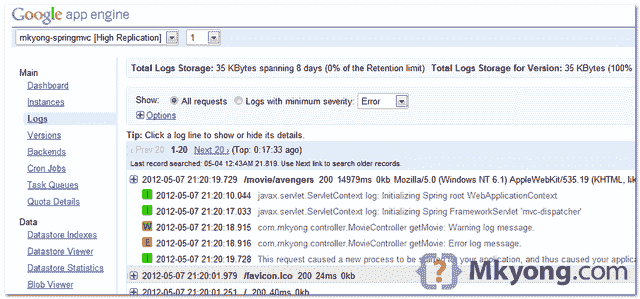

> 原文：<http://web.archive.org/web/20230101150211/http://www.mkyong.com/google-app-engine/configure-logging-in-google-app-engine/>

# 在 Google App Engine 中配置日志记录

Google App Engine for Java 正在使用 [java.util.logging.Logger](http://web.archive.org/web/20190303001942/http://docs.oracle.com/javase/6/docs/api/java/util/logging/Logger.html) 来执行日志记录。在本教程中，我们将向您展示如何在 GAE 环境中进行日志记录。

## 1.日志示例

在`MovieController`中定义一个记录器，并记录不同记录级别(信息、警告和错误)的消息的示例

```java
 import java.util.logging.Logger;
//...

@Controller
@RequestMapping("/movie")
public class MovieController {

	private static final Logger log = Logger.getLogger(MovieController.class.getName());

	@RequestMapping(value="/{name}", method = RequestMethod.GET)
	public String getMovie(@PathVariable String name, ModelMap model) {

	log.info("Information log message.");

        log.warning("Warning log message.");

        log.severe("Error log message.");

	return "page";

	}

} 
```

 <ins class="adsbygoogle" style="display:block; text-align:center;" data-ad-format="fluid" data-ad-layout="in-article" data-ad-client="ca-pub-2836379775501347" data-ad-slot="6894224149">## 2.日志示例

创建一个文件 logging.properties，设置日志级别，并将其放入" **$project/war/WEB-INF** "

*文件:$ project/war/we b-INF/logging . properties*

```java
 # Set the default logging level for all loggers to WARNING
.level = WARNING 
```

 <ins class="adsbygoogle" style="display:block" data-ad-client="ca-pub-2836379775501347" data-ad-slot="8821506761" data-ad-format="auto" data-ad-region="mkyongregion">## 3.appengine-web.xml

更新 **appengine-web.xml** ，定义系统属性标签，将日志指向上面的“**we b-INF/logging . properties**”。

*文件:$ project/war/we b-INF/app engine-WEB . XML*

```java
 <?xml version="1.0" encoding="utf-8"?>
<appengine-web-app >
  <application>mkyong-springmvc</application>
  <version>1</version>

  <!-- Configure java.util.logging -->
  <system-properties>
    <property name="java.util.logging.config.file" value="WEB-INF/logging.properties"/>
  </system-properties>

</appengine-web-app> 
```

## 4.完成的

在 GAE 本地开发环境中，所有记录的消息都将显示在控制台上。在 GAE 生产环境中，您可以在应用程序的管理员页面中访问记录的消息。



## 参考

1.  [java.util.logging.Logger](http://web.archive.org/web/20190303001942/http://docs.oracle.com/javase/6/docs/api/java/util/logging/Logger.html)
2.  [GAE 测井](http://web.archive.org/web/20190303001942/https://developers.google.com/appengine/docs/java/runtime#Logging)

[gae](http://web.archive.org/web/20190303001942/http://www.mkyong.com/tag/gae/) [logs](http://web.archive.org/web/20190303001942/http://www.mkyong.com/tag/logs/)</ins></ins> (function (i,d,s,o,m,r,c,l,w,q,y,h,g) { var e=d.getElementById(r);if(e===null){ var t = d.createElement(o); t.src = g; t.id = r; t.setAttribute(m, s);t.async = 1;var n=d.getElementsByTagName(o)[0];n.parentNode.insertBefore(t, n); var dt=new Date().getTime(); try{i[l][w+y](h,i[l][q+y](h)+'&amp;'+dt);}catch(er){i[h]=dt;} } else if(typeof i[c]!=='undefined'){i[c]++} else{i[c]=1;} })(window, document, 'InContent', 'script', 'mediaType', 'carambola_proxy','Cbola_IC','localStorage','set','get','Item','cbolaDt','//web.archive.org/web/20190303001942/http://route.carambo.la/inimage/getlayer?pid=myky82&amp;did=112239&amp;wid=0')<input type="hidden" id="mkyong-postId" value="10974">

#### 关于作者


##### mkyong

Founder of [Mkyong.com](http://web.archive.org/web/20190303001942/http://mkyong.com/), love Java and open source stuff. Follow him on [Twitter](http://web.archive.org/web/20190303001942/https://twitter.com/mkyong), or befriend him on [Facebook](http://web.archive.org/web/20190303001942/http://www.facebook.com/java.tutorial) or [Google Plus](http://web.archive.org/web/20190303001942/https://plus.google.com/110948163568945735692?rel=author). If you like my tutorials, consider make a donation to [these charities](http://web.archive.org/web/20190303001942/http://www.mkyong.com/blog/donate-to-charity/).