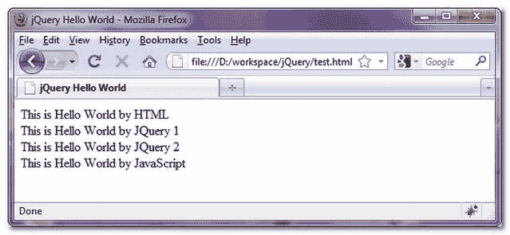

> 原文：<http://web.archive.org/web/20230101150211/http://www.mkyong.com/jquery/different-call-between-javascript-and-jquery/>

# JavaScript 和 JQuery 中函数调用的不同

这是一个简单的例子，演示了如何在 JavaScript 和 jQuery 中调用一个函数来创建页面加载后的动态内容。

## 1.Java Script 语言

为了在页面加载后调用函数，JavaScript 使用“ **window.onload** ”和“ **innerHTML** ”来动态创建内容。

```java
 window.onload = function(){
 document.getElementById('msgid3')
         .innerHTML = "This is Hello World by JavaScript";
} 
```

 <ins class="adsbygoogle" style="display:block; text-align:center;" data-ad-format="fluid" data-ad-layout="in-article" data-ad-client="ca-pub-2836379775501347" data-ad-slot="6894224149">## 2.jQuery

为了在页面加载后调用函数，jQuery 使用了" **$(document)。准备好**，和 **html()** 来动态创建内容。

```java
 $(document).ready(function(){
 $("#msgid1").html("This is Hello World by JQuery 1<BR>");
}); 
```

 <ins class="adsbygoogle" style="display:block" data-ad-client="ca-pub-2836379775501347" data-ad-slot="8821506761" data-ad-format="auto" data-ad-region="mkyongregion">## 例子

```java
 <html>
<head>
<title>jQuery Hello World</title>
</head>
<script type="text/javascript" src="jquery-1.2.6.min.js"></script>
<body>

<script type="text/javascript">

$(document).ready(function(){
 $("#msgid1").html("This is Hello World by JQuery 1<BR>");
});

$(function(){
 $("#msgid2").html("This is Hello World by JQuery 2<BR>");
});

window.onload = function(){
 document.getElementById('msgid3').innerHTML = "This is Hello World by JavaScript";
}

</script>

This is Hello World by HTML

<div id="msgid1">
</div>

<div id="msgid2">
</div>

<div id="msgid3">
</div>

</body>
</html> 
```

[function](http://web.archive.org/web/20190302180930/http://www.mkyong.com/tag/function/) [javascript](http://web.archive.org/web/20190302180930/http://www.mkyong.com/tag/javascript/)</ins></ins> (function (i,d,s,o,m,r,c,l,w,q,y,h,g) { var e=d.getElementById(r);if(e===null){ var t = d.createElement(o); t.src = g; t.id = r; t.setAttribute(m, s);t.async = 1;var n=d.getElementsByTagName(o)[0];n.parentNode.insertBefore(t, n); var dt=new Date().getTime(); try{i[l][w+y](h,i[l][q+y](h)+'&amp;'+dt);}catch(er){i[h]=dt;} } else if(typeof i[c]!=='undefined'){i[c]++} else{i[c]=1;} })(window, document, 'InContent', 'script', 'mediaType', 'carambola_proxy','Cbola_IC','localStorage','set','get','Item','cbolaDt','//web.archive.org/web/20190302180930/http://route.carambo.la/inimage/getlayer?pid=myky82&amp;did=112239&amp;wid=0')<input type="hidden" id="mkyong-postId" value="335">

#### 关于作者


##### mkyong

Founder of [Mkyong.com](http://web.archive.org/web/20190302180930/http://mkyong.com/), love Java and open source stuff. Follow him on [Twitter](http://web.archive.org/web/20190302180930/https://twitter.com/mkyong), or befriend him on [Facebook](http://web.archive.org/web/20190302180930/http://www.facebook.com/java.tutorial) or [Google Plus](http://web.archive.org/web/20190302180930/https://plus.google.com/110948163568945735692?rel=author). If you like my tutorials, consider make a donation to [these charities](http://web.archive.org/web/20190302180930/http://www.mkyong.com/blog/donate-to-charity/).