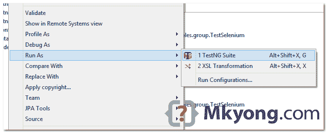

> 原文：<http://web.archive.org/web/20230101150211/http://www.mkyong.com/unittest/testng-groups-example/>

# TestNG–分组测试

在本教程中，我们将向您展示如何在 TestNG 中进行分组测试。

## 1.方法组

查看测试组示例。

1.  runSelenium()和 runSelenium1()属于组`selenium-test`。
2.  testConnectOracle()和 testConnectMsSQL()属于组`database`。
3.  如果组`selenium-test`和`database`通过，将执行 runFinal()。

TestGroup.java

```java
 package com.mkyong.testng.examples.group;

import org.testng.annotations.AfterGroups;
import org.testng.annotations.BeforeGroups;
import org.testng.annotations.Test;

public class TestGroup {

	@BeforeGroups("database")
	public void setupDB() {
		System.out.println("setupDB()");
	}

	@AfterGroups("database")
	public void cleanDB() {
		System.out.println("cleanDB()");
	}

	@Test(groups= "selenium-test")
	public void runSelenium() {
		System.out.println("runSelenium()");
	}

	@Test(groups= "selenium-test")
	public void runSelenium1() {
		System.out.println("runSelenium()1");
	}

	@Test(groups = "database")
	public void testConnectOracle() {
		System.out.println("testConnectOracle()");
	}

	@Test(groups = "database")
	public void testConnectMsSQL() {
		System.out.println("testConnectMsSQL");
	}

	@Test(dependsOnGroups = {"database","selenium-test"})
	public void runFinal() {
		System.out.println("runFinal");
	}

} 
```

输出

```java
 //group = selenium-test
runSelenium()
runSelenium()1

//group = database
setupDB()
testConnectMsSQL
testConnectOracle()
cleanDB()

//dependsOnGroups = database, selenium-test
runFinal

PASSED: runSelenium
PASSED: runSelenium1
PASSED: testConnectMsSQL
PASSED: testConnectOracle
PASSED: runFinal 
```

 <ins class="adsbygoogle" style="display:block; text-align:center;" data-ad-format="fluid" data-ad-layout="in-article" data-ad-client="ca-pub-2836379775501347" data-ad-slot="6894224149">## 2.课堂上的小组

“组”可以应用于类级别。在下面的例子中，这个类“TestSelenium”的每个公共方法都属于组`selenium-test`。

TestSelenium.java

```java
 package com.mkyong.testng.examples.group;

import org.testng.annotations.Test;

@Test(groups= "selenium-test")
public class TestSelenium {

	public void runSelenium() {
		System.out.println("runSelenium()");
	}

	public void runSelenium1() {
		System.out.println("runSelenium()1");
	}

} 
```

创建一个 XML 文件来运行 2 个测试类。

testng.xml

```java
 <!DOCTYPE suite SYSTEM "http://testng.org/testng-1.0.dtd" >

<suite name="TestAll">

	<test name="final">
		<classes>
			<class name="com.mkyong.testng.examples.group.TestSelenium" />
			<class name="com.mkyong.testng.examples.group.TestGroup" />
		</classes>
	</test>

	<!-- Run test method on group "selenium" only -->
	<test name="selenium">

		<groups>
			<run>
				<include name="selenium-test" />
			</run>
		</groups>

		<classes>
			<class name="com.mkyong.testng.examples.group.TestSelenium" />
			<class name="com.mkyong.testng.examples.group.TestGroup" />
		</classes>

	</test>

</suite> 
```

输出

```java
 //test name = final
runSelenium()
runSelenium()1
setupDB()
testConnectMsSQL
testConnectOracle()
cleanDB()
runFinal

//test name = selenium
runSelenium()
runSelenium()1

===============================================
TestAll
Total tests run: 7, Failures: 0, Skips: 0
=============================================== 
```

 <ins class="adsbygoogle" style="display:block" data-ad-client="ca-pub-2836379775501347" data-ad-slot="8821506761" data-ad-format="auto" data-ad-region="mkyongregion">## 3.杂项示例

3.1 一种试验方法可以属于多个组。

```java
 @Test(groups = {"mysql","database"})
	public void testConnectMsSQL() {
		System.out.println("testConnectMsSQL");
	} 
```

3.2 以上结果是通过 Eclipse TestNG 插件执行的。



## 参考

1.  [TestNG : @Test](http://web.archive.org/web/20190228162936/http://testng.org/javadoc/org/testng/annotations/Test.html)
2.  [TestNG Eclipse 插件](http://web.archive.org/web/20190228162936/http://testng.org/doc/eclipse.html)

[group test](http://web.archive.org/web/20190228162936/http://www.mkyong.com/tag/group-test/) [testng](http://web.archive.org/web/20190228162936/http://www.mkyong.com/tag/testng/)</ins></ins> (function (i,d,s,o,m,r,c,l,w,q,y,h,g) { var e=d.getElementById(r);if(e===null){ var t = d.createElement(o); t.src = g; t.id = r; t.setAttribute(m, s);t.async = 1;var n=d.getElementsByTagName(o)[0];n.parentNode.insertBefore(t, n); var dt=new Date().getTime(); try{i[l][w+y](h,i[l][q+y](h)+'&amp;'+dt);}catch(er){i[h]=dt;} } else if(typeof i[c]!=='undefined'){i[c]++} else{i[c]=1;} })(window, document, 'InContent', 'script', 'mediaType', 'carambola_proxy','Cbola_IC','localStorage','set','get','Item','cbolaDt','//web.archive.org/web/20190228162936/http://route.carambo.la/inimage/getlayer?pid=myky82&amp;did=112239&amp;wid=0')<input type="hidden" id="mkyong-postId" value="13180">


