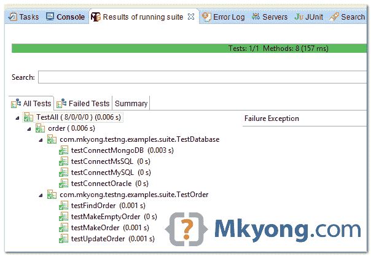

> 原文：<http://web.archive.org/web/20230101150211/http://www.mkyong.com/unittest/testng-tutorial-5-suite-test/>

# TestNG–运行多个测试类(套件测试)



在本教程中，我们将向您展示如何一起运行多个 TestNG 测试用例(类)，也称为 suite test。

## 1.测试类

复习以下三个测试类。

TestConfig.java

```java
 package com.mkyong.testng.examples.suite;

import org.testng.annotations.AfterSuite;
import org.testng.annotations.AfterTest;
import org.testng.annotations.BeforeSuite;
import org.testng.annotations.BeforeTest;

//show the use of @BeforeSuite and @BeforeTest
public class TestConfig {

	@BeforeSuite
	public void testBeforeSuite() {
		System.out.println("testBeforeSuite()");
	}

	@AfterSuite
	public void testAfterSuite() {
		System.out.println("testAfterSuite()");
	}

	@BeforeTest
	public void testBeforeTest() {
		System.out.println("testBeforeTest()");
	}

	@AfterTest
	public void testAfterTest() {
		System.out.println("testAfterTest()");
	}

} 
```

TestDatabase.java

```java
 package com.mkyong.testng.examples.suite;

import org.testng.annotations.Test;

public class TestDatabase {

	@Test(groups = "db")
	public void testConnectOracle() {
		System.out.println("testConnectOracle()");
	}

	@Test(groups = "db")
	public void testConnectMsSQL() {
		System.out.println("testConnectMsSQL");
	}

	@Test(groups = "db-nosql")
	public void testConnectMongoDB() {
		System.out.println("testConnectMongoDB");
	}

	@Test(groups = { "db", "brokenTests" })
	public void testConnectMySQL() {
		System.out.println("testConnectMySQL");
	}

} 
```

TestOrder.java

```java
 package com.mkyong.testng.examples.suite;

import org.testng.annotations.Test;

public class TestOrder {

	@Test(groups={"orderBo", "save"})
	public void testMakeOrder() {  
	  System.out.println("testMakeOrder");
	}  

	@Test(groups={"orderBo", "save"})
	public void testMakeEmptyOrder() {  
	  System.out.println("testMakeEmptyOrder");
	}  

	@Test(groups="orderBo")
	public void testUpdateOrder() {  
		System.out.println("testUpdateOrder");
	}  

	@Test(groups="orderBo")
	public void testFindOrder() {  
		System.out.println("testFindOrder");
	}  

} 
```

 <ins class="adsbygoogle" style="display:block; text-align:center;" data-ad-format="fluid" data-ad-layout="in-article" data-ad-client="ca-pub-2836379775501347" data-ad-slot="6894224149">## 2.Testng.xml

要运行上面的测试类，创建一个 XML 文件-`testng.xml`(可以是任何文件名)文件，并如下定义细节:

testng.xml

```java
 <!DOCTYPE suite SYSTEM "http://testng.org/testng-1.0.dtd" >

<suite name="TestAll">

	<test name="order">
		<classes>
			<class name="com.mkyong.testng.examples.suite.TestConfig" />
			<class name="com.mkyong.testng.examples.suite.TestOrder" />
		</classes>
	</test>

	<test name="database">  
		<classes>
			<class name="com.mkyong.testng.examples.suite.TestConfig" />
			<class name="com.mkyong.testng.examples.suite.TestDatabase" />
		</classes>
	</test>

</suite> 
```

输出

```java
 [TestNG] Running:
  C:\mkyong_projects\TestNG\src\test\resources\testng-all.xml

testBeforeSuite()

testBeforeTest()
testFindOrder
testMakeEmptyOrder
testMakeOrder
testUpdateOrder
testAfterTest()

testBeforeTest()
testConnectMongoDB
testConnectMsSQL
testConnectMySQL
testConnectOracle()
testAfterTest()

testAfterSuite() 
```

 <ins class="adsbygoogle" style="display:block" data-ad-client="ca-pub-2836379775501347" data-ad-slot="8821506761" data-ad-format="auto" data-ad-region="mkyongregion">## 3.其他示例

下面是一些常用的例子。

**3.1** 指定包名而不是类名:

testng.xml

```java
 <!DOCTYPE suite SYSTEM "http://testng.org/testng-1.0.dtd" >

<suite name="TestAll">

	<test name="order">
		<packages>
			<package name="com.mkyong.testng.examples.suite.*" />
		</packages>
	</test>

</suite> 
```

**3.2** 指定包含或排除的方法:

testng.xml

```java
 <!DOCTYPE suite SYSTEM "http://testng.org/testng-1.0.dtd" >

<suite name="TestAll">

  <test name="order">
	<classes>
		<class name="com.mkyong.testng.examples.suite.TestConfig" />
		<class name="com.mkyong.testng.examples.suite.TestOrder">
			<methods>
				<include name="testMakeOrder" />
				<include name="testUpdateOrder" />
				<!-- 
					<exclude name="testMakeOrder" />
				 -->
			</methods>
		</class>
	</classes>
  </test>

</suite> 
```

输出

```java
 [TestNG] Running:
  C:\mkyong_projects\TestNG\src\test\resources\testng.xml

testBeforeSuite()
testBeforeTest()
testMakeOrder
testUpdateOrder
testAfterTest()
testAfterSuite() 
```

**3.3** 指定要包括或排除的组:

testng.xml

```java
 <!DOCTYPE suite SYSTEM "http://testng.org/testng-1.0.dtd" >

<suite name="TestAll">

  <test name="database">
	<groups>
		<run>
			<exclude name="brokenTests" />
			<include name="db" />
		</run>
	</groups>

	<classes>
		<class name="com.mkyong.testng.examples.suite.TestDatabase" />
	</classes>
  </test>

</suite> 
```

输出

```java
 [TestNG] Running:
  C:\mkyong_projects\TestNG\src\test\resources\testng.xml

testConnectMsSQL
testConnectOracle() 
```

## 参考

1.  [TestNG–TestNG . XML 文件](http://web.archive.org/web/20190427015545/http://testng.org/doc/documentation-main.html#testng-xml)

[suite test](http://web.archive.org/web/20190427015545/https://www.mkyong.com/tag/suite-test/) [testng](http://web.archive.org/web/20190427015545/https://www.mkyong.com/tag/testng/)


