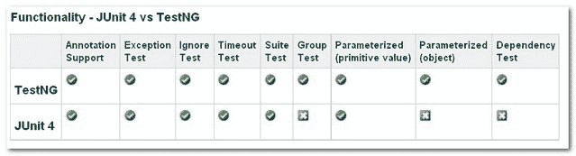

# JUnit 4 与 TestNG–比较

> 原文：<http://web.archive.org/web/20230101150211/http://www.mkyong.com/unittest/junit-4-vs-testng-comparison/>

JUnit 4 和 TestNG 都是 Java 中非常流行的单元测试框架。这两个框架在功能上看起来非常相似。哪个更好？Java 项目中应该使用哪个单元测试框架？

这里我做了一个 JUnit 4 和 TestNG 的特性比较。



## 1.注释支持

JUnit 4 和 TestNG 中实现的注释支持看起来很相似。

| 特征 | 6 月 4 日 | 测试 |
| 测试注释 | @测试 | @测试 |
| 在此套件中的所有测试运行之前运行 | — | @ BeforeSuite 套件 |
| 在此套件中的所有测试运行后运行 | — | @AfterSuite |
| 测试前运行 | — | @测试前 |
| 测试后运行 | — | @事后测试 |
| 在调用属于任何这些组的第一个测试方法之前运行 | — | @ BeforeGroups |
| 在属于这些组的最后一个测试方法被调用后运行 | — | @AfterGroups |
| 在调用当前类中的第一个测试方法之前运行 | @BeforeClass | @BeforeClass |
| 在运行完当前类中的所有测试方法后运行 | @课后 | @课后 |
| 在每个测试方法之前运行 | @以前 | @ before 方法 |
| 在每个测试方法后运行 | @之后 | @AfterMethod |
| 忽略测试 | @忽略 | @Test(enbale=false) |
| 预期异常 | @Test(应为= ArithmeticException.class) | @ Test(expected exceptions = arithmetic exception . class) |
| 超时 | @Test(超时= 1000) | @Test(超时= 1000) |

JUnit4 和 TestNG 之间的主要注释差异是

1.在 JUnit 4 中，我们必须将“@BeforeClass”和“@AfterClass”方法声明为静态方法。TestNG 在方法声明方面更加灵活，它没有这种限制。

2.3 附加设置/拆卸级别:套件和组(@Before/AfterSuite，@Before/AfterTest，@Before/AfterGroup)。点击此处查看更多详情。

*JUnit 4*

```
 @BeforeClass
    public static void oneTimeSetUp() {
        // one-time initialization code   
    	System.out.println("@BeforeClass - oneTimeSetUp");
    } 
```

*测试*

```
 @BeforeClass
    public void oneTimeSetUp() {
        // one-time initialization code   
    	System.out.println("@BeforeClass - oneTimeSetUp");
} 
```

在 JUnit 4 中，注释命名约定有点混乱，例如“Before”、“After”和“Expected”，我们并不真正理解“Before”和“After”做了什么，以及我们从测试方法中“期望”了什么？测试更容易理解，它用“BeforeMethod”、“AfterMethod”和“ExpectedException”来代替。

## 2.异常测试

“异常测试”意味着单元测试会抛出什么异常，这个特性在 JUnit 4 和 TestNG 中都实现了。

*JUnit 4*

```
 @Test(expected = ArithmeticException.class)  
	public void divisionWithException() {  
	  int i = 1/0;
	} 
```

*测试*

```
 @Test(expectedExceptions = ArithmeticException.class)  
	public void divisionWithException() {  
	  int i = 1/0;
	} 
```

## 3.忽略测试

“忽略”意味着它是否应该忽略单元测试，这个特性在 JUnit 4 和 TestNG 中都实现了。

*JUnit 4*

```
 @Ignore("Not Ready to Run")  
	@Test
	public void divisionWithException() {  
	  System.out.println("Method is not ready yet");
	} 
```

*测试*

```
 @Test(enabled=false)
	public void divisionWithException() {  
	  System.out.println("Method is not ready yet");
	} 
```

## 4.时间测验

“时间测试”意味着如果一个单元测试运行的时间超过了指定的毫秒数，测试将被终止并标记为失败，这个特性在 JUnit 4 和 TestNG 中都实现了。

*JUnit 4*

```
 @Test(timeout = 1000)  
	public void infinity() {  
		while (true);  
	} 
```

*测试*

```
 @Test(timeOut = 1000)  
	public void infinity() {  
		while (true);  
	} 
```

## 5.套件测试

“套件测试”意味着捆绑几个单元测试并一起运行。这个特性在 JUnit 4 和 TestNG 中都实现了。然而，两者都使用非常不同的方法来实现它。

*JUnit 4*

“@RunWith”和“@Suite”用于运行套件测试。下面的类意味着单元测试“JunitTest1”和“JunitTest2”在 JunitTest5 执行后一起运行。所有的声明都是在类内部定义的。

```
 @RunWith(Suite.class)
@Suite.SuiteClasses({
        JunitTest1.class,
        JunitTest2.class
})
public class JunitTest5 {
} 
```

*测试*

XML 文件用于运行套件测试。下面的 XML 文件意味着单元测试“TestNGTest1”和“TestNGTest2”将一起运行它。

```
 <!DOCTYPE suite SYSTEM "http://beust.com/testng/testng-1.0.dtd" >
<suite name="My test suite">
  <test name="testing">
    <classes>
       <class name="com.fsecure.demo.testng.TestNGTest1" />
       <class name="com.fsecure.demo.testng.TestNGTest2" />
    </classes>
  </test>
</suite> 
```

TestNG 不仅可以捆绑类测试，还可以捆绑方法测试。由于 TestNG 独特的“分组”概念，每个方法都被绑定到一个组，它可以根据特性对测试进行分类。举个例子，

这里有一个包含四个方法的类，分为三组(方法 1、方法 2 和方法 3)

```
 @Test(groups="method1")
	public void testingMethod1() {  
	  System.out.println("Method - testingMethod1()");
	}  

	@Test(groups="method2")
	public void testingMethod2() {  
		System.out.println("Method - testingMethod2()");
	}  

	@Test(groups="method1")
	public void testingMethod1_1() {  
		System.out.println("Method - testingMethod1_1()");
	}  

	@Test(groups="method4")
	public void testingMethod4() {  
		System.out.println("Method - testingMethod4()");
	} 
```

使用下面的 XML 文件，我们可以只使用组“method1”来执行单元测试。

```
 <!DOCTYPE suite SYSTEM "http://beust.com/testng/testng-1.0.dtd" >
<suite name="My test suite">
  <test name="testing">
  	<groups>
      <run>
        <include name="method1"/>
      </run>
    </groups>
    <classes>
       <class name="com.fsecure.demo.testng.TestNGTest5_2_0" />
    </classes>
  </test>
</suite> 
```

有了“分组”测试概念，集成测试的可能性是无限的。例如，我们只能从所有的单元测试类中测试“DatabaseFuntion”组。

## 6.参数化测试

“参数化测试”是指改变单元测试的参数值。这个特性在 JUnit 4 和 TestNG 中都实现了。然而，两者都使用非常不同的方法来实现它。

*JUnit 4*

“@RunWith”和“@Parameter”用于为单元测试提供参数值，@Parameters 必须返回 List[]，参数将作为实参传入类构造函数。

```
 @RunWith(value = Parameterized.class)
public class JunitTest6 {

	 private int number;

	 public JunitTest6(int number) {
	    this.number = number;
	 }

	 @Parameters
	 public static Collection<Object[]> data() {
	   Object[][] data = new Object[][] { { 1 }, { 2 }, { 3 }, { 4 } };
	   return Arrays.asList(data);
	 }

	 @Test
	 public void pushTest() {
	   System.out.println("Parameterized Number is : " + number);
	 }
} 
```

它在这里有许多限制；我们必须遵循“JUnit”的方式来声明参数，并且参数必须传递到构造函数中，以便将类成员初始化为用于测试的参数值。参数类的返回类型为“List []”，数据已被限制为字符串或一个用于测试的原始值。

*测试*

XML 文件或“@DataProvider”用于为测试提供不同参数。

**用于参数化测试的 XML 文件。**
只有“@Parameters”在需要参数进行测试的方法中声明，参数化数据会在 TestNG 的 XML 配置文件中提供。通过这样做，我们可以用不同的数据集重用单个测试用例，甚至得到不同的结果。此外，即使是最终用户、QA 或 QE 也可以用 XML 文件提供他们自己数据进行测试。

*单元测试*

```
 public class TestNGTest6_1_0 {

	   @Test
	   @Parameters(value="number")
	   public void parameterIntTest(int number) {
	      System.out.println("Parameterized Number is : " + number);
	   }

      } 
```

XML 文件

```
 <!DOCTYPE suite SYSTEM "http://beust.com/testng/testng-1.0.dtd" >
<suite name="My test suite">
  <test name="testing">

    <parameter name="number" value="2"/> 	

    <classes>
       <class name="com.fsecure.demo.testng.TestNGTest6_0" />
    </classes>
  </test>
</suite> 
```

**@DataProvider 进行参数化测试。**

虽然将数据值放入 XML 文件非常方便，但是测试有时需要复杂的类型，这些类型不能表示为字符串或原始值。TestNG 用它的@DataProvider 注释来处理这个场景，这有助于将复杂的参数类型映射到测试方法。

@DataProvider for Vector，String 或 Integer 作为参数

```
 @Test(dataProvider = "Data-Provider-Function")
	public void parameterIntTest(Class clzz, String[] number) {
	   System.out.println("Parameterized Number is : " + number[0]);
	   System.out.println("Parameterized Number is : " + number[1]);
	}

	//This function will provide the patameter data
	@DataProvider(name = "Data-Provider-Function")
	public Object[][] parameterIntTestProvider() {
		return new Object[][]{
				   {Vector.class, new String[] {"java.util.AbstractList", 
"java.util.AbstractCollection"}},
				   {String.class, new String[] {"1", "2"}},
				   {Integer.class, new String[] {"1", "2"}}
				  };
	} 
```

@ data provider for object as parameter
P . S " testngtest 6 _ 3 _ 0 "是一个简单的对象，只带有 get set 方法用于演示。

```
 @Test(dataProvider = "Data-Provider-Function")
	public void parameterIntTest(TestNGTest6_3_0 clzz) {
	   System.out.println("Parameterized Number is : " + clzz.getMsg());
	   System.out.println("Parameterized Number is : " + clzz.getNumber());
	}

	//This function will provide the patameter data
	@DataProvider(name = "Data-Provider-Function")
	public Object[][] parameterIntTestProvider() {

		TestNGTest6_3_0 obj = new TestNGTest6_3_0();
		obj.setMsg("Hello");
		obj.setNumber(123);

		return new Object[][]{
				   {obj}
		};
	} 
```

TestNG 的参数化测试非常用户友好和灵活(无论是在 XML 文件中还是在类内部)。它可以支持许多复杂的数据类型作为参数值，并且可能性是无限的。如上例，我们甚至可以传入我们自己的对象(TestNGTest6_3_0)进行参数化测试

## 7.依赖性测试

“参数化测试”意味着方法是基于依赖的测试，它将在期望的方法之前执行。如果依赖方法失败，那么所有后续测试将被跳过，而不是被标记为失败。

*JUnit 4*

JUnit 框架专注于测试隔离；它目前不支持这个特性。

*测试*

它使用“依赖方法”来实现依赖测试，如下所示

```
 @Test
	public void method1() {
	   System.out.println("This is method 1");
	}

	@Test(dependsOnMethods={"method1"})
	public void method2() {
		System.out.println("This is method 2");
	} 
```

只有当“方法 1()”成功运行时，“方法 2()”才会执行，否则“方法 2()”将跳过测试。

## 结论

经过对所有特性的比较，我建议使用 TestNG 作为 Java 项目的核心单元测试框架，因为 TestNG 在参数化测试、依赖测试和套件测试(分组概念)方面更先进。TestNG 是针对高级测试和复杂集成测试的。它的灵活性对于大型测试套件尤其有用。此外，TestNG 还涵盖了 JUnit4 的全部核心功能。我再也没有理由使用 JUnit 了。

## 参考

TestNG
————
[http://en.wikipedia.org/wiki/TestNG](http://web.archive.org/web/20220823044426/https://en.wikipedia.org/wiki/TestNG)
http://www.ibm.com/developerworks/java/library/j-testng/
[http://testng.org/doc/index.html](http://web.archive.org/web/20220823044426/http://testng.org/doc/index.html)
[http://beust.com/weblog/](http://web.archive.org/web/20220823044426/http://beust.com/weblog/)

JUnit
————
[http://en.wikipedia.org/wiki/JUnit](http://web.archive.org/web/20220823044426/https://en.wikipedia.org/wiki/JUnit)
http://www . IBM . com/developer works/Java/library/j-JUnit 4 . html
[http://junit.sourceforge.net/doc/faq/faq.htm](http://web.archive.org/web/20220823044426/http://junit.sourceforge.net/doc/faq/faq.htm)
[http://www.devx.com/Java/Article/31983/0/page/3](http://web.archive.org/web/20220823044426/http://www.devx.com/Java/Article/31983/0/page/3)
[http://our craft . WordPress . com/2008/08/27/writing-a-parameterized-JUnit-test/](http://web.archive.org/web/20220823044426/https://ourcraft.wordpress.com/2008/08/27/writing-a-parameterized-junit-test/)

TestNG VS JUnit
——————
[http://docs . codehaus . org/display/XPR/Migration+to+JUnit 4+or+TestNG](http://web.archive.org/web/20220823044426/http://docs.codehaus.org/display/XPR/Migration+to+JUnit4+or+TestNG)
[http://www . IBM . com/developer works/Java/library/j-CQ 08296/index . html](http://web.archive.org/web/20220823044426/https://www.ibm.com/developerworks/java/library/j-cq08296/index.html)
[http://www.cavdar.net/2008/07/21/junit-4-in-60-seconds/](http://web.archive.org/web/20220823044426/http://www.cavdar.net/2008/07/21/junit-4-in-60-seconds/)

<input type="hidden" id="mkyong-current-postId" value="1412">