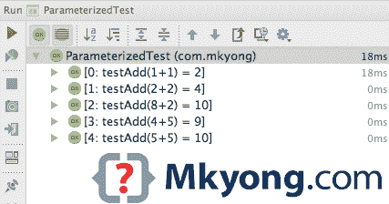
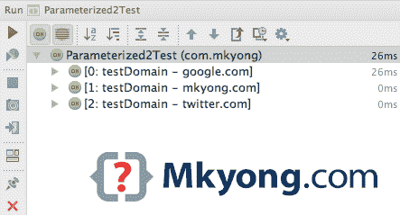

# JUnit–参数化测试

> 原文：<http://web.archive.org/web/20230101150211/http://www.mkyong.com/unittest/junit-4-tutorial-6-parameterized-test/>

在 JUnit 中，您可以通过以下方法将参数传递给单元测试方法:

1.  构造器
2.  通过`@Parameter`注入磁场

*P.S .用 JUnit 4.12 测试*

## 1.match utils–多参数测试

简单的加法运算。

MathUtils.java

```java
 package com.mkyong.examples;

public class MathUtils {

    public static int add(int a, int b) {
        return a + b;
    }

} 
```

## 1.2 match utils–通过构造函数参数化

参数通过构造函数传递给测试方法。

ParameterizedTest.java

```java
 package com.mkyong;

import com.mkyong.examples.MathUtils;
import org.junit.Test;
import org.junit.runner.RunWith;
import org.junit.runners.Parameterized;
import org.junit.runners.Parameterized.Parameters;

import java.util.Arrays;
import java.util.Collection;

import static org.hamcrest.CoreMatchers.is;
import static org.junit.Assert.assertThat;

@RunWith(value = Parameterized.class)
public class ParameterizedTest {

    private int numberA;
    private int numberB;
    private int expected;

    // Inject via constructor
    // for {8, 2, 10}, numberA = 8, numberB = 2, expected = 10
    public ParameterizedTest(int numberA, int numberB, int expected) {
        this.numberA = numberA;
        this.numberB = numberB;
        this.expected = expected;
    }

	// name attribute is optional, provide an unique name for test
	// multiple parameters, uses Collection<Object[]>
    @Parameters(name = "{index}: testAdd({0}+{1}) = {2}")
    public static Collection<Object[]> data() {
        return Arrays.asList(new Object[][]{
                {1, 1, 2},
                {2, 2, 4},
                {8, 2, 10},
                {4, 5, 9},
                {5, 5, 10}
        });
    }

    @Test
    public void test_addTwoNumbes() {
        assertThat(MathUtils.add(numberA, numberB), is(expected));
    }

} 
```

## 1.3 匹配-通过现场注入参数化

参数通过现场注入传递到测试方法中。

ParameterizedTest.java

```java
 package com.mkyong;

import com.mkyong.examples.MathUtils;
import org.junit.Test;
import org.junit.runner.RunWith;
import org.junit.runners.Parameterized;
import org.junit.runners.Parameterized.Parameters;
import org.junit.runners.Parameterized.Parameter;

import java.util.Arrays;
import java.util.Collection;

import static org.hamcrest.CoreMatchers.is;
import static org.junit.Assert.assertThat;

@RunWith(value = Parameterized.class)
public class ParameterizedTest {

    //default value = 0
    @Parameter(value = 0)
    public int numberA;

    @Parameter(value = 1)
    public int numberB;

    @Parameter(value = 2)
    public int expected;

    @Parameters(name = "{index}: testAdd({0}+{1}) = {2}")
    public static Collection<Object[]> data() {
        return Arrays.asList(new Object[][]{
                {1, 1, 2},
                {2, 2, 4},
                {8, 2, 10},
                {4, 5, 9},
                {5, 5, 10}
        });
    }

    @Test
    public void test_addTwoNumbes() {
        assertThat(MathUtils.add(numberA, numberB), is(expected));
    }

} 
```

**Note**
For `@Parameters`, the “name” attribute is optional, it helps you to identify individual test cases by providing a unique name.

**什么是{0}、{1}和{2}？**
如果参数为“{ 3，4，7 }”，则{0} = 3，{1} = 4，{2} = 7。

输出



## 2.域名–单参数测试

另一个简单的类，验证域名。

DomainUtils.java

```java
 package com.mkyong.examples;

import java.util.regex.Pattern;

public class DomainUtils {

    private static final String DOMAIN_NAME_PATTERN = "^((?!-)[A-Za-z0-9-]{1,63}(?<!-)\\.)+[A-Za-z]{2,6}$";
    private static Pattern pDomainName = Pattern.compile(DOMAIN_NAME_PATTERN);

    public static boolean isValid(String domainName) {
        return pDomainName.matcher(domainName).find();
    }

} 
```

## 2.1 域名参数化测试

参数通过现场注入传递到测试方法中。

ParameterizedTest.java

```java
 package com.mkyong;

import com.mkyong.examples.DomainUtils;
import org.junit.Test;
import org.junit.runner.RunWith;
import org.junit.runners.Parameterized;
import org.junit.runners.Parameterized.Parameter;
import org.junit.runners.Parameterized.Parameters;

import static org.hamcrest.CoreMatchers.is;
import static org.junit.Assert.assertThat;

@RunWith(value = Parameterized.class)
public class Parameterized2Test {

    //default value = 0
    @Parameter
    public String domainName;

	//Single parameter, use Object[]
    @Parameters(name = "{index}: testDomain - {0}")
    public static Object[] data() {
        return new Object[]{
                "google.com",
                "mkyong.com",
                "twitter.com"
        };
    }

    @Test
    public void test_valid_domain() {
        assertThat(DomainUtils.isValid(domainName), is(true));
    }

} 
```

输出

**Note**
TestNG is more flexible in the way of passing the parameters into unit tests, read this [TestNG parameter test](http://web.archive.org/web/20221223172207/http://www.mkyong.com/unittest/testng-tutorial-6-parameterized-test/).

## 参考

1.  [域名正则表达式示例](http://web.archive.org/web/20221223172207/http://www.mkyong.com/regular-expressions/domain-name-regular-expression-example/)
2.  [JUnit 参数化 JavaDoc](http://web.archive.org/web/20221223172207/http://junit.sourceforge.net/javadoc/org/junit/runners/Parameterized.html)
3.  [TestNG 参数测试](http://web.archive.org/web/20221223172207/http://www.mkyong.com/unittest/testng-tutorial-6-parameterized-test/)
4.  [Zohhak–JUnit 参数化简化](http://web.archive.org/web/20221223172207/https://piotrturski.github.io/zohhak/)
5.  [JUnit Wiki–参数化](http://web.archive.org/web/20221223172207/https://github.com/junit-team/junit4/wiki/Parameterized-tests)

<input type="hidden" id="mkyong-current-postId" value="1400">